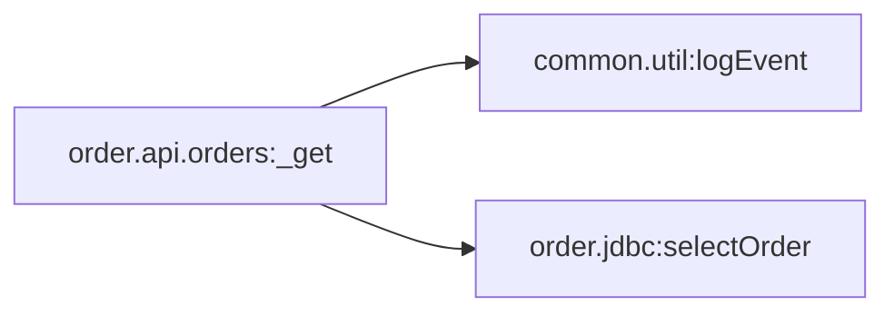
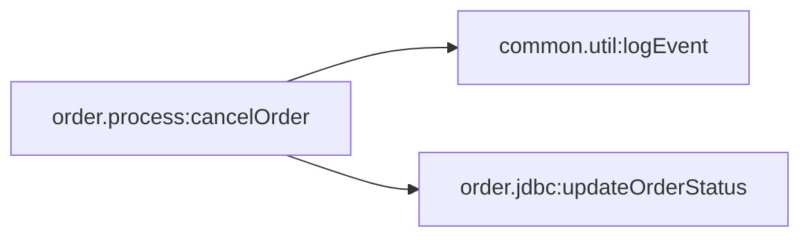
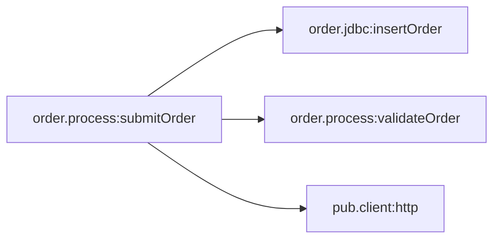

## order.api.orders:_get

```mermaid
flowchart LR
  s_order_api_orders__get["order.api.orders:_get"] --> s_common_util_logEvent["common.util:logEvent"]
  s_order_api_orders__get["order.api.orders:_get"] --> s_order_jdbc_selectOrder["order.jdbc:selectOrder"]
```

## order.process:cancelOrder

```mermaid
flowchart LR
  s_order_process_cancelOrder["order.process:cancelOrder"] --> s_common_util_logEvent["common.util:logEvent"]
  s_order_process_cancelOrder["order.process:cancelOrder"] --> s_order_jdbc_updateOrderStatus["order.jdbc:updateOrderStatus"]
```

## order.process:submitOrder

```mermaid
flowchart LR
  s_order_process_submitOrder["order.process:submitOrder"] --> s_order_jdbc_insertOrder["order.jdbc:insertOrder"]
  s_order_process_submitOrder["order.process:submitOrder"] --> s_order_process_validateOrder["order.process:validateOrder"]
  s_order_process_submitOrder["order.process:submitOrder"] --> s_pub_client_http["pub.client:http"]
```

