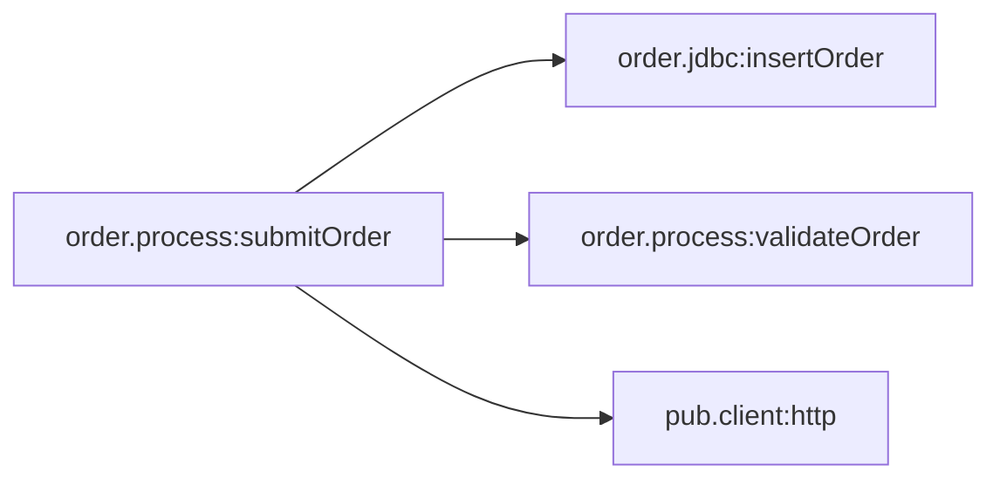

## order.process:submitOrder

```mermaid
flowchart LR
  s_order_process_submitOrder["order.process:submitOrder"] --> s_order_jdbc_insertOrder["order.jdbc:insertOrder"]
  s_order_process_submitOrder["order.process:submitOrder"] --> s_order_process_validateOrder["order.process:validateOrder"]
  s_order_process_submitOrder["order.process:submitOrder"] --> s_pub_client_http["pub.client:http"]
```

