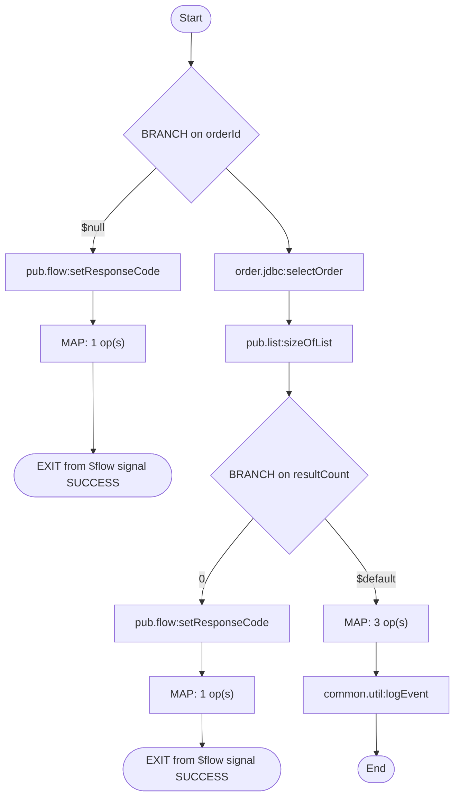

# order.api.orders:_get

- **Kind:** Flow service
- **Package:** OrderProcessing
- **Role:** Entry: REST GET /rest/order/api/orders
- **Source dir:** `sample/OrderProcessing/ns/order/api/orders/_get`
- **Used by capabilities:** order.api.orders:_get
- **Developer comment:** REST resource: returns the status of one order, identified by the orderId query parameter.

## Signature
**Inputs:**

| Field | Type | Flags | Comment |
|---|---|---|---|
| `orderId` | string | optional | Query parameter. |

**Outputs:**

| Field | Type | Flags | Comment |
|---|---|---|---|
| `order` | record | optional |  |
| `  orderId` | string |  |  |
| `  status` | string |  |  |
| `  amount` | string |  |  |
| `error` | string | optional |  |


## Invokes
- `common.util:logEvent`
- `order.jdbc:selectOrder`
- `pub.flow:setResponseCode`
- `pub.list:sizeOfList`

## Logic (pseudocode, generated from flow.xml)
```text
# Reject requests that have no orderId query parameter.
BRANCH on orderId
  CASE $null:
    SEQUENCE [$null]
      INVOKE pub.flow:setResponseCode
        input: set responseCode = "400"; set reasonPhrase = "Bad Request"
      MAP: set error = "orderId is required"
      EXIT from $flow signal SUCCESS
  CASE $default:
    SEQUENCE [$default]
INVOKE order.jdbc:selectOrder
  input: orderId ← orderId
  output: results ← results
INVOKE pub.list:sizeOfList
  input: fromList ← results
  output: resultCount ← size
BRANCH on resultCount
  CASE 0:
    SEQUENCE [0]
      INVOKE pub.flow:setResponseCode
        input: set responseCode = "404"; set reasonPhrase = "Not Found"
      MAP: set error = "Order not found"
      EXIT from $flow signal SUCCESS
  CASE $default:
    SEQUENCE [$default]
      MAP: order/orderId ← results/ORDER_ID; order/status ← results/STATUS; order/amount ← results/AMOUNT
INVOKE common.util:logEvent
  input: set eventType = "ORDER_QUERY"; orderId ← orderId
```

## Flowchart

