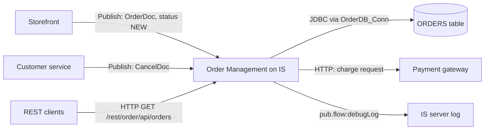

# Functional Specification — Order Management (OrderProcessing + CommonUtils)

| Item | Value |
|---|---|
| Source packages | OrderProcessing 1.0, CommonUtils 1.0 |
| Generated from | Sample packages in `sample/` (synthetic test fixture for the `wm-fsd` agent/skill) |
| Status | Draft — reverse-engineered, pending SME review |

## 1. Introduction

**1.1 Purpose** — One overall specification of the order management application on webMethods
Integration Server: how it is built today (Section 3), what each capability actually does at
runtime (Section 5), and what a Java re-implementation must reproduce or decide (Section 12).

**1.2 Scope** — In scope: all 12 components in the two packages:
- 5 flow services
- 1 Java service
- 3 JDBC adapter services
- 2 triggers
- 2 document types

Not supplied: scheduler exports, global variables, JDBC connection settings (including transaction
type), trigger "on retry failure" settings, UM/Broker configuration, ACLs, and anything about the
systems that publish the documents. See Section 13 (Open Questions).

**1.3 Glossary**
| Term | Meaning |
|---|---|
| IS | webMethods Integration Server |
| Package | Deployable unit of IS components. Here `OrderProcessing` (business) and `CommonUtils` (shared) |
| Flow service | Declarative webMethods service built from MAP, BRANCH, LOOP, INVOKE and similar steps |
| Trigger | IS subscription that invokes a service when a matching document is published. The service's outputs are discarded |
| REST resource | Folder with `_get`/`_post`/… services, exposed at `/rest/<folder path>` |
| `$default` / `$null` | BRANCH cases: "any value no other case matched" / "variable missing" |
| ISRuntimeException | The only kind of error that makes IS retry a trigger |
| CAP-01 / 02 / 03 | Order Submission / Order Cancellation / Order Status Lookup |

## 2. System Context

The application takes in new orders and cancellation requests as published documents, stores
orders in the `ORDERS` table, charges new orders through a payment gateway, and answers order
status queries over REST. It publishes nothing back, and writes audit lines to the IS server log.

The publishers of `OrderDoc` and `CancelDoc` are inferred from the document comments
`[TO CONFIRM: actual publishing systems]`.
