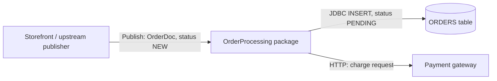

# Functional Specification — OrderProcessing

| Item | Value |
|---|---|
| Source packages | OrderProcessing 1.0 |
| Generated from | Sample package at `sample/OrderProcessing` (synthetic test fixture for the `wm-fsd` agent/skill) |
| Status | Draft — reverse-engineered, pending SME review |

## 1. Introduction

**1.1 Purpose** — Describes what the `OrderProcessing` webMethods Integration Server package
actually does at runtime, so it can be signed off by the business and re-implemented in Java
without opening Designer.

**1.2 Scope** — In scope: everything inside the `OrderProcessing` package folder (1 flow service,
1 Java service, 1 JDBC adapter service, 1 document type, 1 trigger). Not supplied: scheduler
exports, global variables, JDBC connection settings (including transaction type), trigger "on
retry failure" settings, and UM/Broker configuration. See Section 12 (Open Questions). Section 11
covers the Java migration.

**1.3 Glossary**
| Term | Meaning |
|---|---|
| IS | webMethods Integration Server |
| Flow service | Declarative webMethods service built from MAP, BRANCH, LOOP, INVOKE and similar steps |
| Trigger | IS subscription that invokes a service when a matching document is published. The service's outputs are discarded |
| `$default` | BRANCH case taken when no other case matches, including missing or non-numeric values |
| ISRuntimeException | The only kind of error that makes IS retry a trigger |
| CAP-01 | Capability 1, Order Submission (the only capability in this package) |

## 2. System Context

`OrderProcessing` receives new orders published as `OrderDoc` documents. It marks orders over
1000 for approval (and then stops), and validates and stores the rest in the `ORDERS` table
before sending a charge request to a payment gateway. Nothing is published back.

## 3. Capability Summary
| ID | Capability | Entry point | Initiated by | Frequency / volume |
|---|---|---|---|---|
| CAP-01 | Order Submission | `order.process:submitOrder` | Trigger `order.triggers:orderTrigger` on `order.docs:OrderDoc` (filter `status == 'NEW'`) | `[TO CONFIRM: volume not visible in code]` |

## 4. Capabilities
