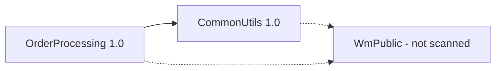
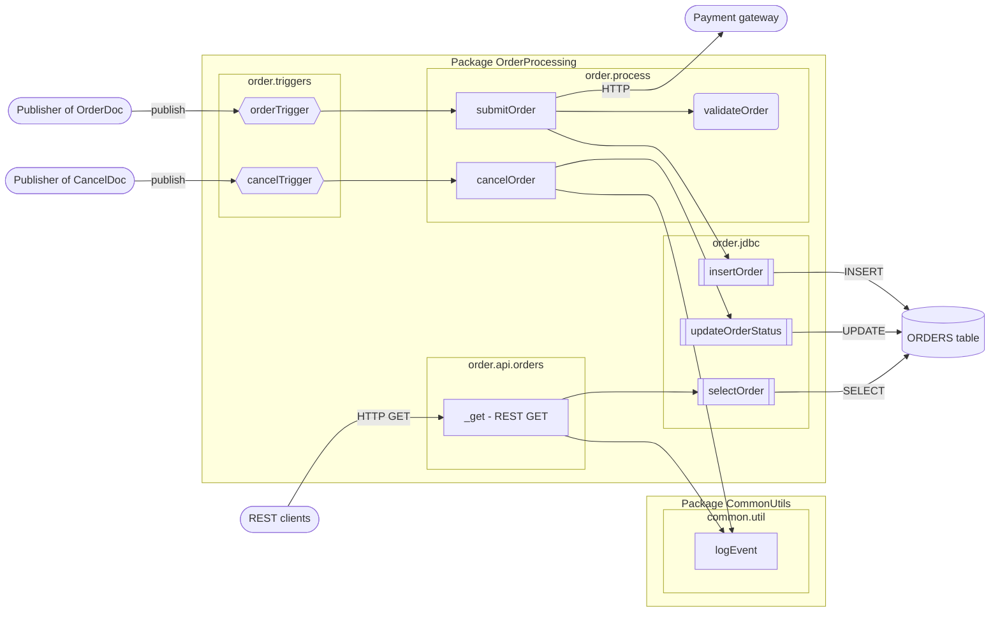
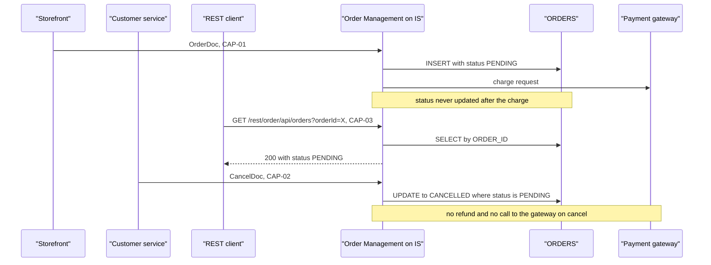
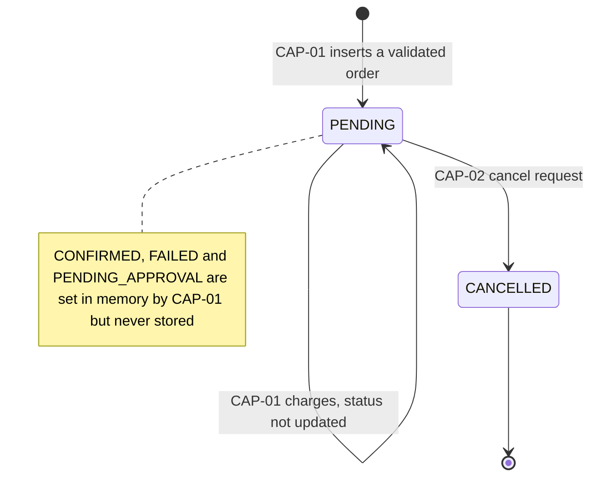

## 3. Existing Architecture

**3.1 Overview** — The application is a small **event-driven order intake** with a
**synchronous REST query**, built on webMethods Integration Server:
- Two document triggers take in new orders and cancellation requests from publishers (publish/subscribe).
- A legacy REST resource answers status queries.
- All three capabilities read or write one relational table, `ORDERS`, through JDBC adapter
  services on one shared connection, `OrderDB_Conn`.
- The `OrderProcessing` package holds all business logic, layered by folder: `triggers`,
  `api`, `process`, `jdbc`, `docs`.
- A separate `CommonUtils` package provides one shared audit-logging service.
- There is no orchestration across capabilities: each one is independent and coordinates with
  the others only through the status column of `ORDERS` (3.6).

**3.2 Package and dependency view**

| Package | Purpose | Components | Depends on |
|---|---|---|---|
| `OrderProcessing` | Order business logic: triggers, REST resource, flow and Java services, adapters, document types | 11 | `WmPublic`, `CommonUtils` (both declared) |
| `CommonUtils` | Shared audit logging | 1 (`common.util:logEvent`) | `WmPublic` |

Both cross-package calls (`_get` and `cancelOrder` → `common.util:logEvent`) are declared in
`manifest.v3`. There are no circular dependencies.

**3.3 Component view**

Shapes: rectangle = flow service, rounded = Java service, double-bordered = adapter, hexagon =
trigger, cylinder = table, stadium = external system or caller.

| Layer | Components | Responsibility |
|---|---|---|
| Entry / channel | `order.triggers:orderTrigger`, `order.triggers:cancelTrigger`, `order.api.orders:_get` | Receive published documents and REST requests |
| Orchestration | `order.process:submitOrder`, `order.process:cancelOrder`, `order.api.orders:_get` | Sequence the steps of each capability (the REST resource is both entry and orchestration) |
| Business logic | `order.process:validateOrder` (Java) | Order field validation |
| Data access | `order.jdbc:insertOrder`, `order.jdbc:updateOrderStatus`, `order.jdbc:selectOrder` | SQL against `ORDERS` via `OrderDB_Conn` |
| Shared utility | `common.util:logEvent` | Audit line to the server log |
| Data contracts | `order.docs:OrderDoc`, `order.docs:CancelDoc` | Inbound document formats |

**3.4 Runtime and integration view**
| Channel / system | Direction | Protocol | Sync/async | Components | Capabilities |
|---|---|---|---|---|---|
| Publisher of `OrderDoc` (storefront) | Inbound | Publish/subscribe, filter `status == 'NEW'`, serial | Async | `orderTrigger` | CAP-01 |
| Publisher of `CancelDoc` (customer service) | Inbound | Publish/subscribe, no filter, concurrent (4 threads) | Async | `cancelTrigger` | CAP-02 |
| REST clients | Inbound | HTTP `GET /rest/order/api/orders?orderId=` | Sync | `order.api.orders:_get` | CAP-03 |
| `ORDERS` table | Outbound | JDBC, connection `OrderDB_Conn` | Sync | 3 adapters | All |
| Payment gateway | Outbound | HTTP, hard-coded URL | Sync | `submitOrder` | CAP-01 |
| IS server log | Outbound | `pub.flow:debugLog`, function `ORDER_AUDIT` | Sync | `logEvent` | CAP-02, CAP-03 |

The concurrency of `cancelTrigger` and the publisher names come from the trigger properties and
document comments `[TO CONFIRM against the IS trigger settings]`.

End-to-end order lifecycle across the three capabilities:

**3.5 Capability-to-component matrix**
| Component | CAP-01 Submission | CAP-02 Cancellation | CAP-03 Status lookup |
|---|---|---|---|
| `order.triggers:orderTrigger` | ✔ | | |
| `order.triggers:cancelTrigger` | | ✔ | |
| `order.api.orders:_get` | | | ✔ |
| `order.process:submitOrder` | ✔ | | |
| `order.process:cancelOrder` | | ✔ | |
| `order.process:validateOrder` | ✔ | | |
| `order.jdbc:insertOrder` | ✔ | | |
| `order.jdbc:updateOrderStatus` | | ✔ | |
| `order.jdbc:selectOrder` | | | ✔ |
| `common.util:logEvent` | | ✔ | ✔ |
| `order.docs:OrderDoc` | ✔ | | |
| `order.docs:CancelDoc` | | ✔ | |

`common.util:logEvent` is the only component shared by more than one capability. The shared
**data** (`ORDERS`) couples all three.

**3.6 Data ownership and entity lifecycle — `ORDERS`**

| Operation | CAP-01 Submission | CAP-02 Cancellation | CAP-03 Status lookup |
|---|---|---|---|
| Create | INSERT, status `PENDING` | | |
| Read | | | SELECT by `ORDER_ID` |
| Update | | `STATUS` `PENDING` → `CANCELLED` (`WHERE STATUS = 'PENDING'`) | |
| Delete | | | |

No capability owns the table outright: CAP-01 creates rows, CAP-02 changes them, and CAP-03
exposes them.

**How the capabilities behave together** (these findings only appear when they are read side by side):
1. **A paid order can be cancelled with no refund.** CAP-01 leaves every order `PENDING`, even
   after a charge request. CAP-02 cancels any `PENDING` row and makes no gateway call.
   (`order.process:submitOrder`, `order.process:cancelOrder`)
2. **Status lookups never show the real outcome.** CAP-03 returns `PENDING` for paid orders and
   orders whose charge was declined alike. `CONFIRMED` and `FAILED` can never appear.
   (`order.api.orders:_get`)
3. **High-value orders are invisible.** Orders over 1000 are never stored by CAP-01, so CAP-03
   returns 404 for them and CAP-02 rejects their cancellation.
4. **A cancellation can be lost.** The two triggers are independent, and `cancelTrigger` runs
   4 threads in parallel. If a `CancelDoc` is processed before the matching `OrderDoc` has been
   inserted, the UPDATE matches 0 rows, CAP-02 fails, and the trigger does not retry it. The
   order is then created as `PENDING` and stays active. `[TO CONFIRM: ordering guarantees between
   the two publishers]`
5. **A cancel during payment still charges.** If CAP-02 runs between CAP-01's INSERT and its
   charge request, the row becomes `CANCELLED`, but CAP-01 still charges the customer.
6. **Duplicate rows break the lookup.** If an `OrderDoc` is redelivered and `ORDER_ID` isn't
   unique, CAP-03 gets several rows; which one it returns is unclear. `[TO CONFIRM]`
7. **Dead-end state.** `PENDING` can only be left by cancelling. Nothing moves an order forward.

**3.7 Cross-cutting patterns**
| Concern | CAP-01 Submission | CAP-02 Cancellation | CAP-03 Status lookup | Consistent? |
|---|---|---|---|---|
| Error handling | TRY/CATCH around validate + insert. Error details dropped. Payment errors uncaught | No TRY/CATCH. Adapter errors propagate. "Not cancellable" → `EXIT FAILURE` | No TRY/CATCH. Adapter errors propagate (HTTP 500 `[TO CONFIRM]`). 400/404 set explicitly | No |
| Logging / audit | None | Both outcomes logged via `logEvent` | Only successful lookups logged. 400/404 not logged | No |
| Retries | HTTP charge: up to 4 attempts, 5 s apart. Trigger retries never effective | None (trigger retries 0) | None | No |
| Transactions | Implicit, via `OrderDB_Conn` type | Same | Same (read only) | Yes, but type unknown |
| Configuration | Hard-coded gateway URL | Literal statuses | None | Partly |
| Security | Not visible | Not visible | REST ACL not visible in the package `[TO CONFIRM]`. Returns `amount` to any caller who knows an `orderId` | Unknown |
| Concurrency | Serial trigger | Concurrent trigger (4) | Per HTTP request | No |

**3.8 Architecture observations and risks**
| # | Observation | Evidence | Impact | Related question / decision |
|---|---|---|---|---|
| A1 | `ORDERS` is shared by all three capabilities, and its status lifecycle is incomplete | Data access matrix (3.6). No UPDATE in CAP-01 | Paid orders can be cancelled without refund. Lookups show stale status | Q3, Q14, D1, D9 |
| A2 | Cancel and submit can race | Separate triggers, `cancelTrigger` concurrent, no retry | Cancellations lost. Cancelled orders charged | Q15, D10 |
| A3 | Logging is inconsistent | CAP-01 has no logging. CAP-03 logs only successful lookups | No audit trail for submissions or failed queries | D12 |
| A4 | Error handling is inconsistent | Only CAP-01 uses TRY/CATCH, and it drops the cause | Hard to diagnose failures. Mixed caller experience | D6, D12 |
| A5 | Hard-coded payment URL | `order.process:submitOrder` | Environment changes need a code change | Q10 |
| A6 | One connection for everything | All 3 adapters use `OrderDB_Conn` | Its transaction type decides rollback behaviour, and its pool size limits all capabilities | Q2 |
| A7 | REST resource security is not visible in the package | No ACL in the `order.api.orders` node | Order data may be exposed without authentication | Q12, D11 |
| A8 | Who cancelled is never recorded | `CancelDoc.requestedBy` is never read | No accountability for cancellations | Q19 |
