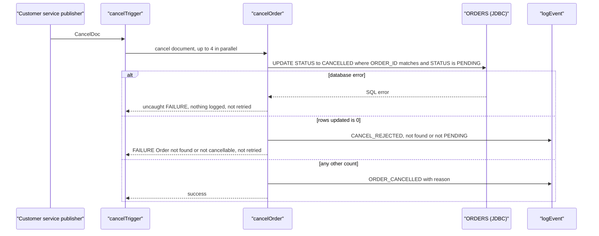
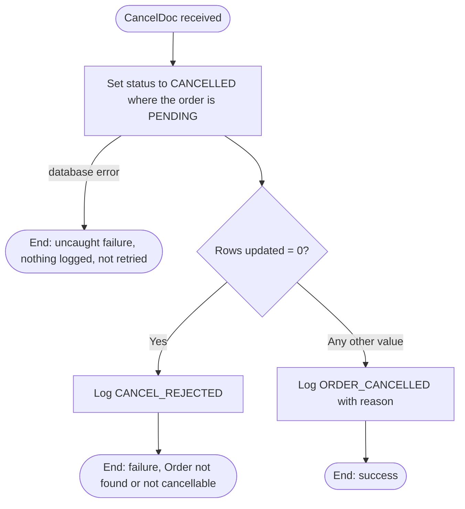

### 5.2 CAP-02 Order Cancellation

**In plain English:** When a cancellation request arrives, this changes the matching order from "PENDING" to "CANCELLED". If there is no such order, it logs a rejection and fails. It does not refund the customer, and it does not record who asked for the cancellation.

**5.2.1 Overview** — Receives a cancellation request published as a `CancelDoc` and changes the
order's status in `ORDERS` from `PENDING` to `CANCELLED`. If no `PENDING` order matches, it logs a
rejection and fails. What actually results: at most an UPDATE of `ORDERS.STATUS` and one audit
line. There is no refund or call to the payment gateway, and who asked for the cancellation is
not recorded.

**5.2.2 Trigger** — Document trigger `order.triggers:cancelTrigger`, subscribed to
`order.docs:CancelDoc`, no filter, processing **concurrently** with up to 4 threads, retries set
to 0 (`order.triggers:cancelTrigger`). Even with retries configured, IS would only retry an
ISRuntimeException, which `cancelOrder` never throws. A failed cancellation is therefore never
retried. `[TO CONFIRM: trigger "on retry failure" setting and the real concurrency settings.]`

**5.2.3 Inputs / Outputs**
| Direction | Field | Type | Mandatory | Description / allowed values | Source |
|---|---|---|---|---|---|
| In | `cancel` | `order.docs:CancelDoc` | Yes | The cancellation request | `order.process:cancelOrder` |
| In | `cancel/orderId` | string | Not validated | Order to cancel. Used in the UPDATE's WHERE clause | `order.docs:CancelDoc` |
| In | `cancel/reason` | string | No | Written to the audit line | `order.docs:CancelDoc` |
| In | `cancel/requestedBy` | string | — | **Never used**: not stored, not logged | `order.docs:CancelDoc` |
| Out | — | — | — | The service declares no outputs | `order.process:cancelOrder` |

**5.2.4 Sequence diagram**

**5.2.5 Processing logic**
1. Update the order: `UPDATE ORDERS SET STATUS = 'CANCELLED' WHERE ORDER_ID = <cancel/orderId>
   AND STATUS = 'PENDING'`, and keep the affected row count as `rowsUpdated`
   (`order.process:cancelOrder` → `order.jdbc:updateOrderStatus`).
2. Decide on the row count (see 5.2.6):
   1. Count `0`: write audit line `CANCEL_REJECTED order=<id> not found or not PENDING` and end
      the service with failure "Order not found or not cancellable" (`order.process:cancelOrder`,
      `common.util:logEvent`).
   2. Any other value: write audit line `ORDER_CANCELLED order=<id> <reason>` and end successfully
      (`order.process:cancelOrder`, `common.util:logEvent`).

**5.2.6 Business rules & decision tables**
| Rule ID | Condition | Outcome | Source |
|---|---|---|---|
| CAP-02-R1 | `rowsUpdated = "0"`: no row with that `ORDER_ID` **and** status `PENDING`. This covers unknown ids, orders already `CANCELLED`, orders over 1000 that CAP-01 never stored, and a missing `orderId` | Log `CANCEL_REJECTED`, service fails "Order not found or not cancellable", not retried | `order.process:cancelOrder` |
| CAP-02-R2 | Any other value (`$default`): 1, or more than 1 if duplicate rows exist | Log `ORDER_CANCELLED` with the reason, service succeeds | `order.process:cancelOrder` |

Only `PENDING` orders can be cancelled. Because CAP-01 never moves an order past `PENDING`, that
means every stored order, including ones already charged (3.6, finding 1).

**5.2.7 Validations**
| Field | Check | On failure | Source |
|---|---|---|---|
| `cancel/orderId` | **None.** A missing id matches no row (SQL `= NULL` is never true) and falls under R1 `[TO CONFIRM: adapter behaviour with a null input]` | — | `order.process:cancelOrder` |
| `cancel/reason`, `cancel/requestedBy` | None | — | `order.process:cancelOrder` |

**5.2.8 Data mappings**
| Target | Source | Transformation / default | Source service |
|---|---|---|---|
| UPDATE `ORDER_ID` parameter | `cancel/orderId` | copy | `order.process:cancelOrder` → `order.jdbc:updateOrderStatus` |
| UPDATE new `STATUS` | literal | `"CANCELLED"` | same |
| UPDATE expected `STATUS` | literal | `"PENDING"` | same |
| `rowsUpdated` | adapter `updateCount` | copy (string) | `order.process:cancelOrder` |
| Audit `eventType` | literal | `"CANCEL_REJECTED"` (R1) or `"ORDER_CANCELLED"` (R2) | `order.process:cancelOrder` |
| Audit `orderId` | `cancel/orderId` | copy | `order.process:cancelOrder` |
| Audit `message` | literal or `cancel/reason` | R1: `"not found or not PENDING"`. R2: the reason, possibly missing | `order.process:cancelOrder` |

**5.2.9 Integrations used**
| System | Protocol / adapter | Operation / SQL / endpoint | Direction | Sync/async | Source |
|---|---|---|---|---|---|
| `ORDERS` table (`OrderDB_Conn`) | JDBC adapter | `UPDATE ORDERS SET STATUS = ? WHERE ORDER_ID = ? AND STATUS = ?` | Outbound | Sync | `order.jdbc:updateOrderStatus` |
| IS server log | `pub.flow:debugLog` via `common.util:logEvent` | function `ORDER_AUDIT`, level `Info` | Outbound | Sync | `common.util:logEvent` |

**5.2.10 Error handling & retries**
| Scenario | Detection | Action | Retry policy | Message / code | Final outcome |
|---|---|---|---|---|---|
| No `PENDING` order matches | `rowsUpdated = "0"` | Log `CANCEL_REJECTED`, `EXIT FAILURE` | None (trigger retries 0, and not an ISRuntimeException) | "Order not found or not cancellable" | Nothing changed. The request is lost. If the order arrives later (3.6, finding 4) it stays active |
| Database error | Exception from `order.jdbc:updateOrderStatus`, no TRY/CATCH | Propagates to the trigger | None | IS error | Nothing changed (or rolled back), nothing logged, request lost |

**5.2.11 Process flowchart**

**5.2.12 Notes**
- **No refund or payment reversal.** Cancelling a charged order doesn't contact the payment
  gateway (3.6, finding 1).
- **`requestedBy` is never used**, so there is no record of who cancelled an order.
- **Missing reason.** If `reason` is absent, the audit line is built from `%message%` with no value
  `[TO CONFIRM: whether IS substitutes an empty string or leaves the literal]`.
- **Races with CAP-01.** See 3.6, findings 4 and 5.
- No step is `DISABLED`.
