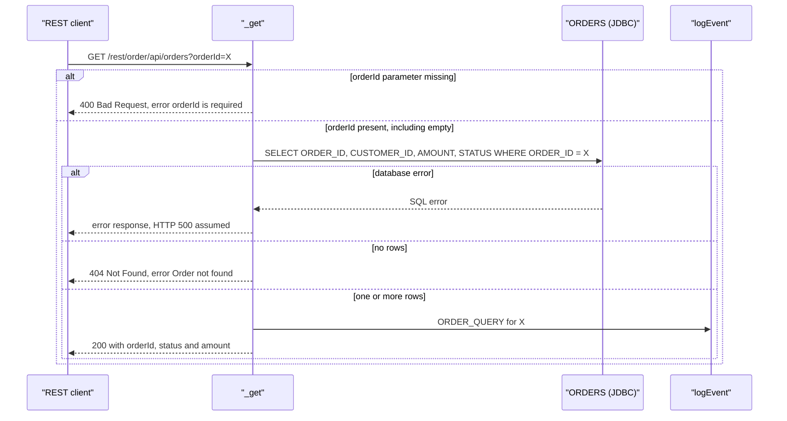
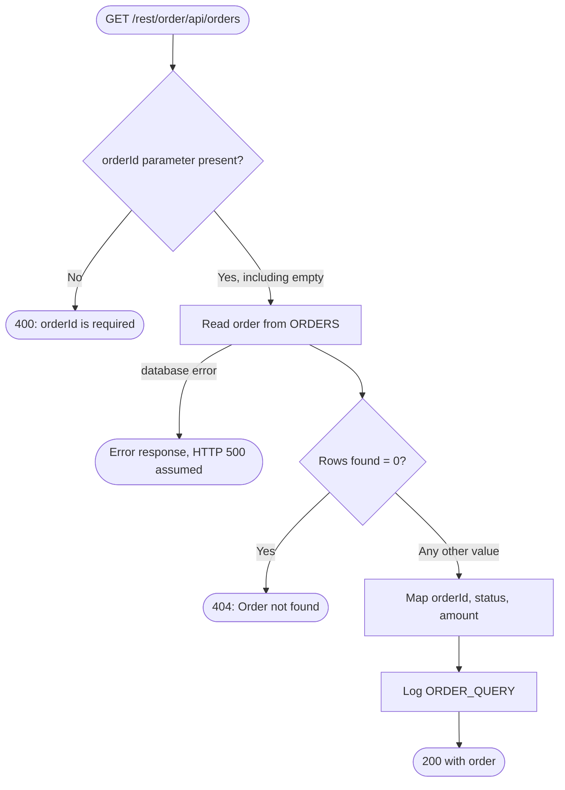

### 5.3 CAP-03 Order Status Lookup

**5.3.1 Overview** — A REST resource that returns the identifier, status and amount of one order.
It answers 400 if the `orderId` parameter is missing, 404 if no row matches, and 200 with the
order otherwise. It reads `ORDERS` only. Only successful lookups are written to the audit log.
Because of how the other capabilities write the table, the status returned is always `PENDING`
or `CANCELLED` (3.6, finding 2).

**5.3.2 Trigger** — Legacy REST resource `order.api.orders:_get`, i.e.
`GET /rest/order/api/orders?orderId=<id>` (`order.api.orders:_get`). The query parameter arrives
as the pipeline input `orderId`, the output pipeline becomes the response body, and
`pub.flow:setResponseCode` sets non-200 statuses.
`[TO CONFIRM: ACL / authentication on the resource, and response format (JSON or XML by Accept
header).]`

**5.3.3 Inputs / Outputs**
| Direction | Field | Type | Mandatory | Description / allowed values | Source |
|---|---|---|---|---|---|
| In | `orderId` (query parameter) | string | Optional in the signature, required by the logic | Order to look up | `order.api.orders:_get` |
| Out | HTTP status | — | — | `200` (default), `400 Bad Request`, `404 Not Found`. Error on database failure `[TO CONFIRM]` | `order.api.orders:_get` |
| Out | `order/orderId`, `order/status`, `order/amount` | string | On 200 | From `ORDERS.ORDER_ID`, `STATUS`, `AMOUNT` | `order.api.orders:_get` |
| Out | `error` | string | On 400/404 | `"orderId is required"` or `"Order not found"` | `order.api.orders:_get` |

The response goes to the REST caller (unlike the trigger-invoked capabilities).

**5.3.4 Sequence diagram**

**5.3.5 Processing logic**
1. If the `orderId` parameter is missing (`$null`), set the response to `400 Bad Request`, set
   `error = "orderId is required"` and end. An empty value (`?orderId=`) is **not** `$null` and
   carries on (`order.api.orders:_get`).
2. Read the order: `SELECT ORDER_ID, CUSTOMER_ID, AMOUNT, STATUS FROM ORDERS WHERE ORDER_ID = ?`
   (`order.jdbc:selectOrder`).
3. Count the rows returned (`pub.list:sizeOfList`).
4. If there are 0 rows, set the response to `404 Not Found`, set `error = "Order not found"` and
   end (`order.api.orders:_get`).
5. Otherwise copy `ORDER_ID`, `STATUS` and `AMOUNT` into `order`. `CUSTOMER_ID` is selected but not
   returned (`order.api.orders:_get`). `[TO CONFIRM: which row is returned when several match]`
6. Write audit line `ORDER_QUERY order=<id>` (no message) and return 200 with `order`
   (`common.util:logEvent`).

**5.3.6 Business rules & decision tables**
| Rule ID | Condition | Outcome | Source |
|---|---|---|---|
| CAP-03-R1 | `orderId` missing (`$null`) | 400 Bad Request, `error = "orderId is required"`. No database read, no log | `order.api.orders:_get` |
| CAP-03-R2 | Any other value (`$default`), **including an empty string** | Continue to the database read | `order.api.orders:_get` |
| CAP-03-R3 | Row count `"0"` | 404 Not Found, `error = "Order not found"`. No log | `order.api.orders:_get` |
| CAP-03-R4 | Any other row count (`$default`) | 200 with `order`, `ORDER_QUERY` logged | `order.api.orders:_get` |

**5.3.7 Validations**
| Field | Check | On failure | Source |
|---|---|---|---|
| `orderId` | Must be present | 400 (R1) | `order.api.orders:_get` |
| `orderId` | **No** check for empty value or format | An empty id gives 404, not 400 | `order.api.orders:_get` |

**5.3.8 Data mappings**
| Target | Source | Transformation / default | Source service |
|---|---|---|---|
| SELECT `ORDER_ID` parameter | `orderId` | copy | `order.api.orders:_get` → `order.jdbc:selectOrder` |
| `resultCount` | `pub.list:sizeOfList(results)` | row count | `order.api.orders:_get` |
| `order/orderId` | `results/ORDER_ID` | copy | `order.api.orders:_get` |
| `order/status` | `results/STATUS` | copy. Only `PENDING` or `CANCELLED` can exist (3.6) | `order.api.orders:_get` |
| `order/amount` | `results/AMOUNT` | copy | `order.api.orders:_get` |
| `error` | literal | `"orderId is required"` (R1), `"Order not found"` (R3) | `order.api.orders:_get` |
| HTTP status | literal | `400 Bad Request` (R1), `404 Not Found` (R3) via `pub.flow:setResponseCode` | `order.api.orders:_get` |
| Audit `eventType` / `orderId` | literal / `orderId` | `"ORDER_QUERY"`, request id | `order.api.orders:_get` |

**5.3.9 Integrations used**
| System | Protocol / adapter | Operation / SQL / endpoint | Direction | Sync/async | Source |
|---|---|---|---|---|---|
| REST clients | HTTP | `GET /rest/order/api/orders` | Inbound | Sync | `order.api.orders:_get` |
| `ORDERS` table (`OrderDB_Conn`) | JDBC adapter | `SELECT ORDER_ID, CUSTOMER_ID, AMOUNT, STATUS FROM ORDERS WHERE ORDER_ID = ?` | Outbound | Sync | `order.jdbc:selectOrder` |
| IS server log | `pub.flow:debugLog` via `common.util:logEvent` | function `ORDER_AUDIT`, level `Info` | Outbound | Sync | `common.util:logEvent` |

**5.3.10 Error handling & retries**
| Scenario | Detection | Action | Retry policy | Message / code | Final outcome |
|---|---|---|---|---|---|
| Parameter missing | `$null` on `orderId` | Set 400 and `error` | None | 400, "orderId is required" | No read, no log |
| Order not found (or empty id) | Row count `0` | Set 404 and `error` | None | 404, "Order not found" | No log |
| Database error | Exception from `order.jdbc:selectOrder`, no TRY/CATCH | Propagates to the REST layer | None | `[TO CONFIRM: HTTP 500 and whether the exception text is exposed to the caller]` | No log |

**5.3.11 Process flowchart**

**5.3.12 Notes**
- **Only successful lookups are logged.** 400, 404 and errors leave no audit line.
- **Security not visible.** The resource returns `amount` to anyone who knows an `orderId`, and no
  ACL appears in the package (3.8, A7).
- **Stale status.** Paid orders show `PENDING`, and orders over 1000 return 404 (3.6).
- **An empty `orderId` returns 404, not 400.**
- `CUSTOMER_ID` is read but not returned.
- No step is `DISABLED`.
