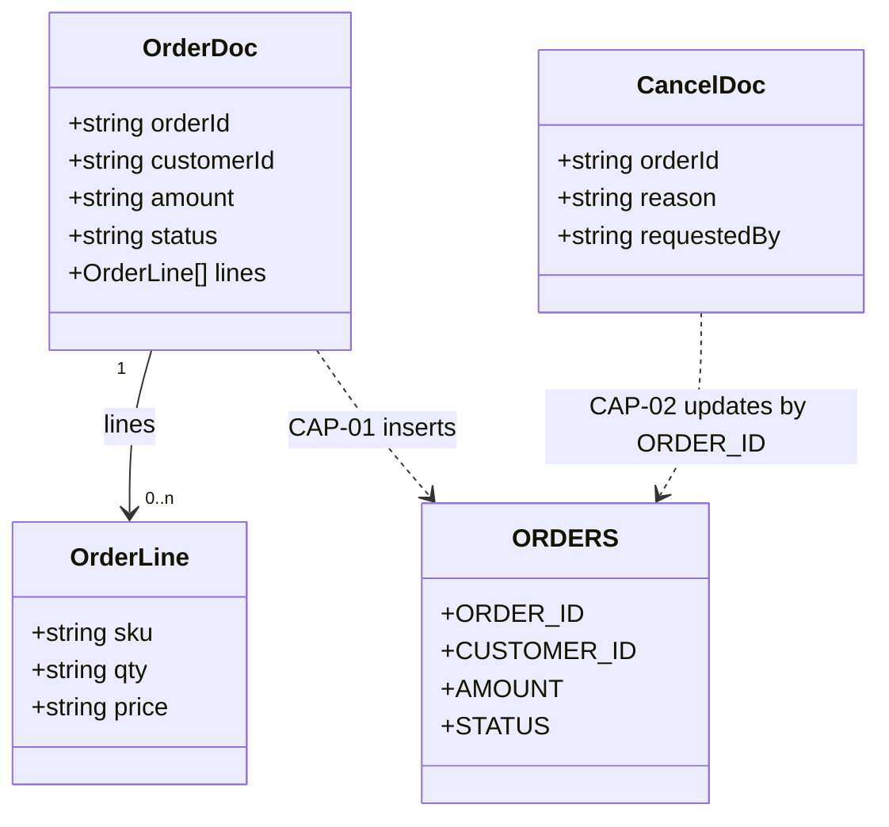

## 6. Common Services

| Service | Package | Purpose | Used by |
|---|---|---|---|
| `common.util:logEvent` | CommonUtils | Builds `"<eventType> order=<orderId> <message>"` and writes it with `pub.flow:debugLog`, function `ORDER_AUDIT`, level `Info` | CAP-02 (`order.process:cancelOrder`), CAP-03 (`order.api.orders:_get`) |

CAP-01 does not use it and has no logging at all (3.8, A3). Whether `Info` lines reach the log
depends on the server's logging configuration `[TO CONFIRM]`.

## 7. Data Dictionary

### `order.docs:OrderDoc`
| Field | Type | Cardinality | Description |
|---|---|---|---|
| `orderId` | string | 1 | Unique order identifier generated upstream by the storefront |
| `customerId` | string | 1 | Customer identifier |
| `amount` | string (decimal) | 1 | Order total in USD, represented as a decimal string |
| `status` | string | 0..1 | Incoming status (the trigger filter requires `NEW`) |
| `lines` | record | 0..n | Order line items |
| `lines/sku` | string | 1 | Product SKU |
| `lines/qty` | string | 1 | Quantity ordered |
| `lines/price` | string | 1 | Unit price |

### `order.docs:CancelDoc`
| Field | Type | Cardinality | Description |
|---|---|---|---|
| `orderId` | string | 1 | Order to cancel |
| `reason` | string | 0..1 | Free-text reason, written to the audit log |
| `requestedBy` | string | 1 | User or system that asked for the cancellation. Never used |

### Table `ORDERS` (columns inferred from the adapter SQL)
| Column | Written by | Read by | Values seen in code |
|---|---|---|---|
| `ORDER_ID` | CAP-01 INSERT | CAP-02 WHERE, CAP-03 SELECT/WHERE | From `OrderDoc.orderId` |
| `CUSTOMER_ID` | CAP-01 INSERT | CAP-03 SELECT (not returned) | From `OrderDoc.customerId` |
| `AMOUNT` | CAP-01 INSERT | CAP-03 SELECT | From `OrderDoc.amount` (string) |
| `STATUS` | CAP-01 INSERT, CAP-02 UPDATE | CAP-02 WHERE, CAP-03 SELECT | `PENDING`, `CANCELLED` |

Column types, keys and constraints are not visible `[TO CONFIRM: DDL, especially a unique key on
ORDER_ID]`.

## 8. Integration Catalog
| System | Protocol / adapter | Connection / endpoint alias | Operations | Used by |
|---|---|---|---|---|
| `ORDERS` table | JDBC adapter | `OrderDB_Conn` | INSERT (CAP-01), UPDATE (CAP-02), SELECT (CAP-03) | `order.jdbc:insertOrder`, `order.jdbc:updateOrderStatus`, `order.jdbc:selectOrder` |
| Payment gateway | HTTP | Hard-coded URL `https://payments.internal/charge`, no alias | Charge request (method not set in the flow) | CAP-01 |
| `OrderDoc` publisher | Publish/subscribe | Broker/UM `[TO CONFIRM]` | Subscribe, filter `status == 'NEW'` | CAP-01 |
| `CancelDoc` publisher | Publish/subscribe | Broker/UM `[TO CONFIRM]` | Subscribe | CAP-02 |
| REST clients | HTTP | `/rest/order/api/orders` | GET | CAP-03 |
| IS server log | `pub.flow:debugLog` | — | Write audit line | CAP-02, CAP-03 |

## 9. Error Catalog
| Message / code | Raised by | Where | Resulting behaviour |
|---|---|---|---|
| "orderId is required" (ServiceException) | `order.process:validateOrder` | CAP-01 | Caught and replaced by the generic CAP-01 message. Never logged |
| "amount must be numeric" | `order.process:validateOrder` | CAP-01 | Same as above |
| "amount must be greater than zero" | `order.process:validateOrder` | CAP-01 | Same as above |
| "Order could not be validated or persisted" | `EXIT FAILURE` | CAP-01 CATCH | Service fails. Not retried |
| Transport error after 4 attempts | `pub.client:http` | CAP-01 | Uncaught. Row kept or rolled back per transaction type |
| HTTP 4xx/5xx from the gateway | Not raised | CAP-01 | Treated as success |
| "Order not found or not cancellable" | `EXIT FAILURE` | CAP-02 | Service fails after logging `CANCEL_REJECTED`. Not retried |
| Database error on UPDATE | `order.jdbc:updateOrderStatus` | CAP-02 | Uncaught. Not logged. Not retried |
| HTTP 400 "orderId is required" | `pub.flow:setResponseCode` + `error` | CAP-03 | Returned to the caller. Not logged |
| HTTP 404 "Order not found" | `pub.flow:setResponseCode` + `error` | CAP-03 | Returned to the caller. Not logged |
| Database error on SELECT | `order.jdbc:selectOrder` | CAP-03 | Uncaught. Error response (HTTP 500 assumed) `[TO CONFIRM]` |

The CAP-01 validation message "orderId is required" and the CAP-03 HTTP 400 message share the
same text but come from different services.

## 10. Configuration & Environment Dependencies
- **Packages:** `OrderProcessing` requires `WmPublic` and `CommonUtils`. `CommonUtils` requires
  `WmPublic`. See 3.2.
- **JDBC connection:** `OrderDB_Conn`, shared by all three adapters. Its transaction type and pool
  size are not supplied `[TO CONFIRM]`.
- **Hard-coded HTTP endpoint:** `https://payments.internal/charge` (CAP-01).
- **Triggers:** `orderTrigger` (serial, 3 retries configured, filter `status == 'NEW'`) and
  `cancelTrigger` (concurrent with 4 threads, 0 retries). Neither retry setting is effective for
  the errors these services raise.
- **REST:** resource at `/rest/order/api/orders`. ACL not visible `[TO CONFIRM]`.
- **Logging:** `pub.flow:debugLog` function `ORDER_AUDIT`, level `Info`.
- No startup/shutdown services, scheduler tasks or global variables were found.
  `[TO CONFIRM: outside-package configuration.]`

## 11. Non-Functional Characteristics Observed in Code
- **Transactions:** no explicit `pub.art.transaction:*` boundaries anywhere. All three capabilities
  depend on the transaction type of `OrderDB_Conn`.
- **Retries:** only the CAP-01 payment call (up to 4 attempts in total, 5 s apart, transport
  errors only). No effective trigger retries.
- **Concurrency:** CAP-01 serial, CAP-02 concurrent (4), CAP-03 one per HTTP request. There is no
  locking between capabilities apart from the `STATUS = 'PENDING'` condition on the cancel UPDATE.
- **Idempotency:** CAP-01 has none (redelivery can insert and charge twice). CAP-02 is naturally
  idempotent (a second cancel matches 0 rows, but then fails). CAP-03 is read-only.
- **Timeouts:** none set for the HTTP call or the database `[TO CONFIRM: defaults]`.
- **Logging/audit:** CAP-02 logs both outcomes. CAP-03 logs successes only. CAP-01 logs nothing.
- **Security:** no authentication or ACL is visible for the REST resource or the triggers.
- **Numeric handling:** amounts are strings, multiplied as floating-point numbers in CAP-01.
