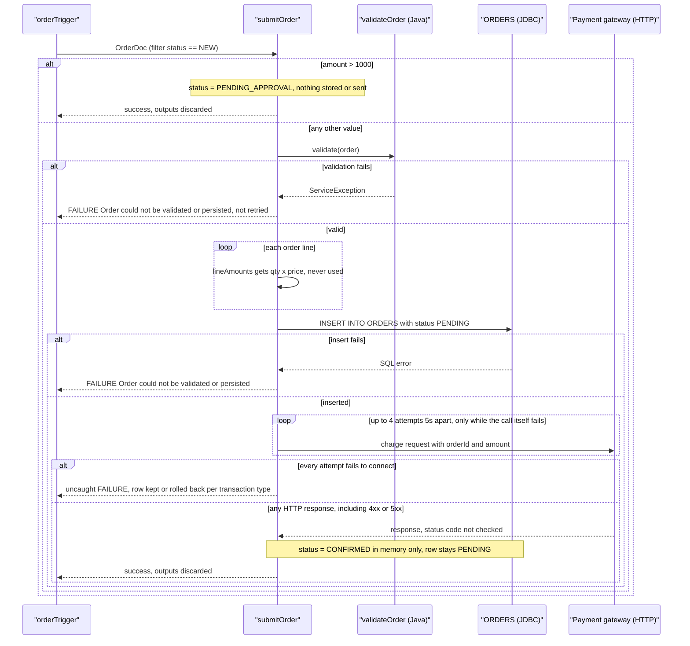
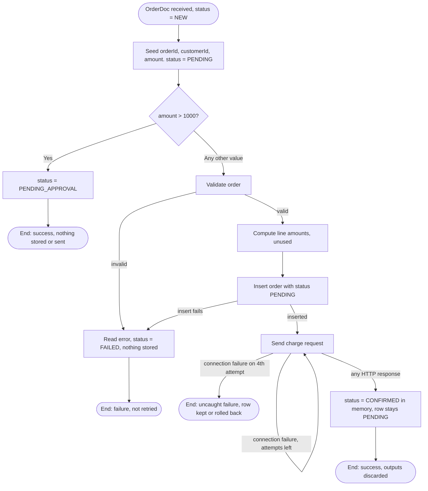

### 4.1 CAP-01 Order Submission

**4.1.1 Overview** — Receives a new customer order published as an `OrderDoc`. Orders over 1000
are marked for manual approval and processing stops. Other orders are validated, inserted into the
`ORDERS` table and charged through a payment gateway. What actually results: at most one `ORDERS`
row, always with status `PENDING`, plus charge requests to the gateway. The final status and
confirmation number are calculated but never stored or sent anywhere (see 4.1.12).

**4.1.2 Trigger** — Document trigger `order.triggers:orderTrigger`, subscribed to
`order.docs:OrderDoc`, filter `status == 'NEW'`, processing documents **serially** (one at a
time) (`order.triggers:orderTrigger`). The trigger is configured for 3 retries 5 s apart, but
Integration Server retries only when the service throws an ISRuntimeException. `submitOrder`
never does this explicitly, so validation, database and payment failures are **not** retried by
the trigger (`order.triggers:orderTrigger`, `order.process:submitOrder`).
`[TO CONFIRM: the trigger's "on retry failure" setting, and whether the JDBC adapter reports
transient database errors as retryable.]`

**4.1.3 Inputs / Outputs**
| Direction | Field | Type | Mandatory | Description / allowed values | Source |
|---|---|---|---|---|---|
| In | `order` | `order.docs:OrderDoc` | Yes | The order to submit | `order.process:submitOrder` |
| In | `order/orderId` | string | Yes (validated) | Unique order identifier from the storefront | `order.docs:OrderDoc` |
| In | `order/customerId` | string | Not validated | Customer identifier | `order.docs:OrderDoc` |
| In | `order/amount` | string (decimal) | Yes (validated) | Order total in USD | `order.docs:OrderDoc` |
| In | `order/status` | string | No | Incoming status. The trigger filter only passes `NEW` | `order.docs:OrderDoc` |
| In | `order/lines[]` | record list | Not validated | Line items: `sku`, `qty`, `price` | `order.docs:OrderDoc` |
| Out | `orderId` | string | — | Echo of the order identifier. **Discarded** | `order.process:submitOrder` |
| Out | `status` | string | — | `PENDING_APPROVAL`, `FAILED` or `CONFIRMED`. **Discarded** | `order.process:submitOrder` |
| Out | `confirmationNumber` | string | — | `<orderId>-CONF`, only on the success path. **Discarded** | `order.process:submitOrder` |

Because a trigger invokes the service, Integration Server discards all three outputs: no system
receives them. `[TO CONFIRM: should the status or confirmation number reach the storefront or
customer?]`

**4.1.4 Sequence diagram**

**4.1.5 Processing logic**
1. Copy `orderId`, `customerId` and `amount` from the input order into working variables and
   set `status = "PENDING"` (`order.process:submitOrder`).
2. Check the order amount against the approval threshold (see 4.1.6). This happens **before**
   validation. If the order needs approval, set `status = "PENDING_APPROVAL"` and end the service
   successfully. Nothing is stored, published or returned, so the order is effectively dropped
   (`order.process:submitOrder`). `[TO CONFIRM: where are high-value orders approved?]`
3. Otherwise, validate and save the order:
   1. Validate the order (`order.process:validateOrder`), see 4.1.7.
   2. For each order line, calculate `qty × price` with floating-point arithmetic and collect the
      results into `lineAmounts` (`order.process:submitOrder`, via `pub.math:multiplyFloats`).
      `lineAmounts` is **never used afterwards**: it isn't stored, and it isn't compared with
      `amount`.
   3. Insert the order into `ORDERS` (`order.jdbc:insertOrder`), with the status at this point
      being `PENDING`.
   4. If 3.1–3.3 fail, read the error with `pub.flow:getLastError` (the details are never logged
      or returned), set `status = "FAILED"` (never stored), and end the service with a failure,
      message "Order could not be validated or persisted" (`order.process:submitOrder`).
4. Send a charge request with `orderId` and `amount` to `https://payments.internal/charge`
   (`order.process:submitOrder`). The response isn't inspected. The call is repeated, up to 4
   attempts 5 s apart, only if the call itself fails (connection error or timeout). An HTTP error
   response, such as a declined payment, counts as success.
5. Set `status = "CONFIRMED"` and `confirmationNumber = "<orderId>-CONF"`, then end the service
   successfully (`order.process:submitOrder`). Neither value is stored, and both outputs are
   discarded, so the `ORDERS` row keeps status `PENDING`.

**4.1.6 Business rules & decision tables**
| Rule ID | Condition | Outcome | Source |
|---|---|---|---|
| CAP-01-R1 | `amount > 1000` (raw: `%amount% > 1000`) | `status = PENDING_APPROVAL`, the service ends successfully. Nothing is stored, charged, published or returned | `order.process:submitOrder` |
| CAP-01-R2 | Any other value (`$default`): 1000 or less, **and also** missing, empty or non-numeric amounts | Continue to validation, saving and payment. Non-numeric, zero and negative amounts then fail validation (4.1.7) | `order.process:submitOrder` |

[TO CONFIRM: how Integration Server evaluates `%amount% > 1000` when `amount` is a string,
e.g. "1000.50", "1,200" or "abc".] The boundary value 1000 itself follows R2.

**4.1.7 Validations**
| Field | Check | On failure | Source |
|---|---|---|---|
| `order/orderId` | Must be present and not blank | `ServiceException("orderId is required")` → CATCH → service fails (4.1.10) | `order.process:validateOrder` |
| `order/amount` | Must parse as a number (`Double.parseDouble`) | `ServiceException("amount must be numeric")` → CATCH → service fails | `order.process:validateOrder` |
| `order/amount` | Must be greater than 0 | `ServiceException("amount must be greater than zero")` → CATCH → service fails | `order.process:validateOrder` |
| `order/customerId`, `order/lines` | **Not validated** | A missing customer or empty line list is saved as-is | `order.process:validateOrder` |

The three validation messages never reach anyone: CATCH replaces them with the generic failure
message without logging them.

**4.1.8 Data mappings**
| Target | Source | Transformation / default | Source service |
|---|---|---|---|
| `orderId` | `order/orderId` | copy | `order.process:submitOrder` |
| `customerId` | `order/customerId` | copy | `order.process:submitOrder` |
| `amount` | `order/amount` | copy (stays a string) | `order.process:submitOrder` |
| `status` | literal | `"PENDING"` at the start, then `PENDING_APPROVAL`, `FAILED` or `CONFIRMED` by path | `order.process:submitOrder` |
| `lineAmounts[]` | `order/lines/qty`, `order/lines/price` | `pub.math:multiplyFloats` (`num1 × num2`), one entry per line. **Unused** | `order.process:submitOrder` |
| `ORDERS.ORDER_ID / CUSTOMER_ID / AMOUNT / STATUS` | `orderId`, `customerId`, `amount`, `status` | copied into `orderRecord`. STATUS is always `PENDING` | `order.process:submitOrder` → `order.jdbc:insertOrder` |
| HTTP body `data/orderId`, `data/amount` | `orderId`, `amount` | copy | `order.process:submitOrder` |
| `confirmationNumber` | `orderId` | `"%orderId%-CONF"` (pipeline variable substitution). **Discarded** | `order.process:submitOrder` |

**4.1.9 Integrations used**
| System | Protocol / adapter | Operation / SQL / endpoint | Direction | Sync/async | Source |
|---|---|---|---|---|---|
| `ORDERS` table (connection alias `OrderDB_Conn`) | JDBC adapter | `INSERT INTO ORDERS (ORDER_ID, CUSTOMER_ID, AMOUNT, STATUS) VALUES (?, ?, ?, ?)` | Outbound | Sync | `order.jdbc:insertOrder` |
| Payment gateway | HTTP (`pub.client:http`) | URL `https://payments.internal/charge`, body fields `orderId`, `amount`. Method, headers, auth and timeout aren't set in the flow `[TO CONFIRM]` | Outbound | Sync, repeated on transport failure | `order.process:submitOrder` |

**4.1.10 Error handling & retries**
| Scenario | Detection | Action | Retry policy | Message / code | Final outcome |
|---|---|---|---|---|---|
| Validation fails | `ServiceException` from `order.process:validateOrder`, caught by TRY/CATCH | `pub.flow:getLastError` (result unused), `status = FAILED` (not stored), `EXIT FAILURE` | None. Not retried by the trigger | "Order could not be validated or persisted" (the specific reason is lost) | Nothing stored, nothing charged |
| Insert fails | Error from `order.jdbc:insertOrder`, caught by the same CATCH | Same as above | None `[TO CONFIRM: transient DB errors and trigger retry]` | Same as above | No row, nothing charged |
| Gateway unreachable (connection error, timeout) | `pub.client:http` throws | Re-run the call | Up to 4 attempts in total, 5 s apart | No CATCH covers this step, so the error propagates uncaught | Service fails. Whether the `PENDING` row stays depends on the transaction type of `OrderDB_Conn`: NO_TRANSACTION keeps it, LOCAL/XA rolls it back `[TO CONFIRM]`. The customer is not charged |
| Gateway returns an HTTP error (4xx/5xx, e.g. declined) | **Not detected**: the status code is never checked | Continues as success | No retry | None | Service succeeds, the row stays `PENDING`, and the customer may not have been charged |

**4.1.11 Process flowchart**

**4.1.12 Notes**
- **Database status never changes from `PENDING`.** The status is saved at insert time, and the
  later `CONFIRMED` / `FAILED` values are never written (`order.process:submitOrder`).
- **Outputs are discarded.** Because a trigger invokes the service, `status` and
  `confirmationNumber` never reach anyone (`order.triggers:orderTrigger`).
- **HTTP error responses are treated as success.** `header/status` is never checked
  (`order.process:submitOrder`).
- **High-value orders are dropped.** Rule R1 ends the service without storing or publishing
  anything.
- **`lineAmounts` is dead logic.** It is calculated per line and never used, and nothing checks
  that the line totals add up to `amount`.
- **Error details are lost.** `pub.flow:getLastError` is called, but its result isn't logged,
  returned or rethrown.
- **Floating-point money.** `pub.math:multiplyFloats` and `Double.parseDouble` are used on
  monetary values.
- **Hard-coded endpoint.** The gateway URL `https://payments.internal/charge` is a literal in the
  flow, not an endpoint alias.
- No step is `DISABLED`.
