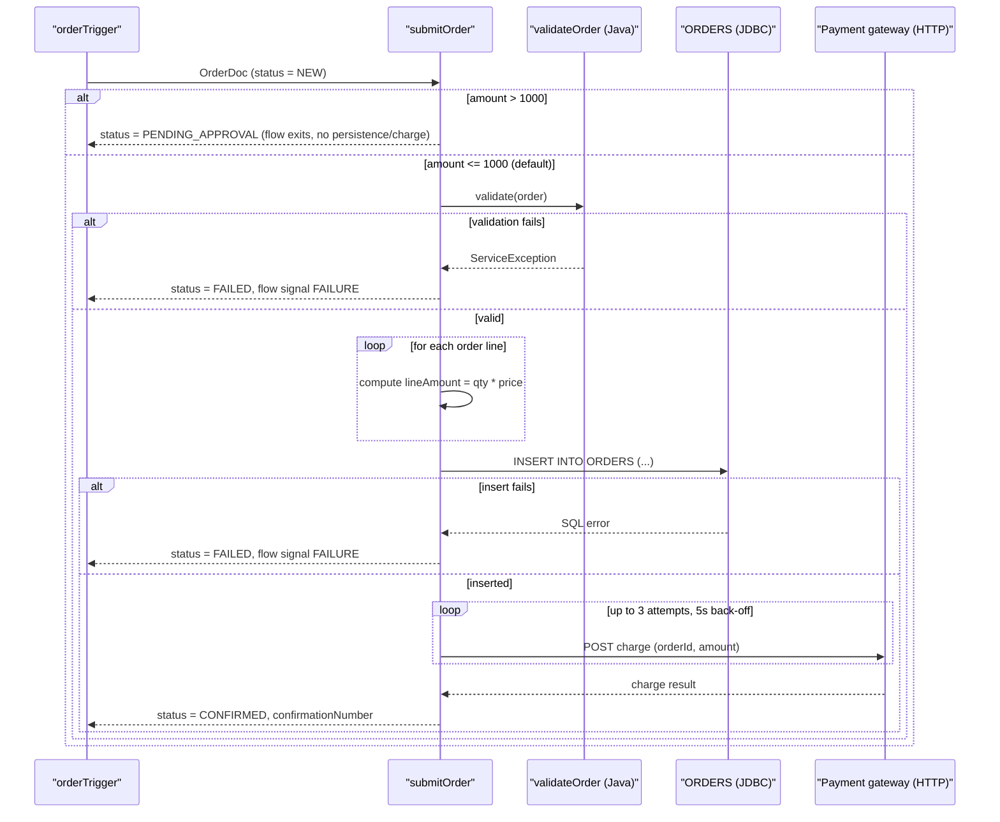
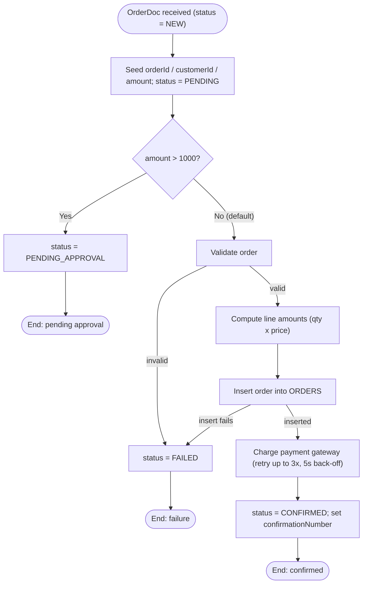

### 4.1 CAP-01 Order Submission

**4.1.1 Overview** — Accepts a new customer order, routes high-value orders to manual approval,
validates and persists the remaining orders, charges the customer, and returns a confirmation.
It is the single entry point for turning a published `OrderDoc` into a stored, charged order.

**4.1.2 Trigger** — Document trigger `order.triggers:orderTrigger`, subscribed to
`order.docs:OrderDoc`, filter condition `status == 'NEW'` (`order.triggers:orderTrigger`).
Processing is **serial** (one document at a time), with up to 3 redelivery retries at a 5s
interval if the trigger itself fails (`order.triggers:orderTrigger`).

**4.1.3 Inputs / Outputs**
| Direction | Field | Type | Mandatory | Description / allowed values | Source |
|---|---|---|---|---|---|
| In | `order` | `order.docs:OrderDoc` | Yes | The order to submit | `order.process:submitOrder` |
| In | `order/orderId` | string | Yes | Unique order identifier from the storefront | `order.docs:OrderDoc` |
| In | `order/customerId` | string | Yes | Customer identifier | `order.docs:OrderDoc` |
| In | `order/amount` | string (decimal) | Yes | Order total in USD | `order.docs:OrderDoc` |
| In | `order/status` | string | No | Optional incoming status | `order.docs:OrderDoc` |
| In | `order/lines[]` | record list | Yes | Line items: `sku`, `qty`, `price` | `order.docs:OrderDoc` |
| Out | `orderId` | string | Yes | Echoed order identifier | `order.process:submitOrder` |
| Out | `status` | string | Yes | `PENDING_APPROVAL`, `FAILED`, or `CONFIRMED` | `order.process:submitOrder` |
| Out | `confirmationNumber` | string | No | Set only when the order reaches `CONFIRMED` | `order.process:submitOrder` |

**4.1.4 Sequence diagram**

**4.1.5 Processing logic**
1. Seed working variables `orderId`, `customerId`, `amount` from the input order and set
   `status = "PENDING"` (`order.process:submitOrder`).
2. Evaluate the order amount against the approval threshold (see 4.1.6). If approval is required,
   set `status = "PENDING_APPROVAL"` and end the flow successfully without persisting or charging
   the order (`order.process:submitOrder`).
3. Otherwise, validate and persist the order:
   1. Validate the order (`order.process:validateOrder`) — see 4.1.7.
   2. For each order line, compute the extended line amount as `qty * price`
      (`order.process:submitOrder`, via `pub.math:multiplyFloats`).
   3. Insert the order into the `ORDERS` table (`order.jdbc:insertOrder`) — see 4.1.9.
   4. If validation or persistence fails at any point, set `status = "FAILED"` and end the flow
      with a failure signal (see 4.1.10).
4. Charge the payment gateway for the order amount, retrying on failure (see 4.1.10)
   (`order.process:submitOrder`).
5. Set `status = "CONFIRMED"` and `confirmationNumber = "<orderId>-CONF"`, then end the flow
   successfully (`order.process:submitOrder`).

**4.1.6 Business rules & decision tables**
| Rule ID | Condition | Outcome | Source |
|---|---|---|---|
| CAP-01-R1 | `amount > 1000` | Order held for manual approval: `status = PENDING_APPROVAL`; flow ends immediately (order is **not** persisted or charged at this point) | `order.process:submitOrder` |
| CAP-01-R2 | `amount <= 1000` (`$default`) | Order proceeds to validation, persistence and payment | `order.process:submitOrder` |

**4.1.7 Validations**
| Field | Check | On failure | Source |
|---|---|---|---|
| `order/orderId` | Must be non-null and non-blank | Throws `ServiceException("orderId is required")`, caught by the flow's TRY/CATCH → `status = FAILED` | `order.process:validateOrder` |
| `order/amount` | Must parse as a number | Throws `ServiceException("amount must be numeric")` → `status = FAILED` | `order.process:validateOrder` |
| `order/amount` | Must be `> 0` | Throws `ServiceException("amount must be greater than zero")` → `status = FAILED` | `order.process:validateOrder` |

**4.1.8 Data mappings**
| Target | Source | Transformation / default | Source service |
|---|---|---|---|
| `orderId` | `order/orderId` | copy | `order.process:submitOrder` |
| `customerId` | `order/customerId` | copy | `order.process:submitOrder` |
| `amount` | `order/amount` | copy | `order.process:submitOrder` |
| `status` | literal | set to `"PENDING"` at start, then reassigned by business rules/outcomes | `order.process:submitOrder` |
| `lineAmount` (per line, loop-local) | `lines/qty`, `lines/price` | `pub.math:multiplyFloats` transformer: `qty * price`, collected into `lineAmounts` | `order.process:submitOrder` |
| `orderRecord/orderId`, `/customerId`, `/amount`, `/status` | `orderId`, `customerId`, `amount`, `status` | copy, passed as JDBC insert input | `order.process:submitOrder` → `order.jdbc:insertOrder` |
| `confirmationNumber` | `orderId` | literal template `"%orderId%-CONF"` (pipeline variable substitution) | `order.process:submitOrder` |

**4.1.9 Integrations used**
| System | Protocol / adapter | Operation / SQL / endpoint | Direction | Sync/async | Source |
|---|---|---|---|---|---|
| `ORDERS` table (connection alias `OrderDB_Conn`) | JDBC adapter | `INSERT INTO ORDERS (ORDER_ID, CUSTOMER_ID, AMOUNT, STATUS) VALUES (?, ?, ?, ?)` | Outbound | Sync | `order.jdbc:insertOrder` |
| Payment gateway | HTTP (`pub.client:http`) | `POST https://payments.internal/charge` `[TO CONFIRM: HTTP method/headers/auth — only the URL and body fields are visible in the flow]` | Outbound | Sync, retried | `order.process:submitOrder` |

**4.1.10 Error handling & retries**
| Scenario | Detection | Action | Retry policy | Message / code | Final outcome |
|---|---|---|---|---|---|
| Validation fails (`orderId`/`amount`) | `ServiceException` from `order.process:validateOrder`, caught by TRY/CATCH | Call `pub.flow:getLastError`, set `status = "FAILED"` | None | Flow `FAILURE` signal, message "Order could not be validated or persisted" | Order not persisted or charged; caller sees failure |
| JDBC insert fails | `ServiceException`/SQL error from `order.jdbc:insertOrder`, caught by same TRY/CATCH | Same as above | None | Same as above | Order not persisted or charged |
| Payment gateway call fails | Failure signal from `pub.client:http` | Retry the HTTP call | Up to 3 attempts, 5s back-off (`REPEAT ... LOOP-ON FAILURE`) | `[TO CONFIRM: what happens if all 3 retries fail — flow has no CATCH around the REPEAT, so a FAILURE here propagates uncaught]` | Order is persisted (`status` was never reset to `FAILED` for this path) but payment may not have succeeded |

**4.1.11 Process flowchart**

**4.1.12 Notes**
- The payment gateway URL `https://payments.internal/charge` is hard-coded in the flow rather than
  read from a package configuration value or endpoint alias (`order.process:submitOrder`).
  `[TO CONFIRM: should this be externalised to an endpoint alias?]`
- No step is `DISABLED`; all steps in the flow execute.
- `[TO CONFIRM: is there a CATCH around the payment REPEAT step, or an outer handler, so an order
  can end up persisted with status CONFIRMED-but-unpaid if all 3 payment retries fail?]`
