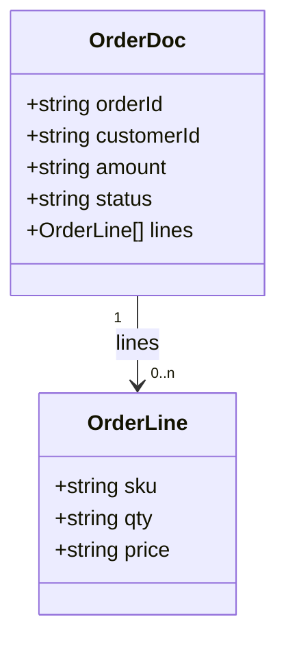
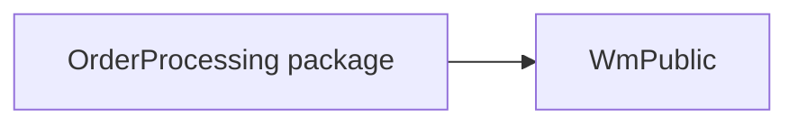

## 5. Common Services
None. The package has no shared logging, formatting or auditing services. There is also no
logging at all, so failures leave no trace in the package itself.

## 6. Data Dictionary

### `order.docs:OrderDoc`
| Field | Type | Cardinality | Description |
|---|---|---|---|
| `orderId` | string | 1 | Unique order identifier generated upstream by the storefront |
| `customerId` | string | 1 | Customer identifier |
| `amount` | string (decimal) | 1 | Order total in USD, represented as a decimal string |
| `status` | string | 0..1 | Incoming status (the trigger filter requires `NEW`) |
| `lines` | record | 0..n | Order line items |
| `lines/sku` | string | 1 | Product SKU |
| `lines/qty` | string | 1 | Quantity ordered |
| `lines/price` | string | 1 | Unit price |

## 7. Integration Catalog
| System | Protocol / adapter | Connection / endpoint alias | Operations | Used by |
|---|---|---|---|---|
| `ORDERS` table | JDBC adapter | `OrderDB_Conn` | INSERT (no UPDATE anywhere) | CAP-01 (`order.jdbc:insertOrder`) |
| Payment gateway | HTTP | Hard-coded URL `https://payments.internal/charge`, no alias | Charge request (method not set in flow) | CAP-01 (`order.process:submitOrder`) |

## 8. Error Catalog
| Message / code | Raised by | Where | Resulting behaviour |
|---|---|---|---|
| "orderId is required" | `ServiceException` | `order.process:validateOrder` | Caught by CAP-01 CATCH and replaced with the generic message below. Never logged |
| "amount must be numeric" | `ServiceException` | `order.process:validateOrder` | Same as above |
| "amount must be greater than zero" | `ServiceException` | `order.process:validateOrder` | Same as above |
| "Order could not be validated or persisted" | Flow `EXIT … SIGNAL FAILURE` | `order.process:submitOrder` CATCH | Service fails. Not retried by the trigger (not an ISRuntimeException) |
| Transport error from `pub.client:http` after 4 attempts | `pub.client:http` | `order.process:submitOrder` | Uncaught, so the service fails. Row kept or rolled back depending on transaction type `[TO CONFIRM]` |
| HTTP 4xx/5xx from the gateway | Not raised | `order.process:submitOrder` | Silently treated as success |

## 9. Configuration & Environment Dependencies
- **Package dependency:** `WmPublic` (`manifest.v3`).
- **JDBC connection:** alias `OrderDB_Conn`, used by `order.jdbc:insertOrder`. Its transaction
  type decides whether the insert survives a later payment failure `[TO CONFIRM]`.
- **Hard-coded HTTP endpoint:** `https://payments.internal/charge` in `order.process:submitOrder`.
- **Trigger:** `order.triggers:orderTrigger`, serial, 3 retries 5 s apart (effective only for
  ISRuntimeExceptions). "On retry failure" setting not supplied.
- No startup/shutdown services, scheduler tasks or global variables were found in the package.
  `[TO CONFIRM: outside-package configuration.]`

## 10. Non-Functional Characteristics Observed in Code
- **Transactions:** no explicit `pub.art.transaction:*` boundaries. The connection's transaction
  type controls what happens (see 9).
- **Retries:** payment call up to 4 attempts in total, 5 s apart, on transport errors only.
  Trigger retries only happen for ISRuntimeExceptions, which this code never raises explicitly.
- **Concurrency:** serial trigger, one document at a time.
- **Timeouts:** none set for the HTTP call `[TO CONFIRM: IS default HTTP timeout in this
  environment]`.
- **Idempotency:** none. A redelivered document would be inserted and charged again unless
  `ORDERS.ORDER_ID` is unique `[TO CONFIRM]`.
- **Logging/audit:** none. Error details are dropped in CATCH.
- **Numeric handling:** amounts and line values are strings, multiplied as floating-point numbers.
