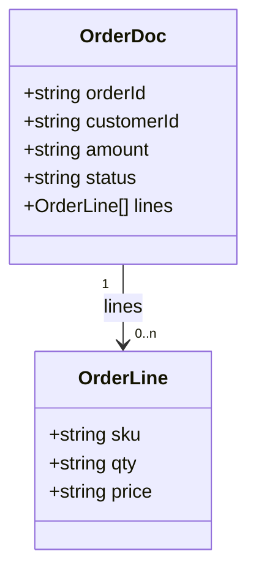
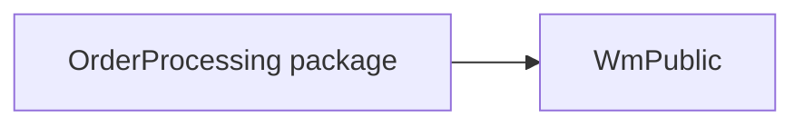

## 5. Common Services
None detected — the package contains no shared logging/formatting/auditing utility services
beyond the business services covered in Section 4.

## 6. Data Dictionary

### `order.docs:OrderDoc`
| Field | Type | Cardinality | Description |
|---|---|---|---|
| `orderId` | string | 1 | Unique order identifier generated upstream by the storefront |
| `customerId` | string | 1 | Customer identifier |
| `amount` | string (decimal) | 1 | Order total in USD, represented as a decimal string |
| `status` | string | 0..1 | Optional incoming status |
| `lines` | record | 0..n | Order line items |
| `lines/sku` | string | 1 | Product SKU |
| `lines/qty` | string | 1 | Quantity ordered |
| `lines/price` | string | 1 | Unit price |

## 7. Integration Catalog
| System | Protocol / adapter | Connection / endpoint alias | Operations | Used by |
|---|---|---|---|---|
| `ORDERS` table | JDBC adapter | `OrderDB_Conn` | INSERT | CAP-01 (`order.jdbc:insertOrder`) |
| Payment gateway | HTTP | `https://payments.internal/charge` (hard-coded, not an alias) | POST charge | CAP-01 (`order.process:submitOrder`) |

## 8. Error Catalog
| Message / code | Raised by | Where | Resulting behaviour |
|---|---|---|---|
| "orderId is required" | `ServiceException` | `order.process:validateOrder` | Caught in CAP-01 TRY/CATCH → `status = FAILED`, flow fails |
| "amount must be numeric" | `ServiceException` | `order.process:validateOrder` | Same as above |
| "amount must be greater than zero" | `ServiceException` | `order.process:validateOrder` | Same as above |
| "Order could not be validated or persisted" | Flow `EXIT ... SIGNAL FAILURE` | `order.process:submitOrder` CATCH block | Flow ends with failure signal to the trigger |
| (uncaught) payment gateway failure after 3 retries | `pub.client:http` failure, not caught by any TRY/CATCH | `order.process:submitOrder` | `[TO CONFIRM: confirm actual trigger-level behaviour on an uncaught failure after persistence]` |

## 9. Configuration & Environment Dependencies
- **Package dependency:** `WmPublic` (`manifest.v3`).
- **JDBC connection:** alias `OrderDB_Conn`, used by `order.jdbc:insertOrder`; connection
  pool/credential details are not in scope of this package and were not read from raw config.
- **Hard-coded HTTP endpoint:** `https://payments.internal/charge` in `order.process:submitOrder`
  (not an endpoint alias — see CAP-01 Notes).
- **Trigger concurrency:** `order.triggers:orderTrigger` runs serial, max 3 redelivery retries,
  5s interval.
- No startup/shutdown services, scheduler tasks, global variables, or Trading
  Networks/UM/Broker configuration were found in the scanned package.
  `[TO CONFIRM: scheduler tasks, global variables, and JDBC connection pool settings live outside
  the package and were not supplied for this review.]`

## 10. Non-Functional Characteristics Observed in Code
- **Transactions:** no explicit `pub.art.transaction:*` boundary around the JDBC insert; the
  insert and the trigger's own transaction model govern atomicity.
  `[TO CONFIRM: adapter connection transaction type]`
- **Retries:** payment gateway call retried up to 3 times with a 5-second back-off
  (`order.process:submitOrder`); trigger redelivery retried up to 3 times at 5s intervals
  (`order.triggers:orderTrigger`).
- **Concurrency:** trigger processes documents serially (one at a time).
- **Timeouts:** none configured in the scanned flow for the HTTP call.
  `[TO CONFIRM: HTTP client timeout]`
- **Validation:** performed in Java (`order.process:validateOrder`) before persistence.
- **Batching:** none — orders are processed and inserted one at a time.

## 11. Open Questions
| # | Question | Context / service | Owner |
|---|---|---|---|
| 1 | What are the HTTP method, headers, and auth used for the payment gateway call beyond the URL and body fields visible in the flow? | `order.process:submitOrder` | `[TO CONFIRM]` |
| 2 | If all 3 payment retries fail, is there an outer handler, or does the order remain persisted with no final status update? | `order.process:submitOrder` | `[TO CONFIRM]` |
| 3 | Should the payment gateway URL be externalised to a package/endpoint alias instead of being hard-coded? | `order.process:submitOrder` | `[TO CONFIRM]` |
| 4 | What are the JDBC connection pool settings and credentials for `OrderDB_Conn`? (outside scanned package) | `order.jdbc:insertOrder` | `[TO CONFIRM]` |
| 5 | Are there scheduler tasks, global variables, or Trading Networks/UM/Broker configuration relevant to this application? (outside scanned package) | Package-wide | `[TO CONFIRM]` |

## Appendix A — Service Inventory
| Name | Kind | Capability | Purpose |
|---|---|---|---|
| `order.process:submitOrder` | Flow service | CAP-01 | Validates, persists, charges and confirms a customer order |
| `order.process:validateOrder` | Java service | CAP-01 | Validates required order fields and that the amount is positive |
| `order.jdbc:insertOrder` | JDBC adapter service | CAP-01 | Inserts the order into the `ORDERS` table |
| `order.triggers:orderTrigger` | Trigger | CAP-01 | Subscribes to new `OrderDoc` publications and invokes `submitOrder` |
| `order.docs:OrderDoc` | Document type | Data dictionary | Canonical order document |
