# Functional Specification — Order Management (OrderProcessing + CommonUtils)

| Item | Value |
|---|---|
| Source packages | OrderProcessing 1.0, CommonUtils 1.0 |
| Generated from | Sample packages in `sample/` (synthetic test fixture for the `wm-fsd` agent/skill) |
| Status | Draft — reverse-engineered, pending SME review |

## 0. Summary in Plain English

*For readers who just want to know what this system does, what is wrong with it, and what to decide. Technical detail starts at Section 1.*

**What the system does.** It looks after customer orders. It receives new orders and cancellation
requests from other systems, keeps the orders in one database table, asks the payment gateway to
charge new orders, and lets other systems look up an order's status over the web. It sends nothing
back to the systems that gave it the orders.

**How a normal order goes through** (an order of 1000 or less):
1. A new order arrives from the storefront.
2. The system checks the order is valid.
3. It saves the order in the database with the status "PENDING".
4. It asks the payment gateway to charge the customer. If the gateway cannot be reached, it tries again, up to 4 attempts in total, 5 seconds apart.
5. It works out a "CONFIRMED" status and a confirmation number, but then throws them away. Nothing stores or sends them.

**What happens to the other requests**
- **A bigger order (over 1000)** is marked "needs approval" and then the system stops. It is not saved, not checked and not charged.
- **A cancellation** changes a saved "PENDING" order to "CANCELLED". If no such order exists, it is rejected and logged.
- **A status lookup** returns the order's number, status and amount. It answers "bad request" if no order number was given and "not found" if there is no such order.

**The five things you most need to know**
1. **Orders never show the real outcome.** Every saved order stays "PENDING" for ever, whether the payment worked or not. "CONFIRMED" and "FAILED" are never stored, so a status lookup cannot tell a paid order from an unpaid one.
2. **A paid order can be cancelled with no refund.** A cancellation only changes the status in the database. It never contacts the payment gateway. A cancellation that arrives while the payment is in progress does not stop the charge either.
3. **Orders over 1000 disappear.** They are never saved, so nobody can look them up, and a cancellation for them is rejected. The "needs approval" status is lost.
4. **A cancellation can get lost.** If the cancellation is processed before its order has been saved, it is rejected and is not tried again. The order is then created and stays active.
5. **A declined payment looks like a success.** The system only retries when the gateway cannot be reached. If the gateway answers with an error such as "payment declined", the system treats that as a success.

Failed requests are generally **not** retried automatically, and the original reason for a failure is mostly not recorded.

**What we could not find out from the code.** Who publishes the orders and cancellations, how the database connection handles failures, what the trigger does after its retries run out, and who is allowed to call the status lookup. These are listed in Section 13 (Open Questions).

**Decisions needed before a rewrite.** For each of the five issues above, decide whether the new system should copy the current behaviour exactly or fix it. They are listed with options in Section 12.2.

## 1. Introduction

**1.1 Purpose** — One overall specification of the order management application on webMethods
Integration Server: how it is built today (Section 3), what each capability actually does at
runtime (Section 5), and what a Java re-implementation must reproduce or decide (Section 12).

**1.2 Scope** — In scope: all 12 components in the two packages:
- 5 flow services
- 1 Java service
- 3 JDBC adapter services
- 2 triggers
- 2 document types

Not supplied: scheduler exports, global variables, JDBC connection settings (including transaction
type), trigger "on retry failure" settings, UM/Broker configuration, ACLs, and anything about the
systems that publish the documents. See Section 13 (Open Questions).

**1.3 Glossary**
| Term | Meaning |
|---|---|
| IS | webMethods Integration Server |
| Package | Deployable unit of IS components. Here `OrderProcessing` (business) and `CommonUtils` (shared) |
| Flow service | Declarative webMethods service built from MAP, BRANCH, LOOP, INVOKE and similar steps |
| Trigger | IS subscription that invokes a service when a matching document is published. The service's outputs are discarded |
| REST resource | Folder with `_get`/`_post`/… services, exposed at `/rest/<folder path>` |
| `$default` / `$null` | BRANCH cases: "any value no other case matched" / "variable missing" |
| ISRuntimeException | The only kind of error that makes IS retry a trigger |
| CAP-01 / 02 / 03 | Order Submission / Order Cancellation / Order Status Lookup |

## 2. System Context

The application takes in new orders and cancellation requests as published documents, stores
orders in the `ORDERS` table, charges new orders through a payment gateway, and answers order
status queries over REST. It publishes nothing back, and writes audit lines to the IS server log.

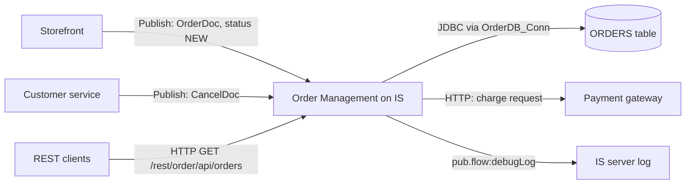

The publishers of `OrderDoc` and `CancelDoc` are inferred from the document comments
`[TO CONFIRM: actual publishing systems]`.

## 3. Existing Architecture

**3.1 Overview** — The application is a small **event-driven order intake** with a
**synchronous REST query**, built on webMethods Integration Server:
- Two document triggers take in new orders and cancellation requests from publishers (publish/subscribe).
- A legacy REST resource answers status queries.
- All three capabilities read or write one relational table, `ORDERS`, through JDBC adapter
  services on one shared connection, `OrderDB_Conn`.
- The `OrderProcessing` package holds all business logic, layered by folder: `triggers`,
  `api`, `process`, `jdbc`, `docs`.
- A separate `CommonUtils` package provides one shared audit-logging service.
- There is no orchestration across capabilities: each one is independent and coordinates with
  the others only through the status column of `ORDERS` (3.6).

**3.2 Package and dependency view**
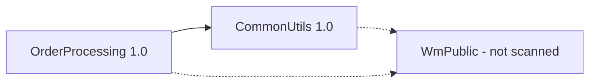

| Package | Purpose | Components | Depends on |
|---|---|---|---|
| `OrderProcessing` | Order business logic: triggers, REST resource, flow and Java services, adapters, document types | 11 | `WmPublic`, `CommonUtils` (both declared) |
| `CommonUtils` | Shared audit logging | 1 (`common.util:logEvent`) | `WmPublic` |

Both cross-package calls (`_get` and `cancelOrder` → `common.util:logEvent`) are declared in
`manifest.v3`. There are no circular dependencies.

**3.3 Component view**
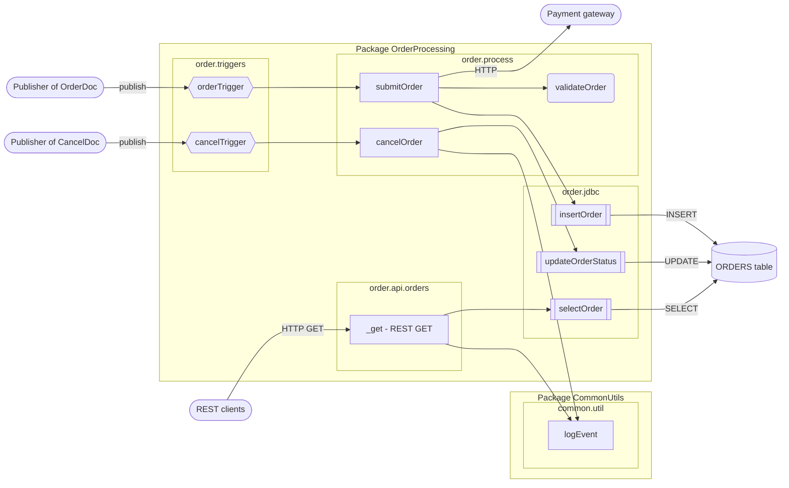
Shapes: rectangle = flow service, rounded = Java service, double-bordered = adapter, hexagon =
trigger, cylinder = table, stadium = external system or caller.

| Layer | Components | Responsibility |
|---|---|---|
| Entry / channel | `order.triggers:orderTrigger`, `order.triggers:cancelTrigger`, `order.api.orders:_get` | Receive published documents and REST requests |
| Orchestration | `order.process:submitOrder`, `order.process:cancelOrder`, `order.api.orders:_get` | Sequence the steps of each capability (the REST resource is both entry and orchestration) |
| Business logic | `order.process:validateOrder` (Java) | Order field validation |
| Data access | `order.jdbc:insertOrder`, `order.jdbc:updateOrderStatus`, `order.jdbc:selectOrder` | SQL against `ORDERS` via `OrderDB_Conn` |
| Shared utility | `common.util:logEvent` | Audit line to the server log |
| Data contracts | `order.docs:OrderDoc`, `order.docs:CancelDoc` | Inbound document formats |

**3.4 Runtime and integration view**
| Channel / system | Direction | Protocol | Sync/async | Components | Capabilities |
|---|---|---|---|---|---|
| Publisher of `OrderDoc` (storefront) | Inbound | Publish/subscribe, filter `status == 'NEW'`, serial | Async | `orderTrigger` | CAP-01 |
| Publisher of `CancelDoc` (customer service) | Inbound | Publish/subscribe, no filter, concurrent (4 threads) | Async | `cancelTrigger` | CAP-02 |
| REST clients | Inbound | HTTP `GET /rest/order/api/orders?orderId=` | Sync | `order.api.orders:_get` | CAP-03 |
| `ORDERS` table | Outbound | JDBC, connection `OrderDB_Conn` | Sync | 3 adapters | All |
| Payment gateway | Outbound | HTTP, hard-coded URL | Sync | `submitOrder` | CAP-01 |
| IS server log | Outbound | `pub.flow:debugLog`, function `ORDER_AUDIT` | Sync | `logEvent` | CAP-02, CAP-03 |

The concurrency of `cancelTrigger` and the publisher names come from the trigger properties and
document comments `[TO CONFIRM against the IS trigger settings]`.

End-to-end order lifecycle across the three capabilities:
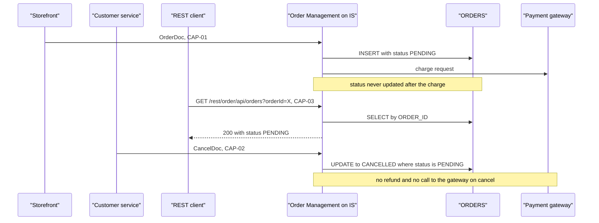

**3.5 Capability-to-component matrix**
| Component | CAP-01 Submission | CAP-02 Cancellation | CAP-03 Status lookup |
|---|---|---|---|
| `order.triggers:orderTrigger` | ✔ | | |
| `order.triggers:cancelTrigger` | | ✔ | |
| `order.api.orders:_get` | | | ✔ |
| `order.process:submitOrder` | ✔ | | |
| `order.process:cancelOrder` | | ✔ | |
| `order.process:validateOrder` | ✔ | | |
| `order.jdbc:insertOrder` | ✔ | | |
| `order.jdbc:updateOrderStatus` | | ✔ | |
| `order.jdbc:selectOrder` | | | ✔ |
| `common.util:logEvent` | | ✔ | ✔ |
| `order.docs:OrderDoc` | ✔ | | |
| `order.docs:CancelDoc` | | ✔ | |

`common.util:logEvent` is the only component shared by more than one capability. The shared
**data** (`ORDERS`) couples all three.

**3.6 Data ownership and entity lifecycle — `ORDERS`**

| Operation | CAP-01 Submission | CAP-02 Cancellation | CAP-03 Status lookup |
|---|---|---|---|
| Create | INSERT, status `PENDING` | | |
| Read | | | SELECT by `ORDER_ID` |
| Update | | `STATUS` `PENDING` → `CANCELLED` (`WHERE STATUS = 'PENDING'`) | |
| Delete | | | |

No capability owns the table outright: CAP-01 creates rows, CAP-02 changes them, and CAP-03
exposes them.

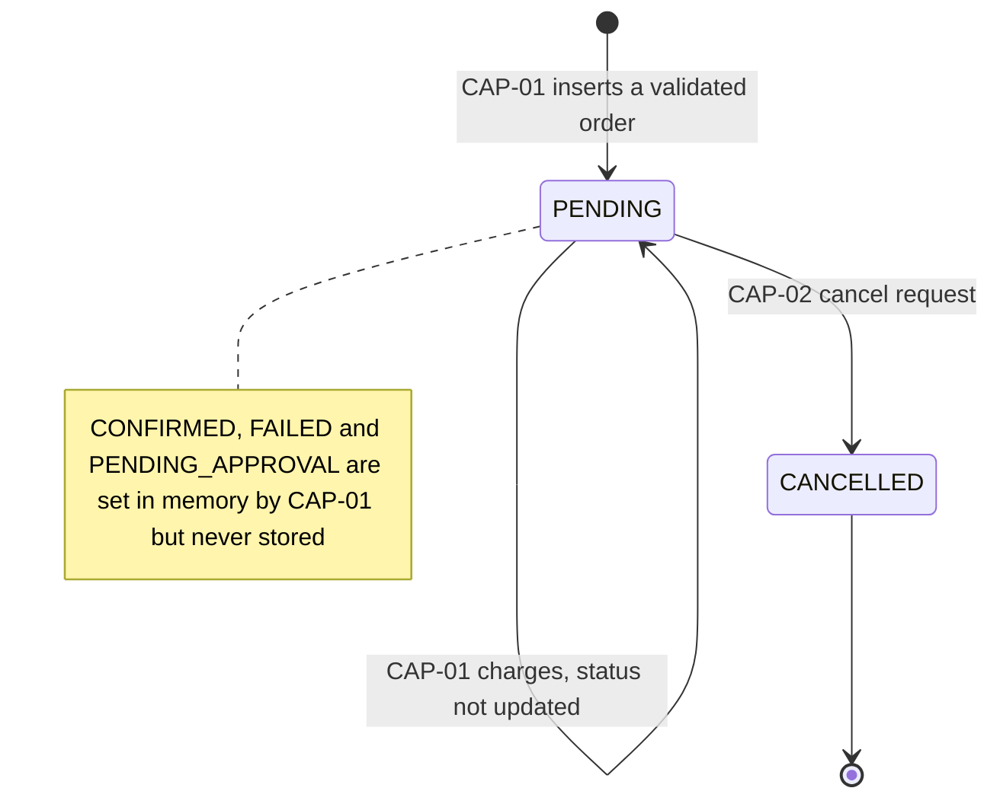

**How the capabilities behave together** (these findings only appear when they are read side by side):
1. **A paid order can be cancelled with no refund.** CAP-01 leaves every order `PENDING`, even
   after a charge request. CAP-02 cancels any `PENDING` row and makes no gateway call.
   (`order.process:submitOrder`, `order.process:cancelOrder`)
2. **Status lookups never show the real outcome.** CAP-03 returns `PENDING` for paid orders and
   orders whose charge was declined alike. `CONFIRMED` and `FAILED` can never appear.
   (`order.api.orders:_get`)
3. **High-value orders are invisible.** Orders over 1000 are never stored by CAP-01, so CAP-03
   returns 404 for them and CAP-02 rejects their cancellation.
4. **A cancellation can be lost.** The two triggers are independent, and `cancelTrigger` runs
   4 threads in parallel. If a `CancelDoc` is processed before the matching `OrderDoc` has been
   inserted, the UPDATE matches 0 rows, CAP-02 fails, and the trigger does not retry it. The
   order is then created as `PENDING` and stays active. `[TO CONFIRM: ordering guarantees between
   the two publishers]`
5. **A cancel during payment still charges.** If CAP-02 runs between CAP-01's INSERT and its
   charge request, the row becomes `CANCELLED`, but CAP-01 still charges the customer.
6. **Duplicate rows break the lookup.** If an `OrderDoc` is redelivered and `ORDER_ID` isn't
   unique, CAP-03 gets several rows; which one it returns is unclear. `[TO CONFIRM]`
7. **Dead-end state.** `PENDING` can only be left by cancelling. Nothing moves an order forward.

**3.7 Cross-cutting patterns**
| Concern | CAP-01 Submission | CAP-02 Cancellation | CAP-03 Status lookup | Consistent? |
|---|---|---|---|---|
| Error handling | TRY/CATCH around validate + insert. Error details dropped. Payment errors uncaught | No TRY/CATCH. Adapter errors propagate. "Not cancellable" → `EXIT FAILURE` | No TRY/CATCH. Adapter errors propagate (HTTP 500 `[TO CONFIRM]`). 400/404 set explicitly | No |
| Logging / audit | None | Both outcomes logged via `logEvent` | Only successful lookups logged. 400/404 not logged | No |
| Retries | HTTP charge: up to 4 attempts, 5 s apart. Trigger retries never effective | None (trigger retries 0) | None | No |
| Transactions | Implicit, via `OrderDB_Conn` type | Same | Same (read only) | Yes, but type unknown |
| Configuration | Hard-coded gateway URL | Literal statuses | None | Partly |
| Security | Not visible | Not visible | REST ACL not visible in the package `[TO CONFIRM]`. Returns `amount` to any caller who knows an `orderId` | Unknown |
| Concurrency | Serial trigger | Concurrent trigger (4) | Per HTTP request | No |

**3.8 Architecture observations and risks**
| # | Observation | Evidence | Impact | Related question / decision |
|---|---|---|---|---|
| A1 | `ORDERS` is shared by all three capabilities, and its status lifecycle is incomplete | Data access matrix (3.6). No UPDATE in CAP-01 | Paid orders can be cancelled without refund. Lookups show stale status | Q3, Q14, D1, D9 |
| A2 | Cancel and submit can race | Separate triggers, `cancelTrigger` concurrent, no retry | Cancellations lost. Cancelled orders charged | Q15, D10 |
| A3 | Logging is inconsistent | CAP-01 has no logging. CAP-03 logs only successful lookups | No audit trail for submissions or failed queries | D12 |
| A4 | Error handling is inconsistent | Only CAP-01 uses TRY/CATCH, and it drops the cause | Hard to diagnose failures. Mixed caller experience | D6, D12 |
| A5 | Hard-coded payment URL | `order.process:submitOrder` | Environment changes need a code change | Q10 |
| A6 | One connection for everything | All 3 adapters use `OrderDB_Conn` | Its transaction type decides rollback behaviour, and its pool size limits all capabilities | Q2 |
| A7 | REST resource security is not visible in the package | No ACL in the `order.api.orders` node | Order data may be exposed without authentication | Q12, D11 |
| A8 | Who cancelled is never recorded | `CancelDoc.requestedBy` is never read | No accountability for cancellations | Q19 |

## 4. Capability Summary
| ID | Capability | Entry point | Initiated by | Frequency / volume |
|---|---|---|---|---|
| CAP-01 | Order Submission | `order.process:submitOrder` | Trigger `order.triggers:orderTrigger` on `order.docs:OrderDoc` (filter `status == 'NEW'`) | `[TO CONFIRM]` |
| CAP-02 | Order Cancellation | `order.process:cancelOrder` | Trigger `order.triggers:cancelTrigger` on `order.docs:CancelDoc` | `[TO CONFIRM]` |
| CAP-03 | Order Status Lookup | `order.api.orders:_get` | REST client: `GET /rest/order/api/orders?orderId=` | `[TO CONFIRM]` |

## 5. Capabilities

### 5.1 CAP-01 Order Submission

**In plain English:** When a new order arrives, this checks it, saves it as "PENDING" and asks the payment gateway to charge the customer. Orders over 1000 are only marked "needs approval" and then ignored. The "confirmed" status it works out at the end is never saved or sent anywhere, so the stored order always says "PENDING".

**5.1.1 Overview** — Receives a new customer order published as an `OrderDoc`. Orders over 1000
are marked for manual approval and processing stops. Other orders are validated, inserted into the
`ORDERS` table and charged through a payment gateway. What actually results: at most one `ORDERS`
row, always with status `PENDING`, plus charge requests to the gateway. The final status and
confirmation number are calculated but never stored or sent anywhere (see 5.1.12).

**5.1.2 Trigger** — Document trigger `order.triggers:orderTrigger`, subscribed to
`order.docs:OrderDoc`, filter `status == 'NEW'`, processing documents **serially** (one at a
time) (`order.triggers:orderTrigger`). The trigger is configured for 3 retries 5 s apart, but
Integration Server retries only when the service throws an ISRuntimeException. `submitOrder`
never does this explicitly, so validation, database and payment failures are **not** retried by
the trigger (`order.triggers:orderTrigger`, `order.process:submitOrder`).
`[TO CONFIRM: the trigger's "on retry failure" setting, and whether the JDBC adapter reports
transient database errors as retryable.]`

**5.1.3 Inputs / Outputs**
| Direction | Field | Type | Mandatory | Description / allowed values | Source |
|---|---|---|---|---|---|
| In | `order` | `order.docs:OrderDoc` | Yes | The order to submit | `order.process:submitOrder` |
| In | `order/orderId` | string | Yes (validated) | Unique order identifier from the storefront | `order.docs:OrderDoc` |
| In | `order/customerId` | string | Not validated | Customer identifier | `order.docs:OrderDoc` |
| In | `order/amount` | string (decimal) | Yes (validated) | Order total in USD | `order.docs:OrderDoc` |
| In | `order/status` | string | No | Incoming status. The trigger filter only passes `NEW` | `order.docs:OrderDoc` |
| In | `order/lines[]` | record list | Not validated | Line items: `sku`, `qty`, `price` | `order.docs:OrderDoc` |
| Out | `orderId` | string | — | Echo of the order identifier. **Discarded** | `order.process:submitOrder` |
| Out | `status` | string | — | `PENDING_APPROVAL`, `FAILED` or `CONFIRMED`. **Discarded** | `order.process:submitOrder` |
| Out | `confirmationNumber` | string | — | `<orderId>-CONF`, only on the success path. **Discarded** | `order.process:submitOrder` |

Because a trigger invokes the service, Integration Server discards all three outputs: no system
receives them. `[TO CONFIRM: should the status or confirmation number reach the storefront or
customer?]`

**5.1.4 Sequence diagram**
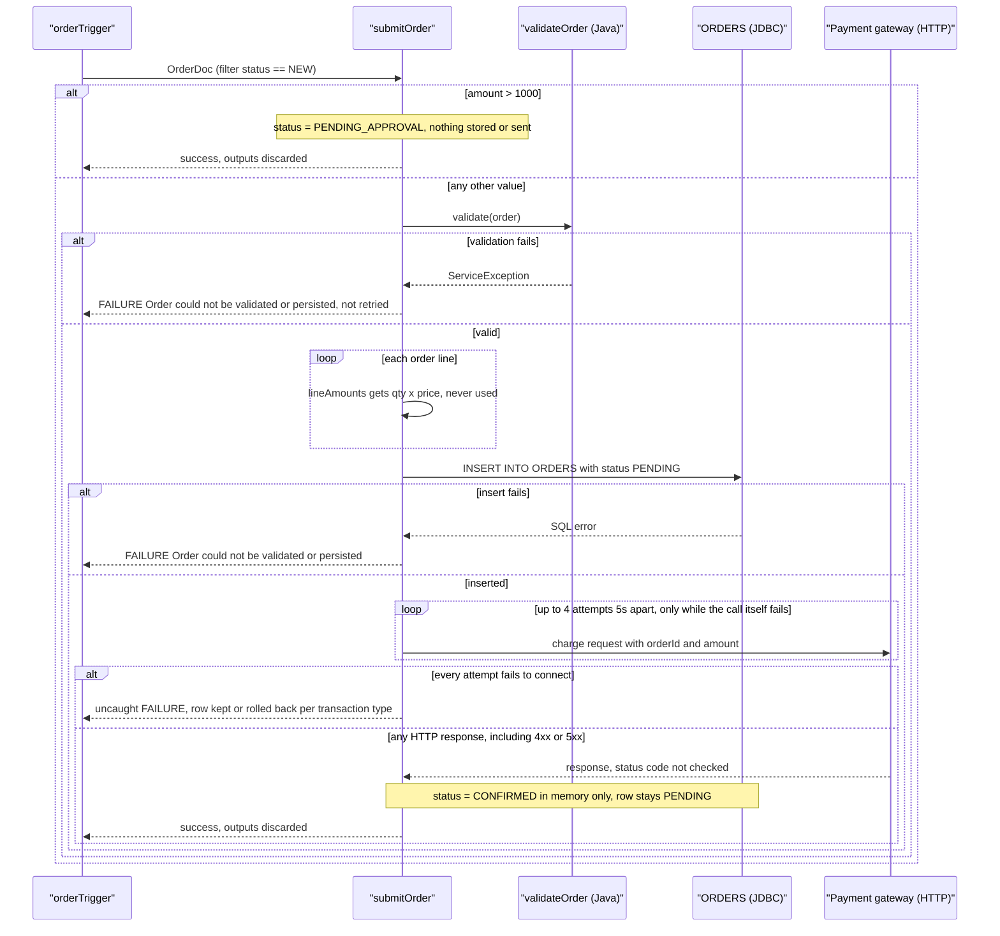

**5.1.5 Processing logic**
1. Copy `orderId`, `customerId` and `amount` from the input order into working variables and
   set `status = "PENDING"` (`order.process:submitOrder`).
2. Check the order amount against the approval threshold (see 5.1.6). This happens **before**
   validation. If the order needs approval, set `status = "PENDING_APPROVAL"` and end the service
   successfully. Nothing is stored, published or returned, so the order is effectively dropped
   (`order.process:submitOrder`). `[TO CONFIRM: where are high-value orders approved?]`
3. Otherwise, validate and save the order:
   1. Validate the order (`order.process:validateOrder`), see 5.1.7.
   2. For each order line, calculate `qty × price` with floating-point arithmetic and collect the
      results into `lineAmounts` (`order.process:submitOrder`, via `pub.math:multiplyFloats`).
      `lineAmounts` is **never used afterwards**: it isn't stored, and it isn't compared with
      `amount`.
   3. Insert the order into `ORDERS` (`order.jdbc:insertOrder`), with the status at this point
      being `PENDING`.
   4. If 3.1–3.3 fail, read the error with `pub.flow:getLastError` (the details are never logged
      or returned), set `status = "FAILED"` (never stored), and end the service with a failure,
      message "Order could not be validated or persisted" (`order.process:submitOrder`).
4. Send a charge request with `orderId` and `amount` to `https://payments.internal/charge`
   (`order.process:submitOrder`). The response isn't inspected. The call is repeated, up to 4
   attempts 5 s apart, only if the call itself fails (connection error or timeout). An HTTP error
   response, such as a declined payment, counts as success.
5. Set `status = "CONFIRMED"` and `confirmationNumber = "<orderId>-CONF"`, then end the service
   successfully (`order.process:submitOrder`). Neither value is stored, and both outputs are
   discarded, so the `ORDERS` row keeps status `PENDING`.

**5.1.6 Business rules & decision tables**
| Rule ID | Condition | Outcome | Source |
|---|---|---|---|
| CAP-01-R1 | `amount > 1000` (raw: `%amount% > 1000`) | `status = PENDING_APPROVAL`, the service ends successfully. Nothing is stored, charged, published or returned | `order.process:submitOrder` |
| CAP-01-R2 | Any other value (`$default`): 1000 or less, **and also** missing, empty or non-numeric amounts | Continue to validation, saving and payment. Non-numeric, zero and negative amounts then fail validation (5.1.7) | `order.process:submitOrder` |

[TO CONFIRM: how Integration Server evaluates `%amount% > 1000` when `amount` is a string,
e.g. "1000.50", "1,200" or "abc".] The boundary value 1000 itself follows R2.

**5.1.7 Validations**
| Field | Check | On failure | Source |
|---|---|---|---|
| `order/orderId` | Must be present and not blank | `ServiceException("orderId is required")` → CATCH → service fails (5.1.10) | `order.process:validateOrder` |
| `order/amount` | Must parse as a number (`Double.parseDouble`) | `ServiceException("amount must be numeric")` → CATCH → service fails | `order.process:validateOrder` |
| `order/amount` | Must be greater than 0 | `ServiceException("amount must be greater than zero")` → CATCH → service fails | `order.process:validateOrder` |
| `order/customerId`, `order/lines` | **Not validated** | A missing customer or empty line list is saved as-is | `order.process:validateOrder` |

The three validation messages never reach anyone: CATCH replaces them with the generic failure
message without logging them.

**5.1.8 Data mappings**
| Target | Source | Transformation / default | Source service |
|---|---|---|---|
| `orderId` | `order/orderId` | copy | `order.process:submitOrder` |
| `customerId` | `order/customerId` | copy | `order.process:submitOrder` |
| `amount` | `order/amount` | copy (stays a string) | `order.process:submitOrder` |
| `status` | literal | `"PENDING"` at the start, then `PENDING_APPROVAL`, `FAILED` or `CONFIRMED` by path | `order.process:submitOrder` |
| `lineAmounts[]` | `order/lines/qty`, `order/lines/price` | `pub.math:multiplyFloats` (`num1 × num2`), one entry per line. **Unused** | `order.process:submitOrder` |
| `ORDERS.ORDER_ID / CUSTOMER_ID / AMOUNT / STATUS` | `orderId`, `customerId`, `amount`, `status` | copied into `orderRecord`. STATUS is always `PENDING` | `order.process:submitOrder` → `order.jdbc:insertOrder` |
| HTTP body `data/orderId`, `data/amount` | `orderId`, `amount` | copy | `order.process:submitOrder` |
| `confirmationNumber` | `orderId` | `"%orderId%-CONF"` (pipeline variable substitution). **Discarded** | `order.process:submitOrder` |

**5.1.9 Integrations used**
| System | Protocol / adapter | Operation / SQL / endpoint | Direction | Sync/async | Source |
|---|---|---|---|---|---|
| `ORDERS` table (connection alias `OrderDB_Conn`) | JDBC adapter | `INSERT INTO ORDERS (ORDER_ID, CUSTOMER_ID, AMOUNT, STATUS) VALUES (?, ?, ?, ?)` | Outbound | Sync | `order.jdbc:insertOrder` |
| Payment gateway | HTTP (`pub.client:http`) | URL `https://payments.internal/charge`, body fields `orderId`, `amount`. Method, headers, auth and timeout aren't set in the flow `[TO CONFIRM]` | Outbound | Sync, repeated on transport failure | `order.process:submitOrder` |

**5.1.10 Error handling & retries**
| Scenario | Detection | Action | Retry policy | Message / code | Final outcome |
|---|---|---|---|---|---|
| Validation fails | `ServiceException` from `order.process:validateOrder`, caught by TRY/CATCH | `pub.flow:getLastError` (result unused), `status = FAILED` (not stored), `EXIT FAILURE` | None. Not retried by the trigger | "Order could not be validated or persisted" (the specific reason is lost) | Nothing stored, nothing charged |
| Insert fails | Error from `order.jdbc:insertOrder`, caught by the same CATCH | Same as above | None `[TO CONFIRM: transient DB errors and trigger retry]` | Same as above | No row, nothing charged |
| Gateway unreachable (connection error, timeout) | `pub.client:http` throws | Re-run the call | Up to 4 attempts in total, 5 s apart | No CATCH covers this step, so the error propagates uncaught | Service fails. Whether the `PENDING` row stays depends on the transaction type of `OrderDB_Conn`: NO_TRANSACTION keeps it, LOCAL/XA rolls it back `[TO CONFIRM]`. The customer is not charged |
| Gateway returns an HTTP error (4xx/5xx, e.g. declined) | **Not detected**: the status code is never checked | Continues as success | No retry | None | Service succeeds, the row stays `PENDING`, and the customer may not have been charged |

**5.1.11 Process flowchart**

**5.1.12 Notes**
- **Database status never changes from `PENDING`.** The status is saved at insert time, and the
  later `CONFIRMED` / `FAILED` values are never written (`order.process:submitOrder`).
- **Outputs are discarded.** Because a trigger invokes the service, `status` and
  `confirmationNumber` never reach anyone (`order.triggers:orderTrigger`).
- **HTTP error responses are treated as success.** `header/status` is never checked
  (`order.process:submitOrder`).
- **High-value orders are dropped.** Rule R1 ends the service without storing or publishing
  anything.
- **`lineAmounts` is dead logic.** It is calculated per line and never used, and nothing checks
  that the line totals add up to `amount`.
- **Error details are lost.** `pub.flow:getLastError` is called, but its result isn't logged,
  returned or rethrown.
- **Floating-point money.** `pub.math:multiplyFloats` and `Double.parseDouble` are used on
  monetary values.
- **Hard-coded endpoint.** The gateway URL `https://payments.internal/charge` is a literal in the
  flow, not an endpoint alias.
- **Interaction with other capabilities (see 3.6).** Because the row stays `PENDING`, CAP-02 can
  cancel an order that has already been charged, and CAP-03 reports `PENDING` for paid orders.
- No step is `DISABLED`.

### 5.2 CAP-02 Order Cancellation

**In plain English:** When a cancellation request arrives, this changes the matching order from "PENDING" to "CANCELLED". If there is no such order, it logs a rejection and fails. It does not refund the customer, and it does not record who asked for the cancellation.

**5.2.1 Overview** — Receives a cancellation request published as a `CancelDoc` and changes the
order's status in `ORDERS` from `PENDING` to `CANCELLED`. If no `PENDING` order matches, it logs a
rejection and fails. What actually results: at most an UPDATE of `ORDERS.STATUS` and one audit
line. There is no refund or call to the payment gateway, and who asked for the cancellation is
not recorded.

**5.2.2 Trigger** — Document trigger `order.triggers:cancelTrigger`, subscribed to
`order.docs:CancelDoc`, no filter, processing **concurrently** with up to 4 threads, retries set
to 0 (`order.triggers:cancelTrigger`). Even with retries configured, IS would only retry an
ISRuntimeException, which `cancelOrder` never throws. A failed cancellation is therefore never
retried. `[TO CONFIRM: trigger "on retry failure" setting and the real concurrency settings.]`

**5.2.3 Inputs / Outputs**
| Direction | Field | Type | Mandatory | Description / allowed values | Source |
|---|---|---|---|---|---|
| In | `cancel` | `order.docs:CancelDoc` | Yes | The cancellation request | `order.process:cancelOrder` |
| In | `cancel/orderId` | string | Not validated | Order to cancel. Used in the UPDATE's WHERE clause | `order.docs:CancelDoc` |
| In | `cancel/reason` | string | No | Written to the audit line | `order.docs:CancelDoc` |
| In | `cancel/requestedBy` | string | — | **Never used**: not stored, not logged | `order.docs:CancelDoc` |
| Out | — | — | — | The service declares no outputs | `order.process:cancelOrder` |

**5.2.4 Sequence diagram**
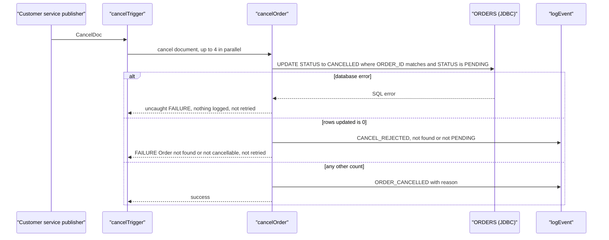

**5.2.5 Processing logic**
1. Update the order: `UPDATE ORDERS SET STATUS = 'CANCELLED' WHERE ORDER_ID = <cancel/orderId>
   AND STATUS = 'PENDING'`, and keep the affected row count as `rowsUpdated`
   (`order.process:cancelOrder` → `order.jdbc:updateOrderStatus`).
2. Decide on the row count (see 5.2.6):
   1. Count `0`: write audit line `CANCEL_REJECTED order=<id> not found or not PENDING` and end
      the service with failure "Order not found or not cancellable" (`order.process:cancelOrder`,
      `common.util:logEvent`).
   2. Any other value: write audit line `ORDER_CANCELLED order=<id> <reason>` and end successfully
      (`order.process:cancelOrder`, `common.util:logEvent`).

**5.2.6 Business rules & decision tables**
| Rule ID | Condition | Outcome | Source |
|---|---|---|---|
| CAP-02-R1 | `rowsUpdated = "0"`: no row with that `ORDER_ID` **and** status `PENDING`. This covers unknown ids, orders already `CANCELLED`, orders over 1000 that CAP-01 never stored, and a missing `orderId` | Log `CANCEL_REJECTED`, service fails "Order not found or not cancellable", not retried | `order.process:cancelOrder` |
| CAP-02-R2 | Any other value (`$default`): 1, or more than 1 if duplicate rows exist | Log `ORDER_CANCELLED` with the reason, service succeeds | `order.process:cancelOrder` |

Only `PENDING` orders can be cancelled. Because CAP-01 never moves an order past `PENDING`, that
means every stored order, including ones already charged (3.6, finding 1).

**5.2.7 Validations**
| Field | Check | On failure | Source |
|---|---|---|---|
| `cancel/orderId` | **None.** A missing id matches no row (SQL `= NULL` is never true) and falls under R1 `[TO CONFIRM: adapter behaviour with a null input]` | — | `order.process:cancelOrder` |
| `cancel/reason`, `cancel/requestedBy` | None | — | `order.process:cancelOrder` |

**5.2.8 Data mappings**
| Target | Source | Transformation / default | Source service |
|---|---|---|---|
| UPDATE `ORDER_ID` parameter | `cancel/orderId` | copy | `order.process:cancelOrder` → `order.jdbc:updateOrderStatus` |
| UPDATE new `STATUS` | literal | `"CANCELLED"` | same |
| UPDATE expected `STATUS` | literal | `"PENDING"` | same |
| `rowsUpdated` | adapter `updateCount` | copy (string) | `order.process:cancelOrder` |
| Audit `eventType` | literal | `"CANCEL_REJECTED"` (R1) or `"ORDER_CANCELLED"` (R2) | `order.process:cancelOrder` |
| Audit `orderId` | `cancel/orderId` | copy | `order.process:cancelOrder` |
| Audit `message` | literal or `cancel/reason` | R1: `"not found or not PENDING"`. R2: the reason, possibly missing | `order.process:cancelOrder` |

**5.2.9 Integrations used**
| System | Protocol / adapter | Operation / SQL / endpoint | Direction | Sync/async | Source |
|---|---|---|---|---|---|
| `ORDERS` table (`OrderDB_Conn`) | JDBC adapter | `UPDATE ORDERS SET STATUS = ? WHERE ORDER_ID = ? AND STATUS = ?` | Outbound | Sync | `order.jdbc:updateOrderStatus` |
| IS server log | `pub.flow:debugLog` via `common.util:logEvent` | function `ORDER_AUDIT`, level `Info` | Outbound | Sync | `common.util:logEvent` |

**5.2.10 Error handling & retries**
| Scenario | Detection | Action | Retry policy | Message / code | Final outcome |
|---|---|---|---|---|---|
| No `PENDING` order matches | `rowsUpdated = "0"` | Log `CANCEL_REJECTED`, `EXIT FAILURE` | None (trigger retries 0, and not an ISRuntimeException) | "Order not found or not cancellable" | Nothing changed. The request is lost. If the order arrives later (3.6, finding 4) it stays active |
| Database error | Exception from `order.jdbc:updateOrderStatus`, no TRY/CATCH | Propagates to the trigger | None | IS error | Nothing changed (or rolled back), nothing logged, request lost |

**5.2.11 Process flowchart**
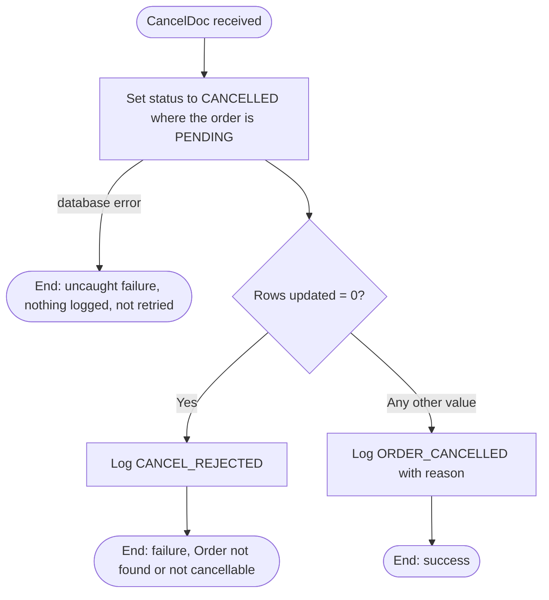

**5.2.12 Notes**
- **No refund or payment reversal.** Cancelling a charged order doesn't contact the payment
  gateway (3.6, finding 1).
- **`requestedBy` is never used**, so there is no record of who cancelled an order.
- **Missing reason.** If `reason` is absent, the audit line is built from `%message%` with no value
  `[TO CONFIRM: whether IS substitutes an empty string or leaves the literal]`.
- **Races with CAP-01.** See 3.6, findings 4 and 5.
- No step is `DISABLED`.

### 5.3 CAP-03 Order Status Lookup

**In plain English:** Other systems can ask "what is the status of order X?" over the web. The answer is the order number, status and amount, or "not found", or "bad request" when no order number was given. The status is always "PENDING" or "CANCELLED", because nothing ever stores any other value.

**5.3.1 Overview** — A REST resource that returns the identifier, status and amount of one order.
It answers 400 if the `orderId` parameter is missing, 404 if no row matches, and 200 with the
order otherwise. It reads `ORDERS` only. Only successful lookups are written to the audit log.
Because of how the other capabilities write the table, the status returned is always `PENDING`
or `CANCELLED` (3.6, finding 2).

**5.3.2 Trigger** — Legacy REST resource `order.api.orders:_get`, i.e.
`GET /rest/order/api/orders?orderId=<id>` (`order.api.orders:_get`). The query parameter arrives
as the pipeline input `orderId`, the output pipeline becomes the response body, and
`pub.flow:setResponseCode` sets non-200 statuses.
`[TO CONFIRM: ACL / authentication on the resource, and response format (JSON or XML by Accept
header).]`

**5.3.3 Inputs / Outputs**
| Direction | Field | Type | Mandatory | Description / allowed values | Source |
|---|---|---|---|---|---|
| In | `orderId` (query parameter) | string | Optional in the signature, required by the logic | Order to look up | `order.api.orders:_get` |
| Out | HTTP status | — | — | `200` (default), `400 Bad Request`, `404 Not Found`. Error on database failure `[TO CONFIRM]` | `order.api.orders:_get` |
| Out | `order/orderId`, `order/status`, `order/amount` | string | On 200 | From `ORDERS.ORDER_ID`, `STATUS`, `AMOUNT` | `order.api.orders:_get` |
| Out | `error` | string | On 400/404 | `"orderId is required"` or `"Order not found"` | `order.api.orders:_get` |

The response goes to the REST caller (unlike the trigger-invoked capabilities).

**5.3.4 Sequence diagram**
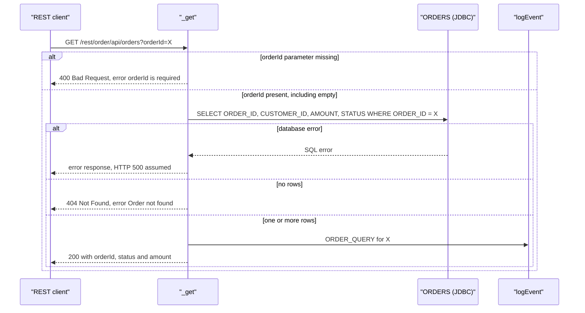

**5.3.5 Processing logic**
1. If the `orderId` parameter is missing (`$null`), set the response to `400 Bad Request`, set
   `error = "orderId is required"` and end. An empty value (`?orderId=`) is **not** `$null` and
   carries on (`order.api.orders:_get`).
2. Read the order: `SELECT ORDER_ID, CUSTOMER_ID, AMOUNT, STATUS FROM ORDERS WHERE ORDER_ID = ?`
   (`order.jdbc:selectOrder`).
3. Count the rows returned (`pub.list:sizeOfList`).
4. If there are 0 rows, set the response to `404 Not Found`, set `error = "Order not found"` and
   end (`order.api.orders:_get`).
5. Otherwise copy `ORDER_ID`, `STATUS` and `AMOUNT` into `order`. `CUSTOMER_ID` is selected but not
   returned (`order.api.orders:_get`). `[TO CONFIRM: which row is returned when several match]`
6. Write audit line `ORDER_QUERY order=<id>` (no message) and return 200 with `order`
   (`common.util:logEvent`).

**5.3.6 Business rules & decision tables**
| Rule ID | Condition | Outcome | Source |
|---|---|---|---|
| CAP-03-R1 | `orderId` missing (`$null`) | 400 Bad Request, `error = "orderId is required"`. No database read, no log | `order.api.orders:_get` |
| CAP-03-R2 | Any other value (`$default`), **including an empty string** | Continue to the database read | `order.api.orders:_get` |
| CAP-03-R3 | Row count `"0"` | 404 Not Found, `error = "Order not found"`. No log | `order.api.orders:_get` |
| CAP-03-R4 | Any other row count (`$default`) | 200 with `order`, `ORDER_QUERY` logged | `order.api.orders:_get` |

**5.3.7 Validations**
| Field | Check | On failure | Source |
|---|---|---|---|
| `orderId` | Must be present | 400 (R1) | `order.api.orders:_get` |
| `orderId` | **No** check for empty value or format | An empty id gives 404, not 400 | `order.api.orders:_get` |

**5.3.8 Data mappings**
| Target | Source | Transformation / default | Source service |
|---|---|---|---|
| SELECT `ORDER_ID` parameter | `orderId` | copy | `order.api.orders:_get` → `order.jdbc:selectOrder` |
| `resultCount` | `pub.list:sizeOfList(results)` | row count | `order.api.orders:_get` |
| `order/orderId` | `results/ORDER_ID` | copy | `order.api.orders:_get` |
| `order/status` | `results/STATUS` | copy. Only `PENDING` or `CANCELLED` can exist (3.6) | `order.api.orders:_get` |
| `order/amount` | `results/AMOUNT` | copy | `order.api.orders:_get` |
| `error` | literal | `"orderId is required"` (R1), `"Order not found"` (R3) | `order.api.orders:_get` |
| HTTP status | literal | `400 Bad Request` (R1), `404 Not Found` (R3) via `pub.flow:setResponseCode` | `order.api.orders:_get` |
| Audit `eventType` / `orderId` | literal / `orderId` | `"ORDER_QUERY"`, request id | `order.api.orders:_get` |

**5.3.9 Integrations used**
| System | Protocol / adapter | Operation / SQL / endpoint | Direction | Sync/async | Source |
|---|---|---|---|---|---|
| REST clients | HTTP | `GET /rest/order/api/orders` | Inbound | Sync | `order.api.orders:_get` |
| `ORDERS` table (`OrderDB_Conn`) | JDBC adapter | `SELECT ORDER_ID, CUSTOMER_ID, AMOUNT, STATUS FROM ORDERS WHERE ORDER_ID = ?` | Outbound | Sync | `order.jdbc:selectOrder` |
| IS server log | `pub.flow:debugLog` via `common.util:logEvent` | function `ORDER_AUDIT`, level `Info` | Outbound | Sync | `common.util:logEvent` |

**5.3.10 Error handling & retries**
| Scenario | Detection | Action | Retry policy | Message / code | Final outcome |
|---|---|---|---|---|---|
| Parameter missing | `$null` on `orderId` | Set 400 and `error` | None | 400, "orderId is required" | No read, no log |
| Order not found (or empty id) | Row count `0` | Set 404 and `error` | None | 404, "Order not found" | No log |
| Database error | Exception from `order.jdbc:selectOrder`, no TRY/CATCH | Propagates to the REST layer | None | `[TO CONFIRM: HTTP 500 and whether the exception text is exposed to the caller]` | No log |

**5.3.11 Process flowchart**
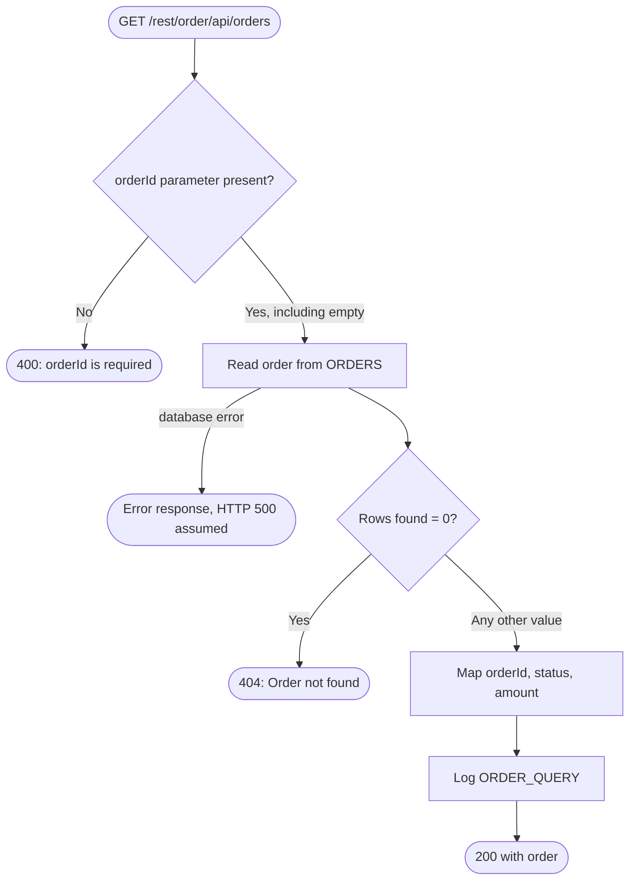

**5.3.12 Notes**
- **Only successful lookups are logged.** 400, 404 and errors leave no audit line.
- **Security not visible.** The resource returns `amount` to anyone who knows an `orderId`, and no
  ACL appears in the package (3.8, A7).
- **Stale status.** Paid orders show `PENDING`, and orders over 1000 return 404 (3.6).
- **An empty `orderId` returns 404, not 400.**
- `CUSTOMER_ID` is read but not returned.
- No step is `DISABLED`.

## 6. Common Services

| Service | Package | Purpose | Used by |
|---|---|---|---|
| `common.util:logEvent` | CommonUtils | Builds `"<eventType> order=<orderId> <message>"` and writes it with `pub.flow:debugLog`, function `ORDER_AUDIT`, level `Info` | CAP-02 (`order.process:cancelOrder`), CAP-03 (`order.api.orders:_get`) |

CAP-01 does not use it and has no logging at all (3.8, A3). Whether `Info` lines reach the log
depends on the server's logging configuration `[TO CONFIRM]`.

## 7. Data Dictionary

### `order.docs:OrderDoc`
| Field | Type | Cardinality | Description |
|---|---|---|---|
| `orderId` | string | 1 | Unique order identifier generated upstream by the storefront |
| `customerId` | string | 1 | Customer identifier |
| `amount` | string (decimal) | 1 | Order total in USD, represented as a decimal string |
| `status` | string | 0..1 | Incoming status (the trigger filter requires `NEW`) |
| `lines` | record | 0..n | Order line items |
| `lines/sku` | string | 1 | Product SKU |
| `lines/qty` | string | 1 | Quantity ordered |
| `lines/price` | string | 1 | Unit price |

### `order.docs:CancelDoc`
| Field | Type | Cardinality | Description |
|---|---|---|---|
| `orderId` | string | 1 | Order to cancel |
| `reason` | string | 0..1 | Free-text reason, written to the audit log |
| `requestedBy` | string | 1 | User or system that asked for the cancellation. Never used |

### Table `ORDERS` (columns inferred from the adapter SQL)
| Column | Written by | Read by | Values seen in code |
|---|---|---|---|
| `ORDER_ID` | CAP-01 INSERT | CAP-02 WHERE, CAP-03 SELECT/WHERE | From `OrderDoc.orderId` |
| `CUSTOMER_ID` | CAP-01 INSERT | CAP-03 SELECT (not returned) | From `OrderDoc.customerId` |
| `AMOUNT` | CAP-01 INSERT | CAP-03 SELECT | From `OrderDoc.amount` (string) |
| `STATUS` | CAP-01 INSERT, CAP-02 UPDATE | CAP-02 WHERE, CAP-03 SELECT | `PENDING`, `CANCELLED` |

Column types, keys and constraints are not visible `[TO CONFIRM: DDL, especially a unique key on
ORDER_ID]`.

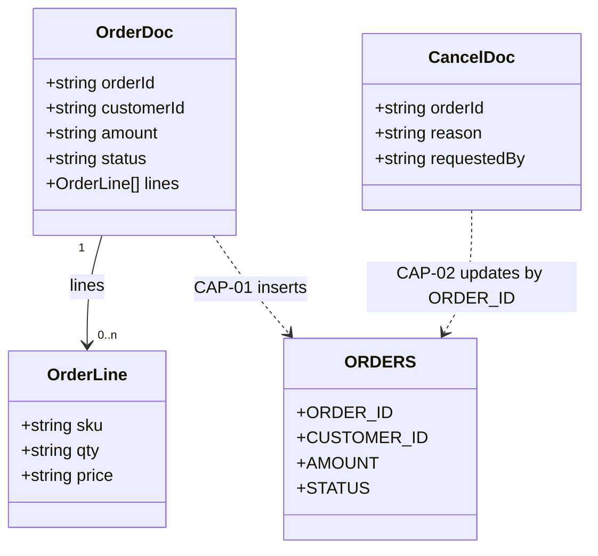

## 8. Integration Catalog
| System | Protocol / adapter | Connection / endpoint alias | Operations | Used by |
|---|---|---|---|---|
| `ORDERS` table | JDBC adapter | `OrderDB_Conn` | INSERT (CAP-01), UPDATE (CAP-02), SELECT (CAP-03) | `order.jdbc:insertOrder`, `order.jdbc:updateOrderStatus`, `order.jdbc:selectOrder` |
| Payment gateway | HTTP | Hard-coded URL `https://payments.internal/charge`, no alias | Charge request (method not set in the flow) | CAP-01 |
| `OrderDoc` publisher | Publish/subscribe | Broker/UM `[TO CONFIRM]` | Subscribe, filter `status == 'NEW'` | CAP-01 |
| `CancelDoc` publisher | Publish/subscribe | Broker/UM `[TO CONFIRM]` | Subscribe | CAP-02 |
| REST clients | HTTP | `/rest/order/api/orders` | GET | CAP-03 |
| IS server log | `pub.flow:debugLog` | — | Write audit line | CAP-02, CAP-03 |

## 9. Error Catalog
| Message / code | Raised by | Where | Resulting behaviour |
|---|---|---|---|
| "orderId is required" (ServiceException) | `order.process:validateOrder` | CAP-01 | Caught and replaced by the generic CAP-01 message. Never logged |
| "amount must be numeric" | `order.process:validateOrder` | CAP-01 | Same as above |
| "amount must be greater than zero" | `order.process:validateOrder` | CAP-01 | Same as above |
| "Order could not be validated or persisted" | `EXIT FAILURE` | CAP-01 CATCH | Service fails. Not retried |
| Transport error after 4 attempts | `pub.client:http` | CAP-01 | Uncaught. Row kept or rolled back per transaction type |
| HTTP 4xx/5xx from the gateway | Not raised | CAP-01 | Treated as success |
| "Order not found or not cancellable" | `EXIT FAILURE` | CAP-02 | Service fails after logging `CANCEL_REJECTED`. Not retried |
| Database error on UPDATE | `order.jdbc:updateOrderStatus` | CAP-02 | Uncaught. Not logged. Not retried |
| HTTP 400 "orderId is required" | `pub.flow:setResponseCode` + `error` | CAP-03 | Returned to the caller. Not logged |
| HTTP 404 "Order not found" | `pub.flow:setResponseCode` + `error` | CAP-03 | Returned to the caller. Not logged |
| Database error on SELECT | `order.jdbc:selectOrder` | CAP-03 | Uncaught. Error response (HTTP 500 assumed) `[TO CONFIRM]` |

The CAP-01 validation message "orderId is required" and the CAP-03 HTTP 400 message share the
same text but come from different services.

## 10. Configuration & Environment Dependencies
- **Packages:** `OrderProcessing` requires `WmPublic` and `CommonUtils`. `CommonUtils` requires
  `WmPublic`. See 3.2.
- **JDBC connection:** `OrderDB_Conn`, shared by all three adapters. Its transaction type and pool
  size are not supplied `[TO CONFIRM]`.
- **Hard-coded HTTP endpoint:** `https://payments.internal/charge` (CAP-01).
- **Triggers:** `orderTrigger` (serial, 3 retries configured, filter `status == 'NEW'`) and
  `cancelTrigger` (concurrent with 4 threads, 0 retries). Neither retry setting is effective for
  the errors these services raise.
- **REST:** resource at `/rest/order/api/orders`. ACL not visible `[TO CONFIRM]`.
- **Logging:** `pub.flow:debugLog` function `ORDER_AUDIT`, level `Info`.
- No startup/shutdown services, scheduler tasks or global variables were found.
  `[TO CONFIRM: outside-package configuration.]`

## 11. Non-Functional Characteristics Observed in Code
- **Transactions:** no explicit `pub.art.transaction:*` boundaries anywhere. All three capabilities
  depend on the transaction type of `OrderDB_Conn`.
- **Retries:** only the CAP-01 payment call (up to 4 attempts in total, 5 s apart, transport
  errors only). No effective trigger retries.
- **Concurrency:** CAP-01 serial, CAP-02 concurrent (4), CAP-03 one per HTTP request. There is no
  locking between capabilities apart from the `STATUS = 'PENDING'` condition on the cancel UPDATE.
- **Idempotency:** CAP-01 has none (redelivery can insert and charge twice). CAP-02 is naturally
  idempotent (a second cancel matches 0 rows, but then fails). CAP-03 is read-only.
- **Timeouts:** none set for the HTTP call or the database `[TO CONFIRM: defaults]`.
- **Logging/audit:** CAP-02 logs both outcomes. CAP-03 logs successes only. CAP-01 logs nothing.
- **Security:** no authentication or ACL is visible for the REST resource or the triggers.
- **Numeric handling:** amounts are strings, multiplied as floating-point numbers in CAP-01.

## 12. Re-implementation Notes (target: Java)

**12.0 Target structure (proposal)** — All three capabilities share one table and one status
lifecycle, so a single service that owns `ORDERS` is the simplest faithful port. Splitting it
would turn today's shared-table coupling into distributed coordination.

| Today (webMethods) | Proposed Java module / class | Notes |
|---|---|---|
| Package `OrderProcessing` | Spring Boot service `order-service` | Owns `ORDERS` |
| CAP-01 `orderTrigger` + `submitOrder` + `validateOrder` | `OrderIntakeListener` → `OrderSubmissionService`, `OrderValidator` | Messaging adapter + service |
| CAP-02 `cancelTrigger` + `cancelOrder` | `OrderCancellationListener` → `OrderCancellationService` | Messaging adapter + service |
| CAP-03 `order.api.orders:_get` | `OrderQueryController` (`GET /rest/order/api/orders`) | Keep the path so callers don't change |
| `order.jdbc:*` adapters | `OrderRepository` (JdbcTemplate) | One class for the three statements |
| Package `CommonUtils` / `common.util:logEvent` | `AuditLogger` in a small shared library (or a class in the service) | SLF4J logger `ORDER_AUDIT` |
| `order.docs:*` | `OrderDoc`, `OrderLine`, `CancelDoc` records + JSON/message mapping | Data contracts |

**12.1 Construct mapping**
| webMethods element | Behaviour to reproduce | Java equivalent |
|---|---|---|
| `orderTrigger` (serial, filter `status == 'NEW'`) | One document at a time, only `NEW`. Ordinary failures not retried | JMS/Kafka listener, concurrency 1, selector/filter on `status`. Retry only exceptions marked as transient |
| `cancelTrigger` (concurrent, 4) | Up to 4 in parallel, no retries | Listener with concurrency 4, no retry |
| REST resource `_get` | `GET /rest/order/api/orders?orderId=`, outputs as body | `@GetMapping("/rest/order/api/orders")` with `@RequestParam(required = false) String orderId` |
| `pub.flow:setResponseCode` | 400 / 404 with `{ "error": … }`, otherwise 200 with `{ "order": … }` | `ResponseEntity.status(…).body(…)` |
| `submitOrder` | Steps in 5.1.5. Result discarded | `OrderSubmissionService.submit(OrderDoc)` returning `void` (or a result per D2) |
| `cancelOrder` | Steps in 5.2.5 | `OrderCancellationService.cancel(CancelDoc)` |
| `validateOrder` | Three checks in 5.1.7, first failure wins | `OrderValidator.validate(OrderDoc)` throwing `OrderValidationException` |
| BRANCH `%amount% > 1000` / `$default` | Runs before validation. Anything not over 1000 continues | `if (isOver(amount, 1000)) { … return; }`, string comparison per Q7 |
| BRANCH `$null` (CAP-03) | Only a *missing* parameter → 400. Empty → continue | `if (orderId == null)` (not `isBlank`) to match today |
| BRANCH on row count `"0"` | Zero vs any other count | `if (count == 0)` |
| LOOP + `pub.math:multiplyFloats` | Per-line `qty × price` as `double`, unused | Drop it, or keep it, per D5 |
| `pub.list:sizeOfList` | Row count | `results.size()` |
| `order.jdbc:insertOrder` / `updateOrderStatus` / `selectOrder` | SQL in 5.1.9 / 5.2.9 / 5.3.9 | `OrderRepository.insert / updateStatus(id, expected, new) → int / findById → List` |
| TRY/CATCH + `getLastError` + `EXIT FAILURE` (CAP-01) | Validation or insert error → generic failure, cause dropped | `catch (Exception e) { throw new OrderProcessingException("Order could not be validated or persisted"); }`. D6 covers keeping the cause |
| `EXIT FAILURE` (CAP-02) | Fail with "Order not found or not cancellable" | `throw new OrderNotCancellableException(…)`, not retried |
| `pub.client:http` + REPEAT `COUNT=3` | Up to 4 attempts, 5 s apart, transport exceptions only. Ignore HTTP status | `RestClient` + Resilience4j `Retry` (`maxAttempts=4`, `waitDuration=5s`, `retryExceptions=IOException`). Don't fail on non-2xx unless D3 says so |
| `common.util:logEvent` / `pub.flow:debugLog` | `"<eventType> order=<id> <message>"` at Info | `auditLog.info("{} order={} {}", eventType, orderId, message)` |
| Implicit adapter transaction | Depends on `OrderDB_Conn` | NO_TRANSACTION → auto-commit. LOCAL/XA → `@Transactional` per service method |
| `%orderId%-CONF` | Text concatenation | `orderId + "-CONF"` |

**12.2 Behaviour decisions (reproduce exactly or fix)**
| # | Current behaviour | Evidence | Options | Decision owner |
|---|---|---|---|---|
| D1 | `ORDERS.STATUS` stays `PENDING` after CAP-01, whatever the payment result | 5.1.12, 3.6 | Reproduce, or UPDATE to `CONFIRMED` / `FAILED` | Business owner |
| D2 | CAP-01 status and confirmation number go nowhere | 5.1.3 | Reproduce, or publish a result event / store the confirmation number | Business owner |
| D3 | Declined or failed charges (HTTP 4xx/5xx) count as success | 5.1.10 | Reproduce, or treat non-2xx as failure | Business + payments |
| D4 | Orders over 1000 are dropped, not queued for approval | 5.1.6 | Reproduce, or store/publish them for approval | Business owner |
| D5 | Line totals calculated and ignored | 5.1.5 | Drop it, or check that the lines add up to `amount` | Business analyst |
| D6 | CAP-01 error details are lost | 5.1.10 | Reproduce the generic message, or log and keep the cause | Tech lead |
| D7 | Money handled as floating point | `multiplyFloats`, `Double.parseDouble` | `double` to match, or `BigDecimal` | Tech lead + finance |
| D8 | Duplicate `OrderDoc` delivery may insert and charge twice | 11 | Reproduce, or de-duplicate on `orderId` | Tech lead |
| D9 | Charged orders can be cancelled with no refund | 3.6, finding 1 | Reproduce, block cancel after charge, or trigger a refund | Business + payments |
| D10 | A cancel processed before its order exists is lost. A cancel during payment still charges | 3.6, findings 4–5 | Reproduce, park and retry early cancels, or lock/check status before charging | Tech lead + business |
| D11 | REST lookup has no visible security | 3.8, A7 | Reproduce (if secured outside the package), or add authentication | Security |
| D12 | Logging and error handling differ per capability | 3.7 | Reproduce per capability, or apply one audit/error policy | Tech lead |
| D13 | Multiple rows for one `ORDER_ID` give an unclear lookup result | 3.6, finding 6 | Reproduce (first row?), or enforce a unique key | DBA + tech lead |

**12.3 Data types**
| Field | IS type | Meaning | Recommended Java type | Note |
|---|---|---|---|---|
| `orderId` | String | Identifier | `String` | Non-blank in CAP-01. Unchecked in CAP-02/03 |
| `customerId` | String | Identifier | `String` | Not validated |
| `amount` / `AMOUNT` | String | USD total | `BigDecimal` (or `double` to match, D7) | `Double.parseDouble` accepts "1e3" and "NaN" today |
| `lines/qty`, `lines/price` | String | Quantity, unit price | `int`/`BigDecimal`, `BigDecimal` | Multiplied as float today |
| `status` / `STATUS` | String | Order state | `enum OrderStatus { PENDING, PENDING_APPROVAL, FAILED, CONFIRMED, CANCELLED }` | Only `PENDING` and `CANCELLED` are ever stored |
| `updateCount`, `resultCount` | String | Row counts | `int` | Compared with the string `"0"` today |
| `reason`, `requestedBy` | String | Free text, actor | `String` | `requestedBy` unused today |

**12.4 Idempotency, transactions and concurrency** — CAP-01 inserts first and charges second,
with no de-duplication: redelivery can insert twice and charge twice (D8). If every payment
attempt fails to connect, whether the `PENDING` row survives depends on the `OrderDB_Conn`
transaction type. CAP-02's conditional UPDATE is safe to repeat, but a repeat counts as a failure.
The two listeners must keep today's independence (or fix it on purpose, D10): CAP-02 at
concurrency 4 can overtake CAP-01. CAP-03 is read-only.

**12.5 Acceptance test cases** (describe current behaviour; update them if a decision in 12.2 changes it)
| ID | Input / precondition | Expected observable outcome | Covers |
|---|---|---|---|
| T01 | `OrderDoc` `amount = "1500"`, valid | No INSERT, no HTTP call, service succeeds | CAP-01-R1 |
| T02 | `amount = "1000"`, gateway 200 | 1 INSERT `PENDING`, 1 HTTP call, success | CAP-01-R2 boundary |
| T03 | `amount = "250"`, 2 lines, gateway 200 | 1 INSERT `PENDING`, 1 HTTP call with `orderId` and `amount = "250"`, no UPDATE | CAP-01 5.1.5 |
| T04 | `orderId = ""` | No INSERT, no HTTP, failure "Order could not be validated or persisted" | CAP-01 validation |
| T05 | `amount = "abc"` | Branch result `[TO CONFIRM]`, then validation failure as T04 | CAP-01-R2, validation |
| T06 | `amount = "0"` and `"-5"` | Validation failure as T04 | CAP-01 validation |
| T07 | INSERT throws | No HTTP, failure as T04 | CAP-01 errors |
| T08 | Gateway refuses connections every time | 4 attempts about 5 s apart, service fails. Row per transaction type | CAP-01 retry |
| T09 | Gateway refuses twice, then 200 | 3 attempts, success, row `PENDING` | CAP-01 retry |
| T10 | Gateway returns 402 or 500 | 1 attempt, success, row `PENDING` | CAP-01, D3 |
| T11 | Same `OrderDoc` delivered twice | 2 INSERT attempts, up to 2 charges `[TO CONFIRM: unique key]` | D8 |
| T12 | `OrderDoc` with `status = "PAID"` | Trigger skips it | CAP-01 trigger |
| T13 | Valid order with empty `lines` | Saved and charged as normal | CAP-01 validation gap |
| T14 | `CancelDoc` for a `PENDING` order | Row → `CANCELLED`, log `ORDER_CANCELLED order=<id> <reason>`, success | CAP-02-R2 |
| T15 | `CancelDoc` for an unknown id | No change, log `CANCEL_REJECTED`, failure "Order not found or not cancellable", not retried | CAP-02-R1 |
| T16 | `CancelDoc` for an already `CANCELLED` order | As T15 | CAP-02-R1 |
| T17 | `CancelDoc` without `orderId` | As T15 `[TO CONFIRM: adapter null handling]` | CAP-02 validation |
| T18 | Database error on the cancel UPDATE | Failure, nothing logged, not retried | CAP-02 errors |
| T19 | Submit (T03) completes, then `CancelDoc` | Row `CANCELLED`, customer stays charged, no gateway call | D9, cross-capability |
| T20 | `CancelDoc` processed before the matching `OrderDoc` | Cancel fails (T15), then order inserted `PENDING` and charged | D10, cross-capability |
| T21 | `CancelDoc` processed between CAP-01's INSERT and charge | Row `CANCELLED`, charge still sent | D10, cross-capability |
| T22 | `GET /rest/order/api/orders` (no parameter) | 400, `{error: "orderId is required"}`, no DB read, no log | CAP-03-R1 |
| T23 | `GET …?orderId=` (empty) | 404, `{error: "Order not found"}`, no log | CAP-03-R2, R3 |
| T24 | `GET …?orderId=<unknown>` | 404, no log | CAP-03-R3 |
| T25 | `GET …?orderId=<existing>` | 200, `{order: {orderId, status, amount}}`, log `ORDER_QUERY order=<id>` | CAP-03-R4 |
| T26 | `GET` for an order submitted and paid (T03) | 200 with `status = "PENDING"` | D1, cross-capability |
| T27 | `GET` for an order over 1000 (T01) | 404 | D4, cross-capability |
| T28 | Database down on `GET` | Error response, HTTP 500 assumed `[TO CONFIRM]`, no log | CAP-03 errors |

## 13. Open Questions
| # | Question | Context / service | Owner |
|---|---|---|---|
| Q1 | What HTTP method, headers, auth and timeout should the payment call use? None are set in the flow | `order.process:submitOrder` | Integration team |
| Q2 | What are the transaction type and pool size of `OrderDB_Conn`? They decide rollback behaviour for all three capabilities | `order.jdbc:*` | DBA / IS admin |
| Q3 | Should `ORDERS.STATUS` be updated to `CONFIRMED` / `FAILED`? (D1) | `order.process:submitOrder` | Business owner |
| Q4 | Where are orders over 1000 approved? They are neither stored nor published (D4) | `order.process:submitOrder` | Business owner |
| Q5 | Should the CAP-01 status or confirmation number reach anyone? (D2) | `order.process:submitOrder` | Business owner |
| Q6 | Is treating HTTP 4xx/5xx (e.g. declined payment) as success intended? (D3) | `order.process:submitOrder` | Payments |
| Q7 | How does IS evaluate `%amount% > 1000` for strings such as "1000.50", "1,200" or "abc"? | `order.process:submitOrder` | IS developer |
| Q8 | What are the real trigger settings (concurrency, retries, "on retry failure")? Does the JDBC adapter report transient errors as retryable? | `order.triggers:*` | IS admin |
| Q9 | Is `ORDERS.ORDER_ID` unique? (D8, D13) | `ORDERS` | DBA |
| Q10 | Should the gateway URL become an endpoint alias? | `order.process:submitOrder` | Integration team |
| Q11 | Are there scheduler tasks, global variables or UM/Broker settings outside the packages? | Application-wide | IS admin |
| Q12 | What ACL / authentication protects `/rest/order/api/orders`? (D11) | `order.api.orders:_get` | Security |
| Q13 | What does the REST resource return on a database error (status, body, exception text)? Which content types are supported? | `order.api.orders:_get` | IS developer |
| Q14 | Should cancelling a charged order trigger a refund, or be blocked? (D9) | `order.process:cancelOrder` | Business + payments |
| Q15 | Can a `CancelDoc` arrive before its `OrderDoc` is processed? How should early cancels be handled? (D10) | Both triggers | Business + integration |
| Q16 | Which row does CAP-03 return when several match? (D13) | `order.api.orders:_get` | IS developer |
| Q17 | When `reason` is missing, does `%message%` become empty or stay literal in the audit line? | `common.util:logEvent` | IS developer |
| Q18 | Is the server log configured so that `ORDER_AUDIT` Info lines are kept? | `common.util:logEvent` | IS admin |
| Q19 | Should `requestedBy` be recorded for cancellations? (A8) | `order.process:cancelOrder` | Business owner |
| Q20 | Which systems actually publish `OrderDoc` and `CancelDoc`? | Triggers | Integration team |

## Appendix A — Service Inventory
| Name | Package | Kind | Capability | Purpose |
|---|---|---|---|---|
| `order.process:submitOrder` | OrderProcessing | Flow service | CAP-01 | Validates, saves and charges an order |
| `order.process:validateOrder` | OrderProcessing | Java service | CAP-01 | Checks `orderId` is present and `amount` is a positive number |
| `order.jdbc:insertOrder` | OrderProcessing | JDBC adapter service | CAP-01 | Inserts the order into `ORDERS` |
| `order.triggers:orderTrigger` | OrderProcessing | Trigger | CAP-01 | Subscribes to `OrderDoc` (`status == 'NEW'`), invokes `submitOrder` |
| `order.process:cancelOrder` | OrderProcessing | Flow service | CAP-02 | Cancels a `PENDING` order and logs the outcome |
| `order.jdbc:updateOrderStatus` | OrderProcessing | JDBC adapter service | CAP-02 | Conditional status UPDATE on `ORDERS` |
| `order.triggers:cancelTrigger` | OrderProcessing | Trigger | CAP-02 | Subscribes to `CancelDoc`, invokes `cancelOrder` |
| `order.api.orders:_get` | OrderProcessing | Flow service (REST resource) | CAP-03 | `GET /rest/order/api/orders` status lookup |
| `order.jdbc:selectOrder` | OrderProcessing | JDBC adapter service | CAP-03 | Reads one order by id |
| `common.util:logEvent` | CommonUtils | Flow service | CAP-02, CAP-03 | Audit line to the server log |
| `order.docs:OrderDoc` | OrderProcessing | Document type | CAP-01 | New order contract |
| `order.docs:CancelDoc` | OrderProcessing | Document type | CAP-02 | Cancellation request contract |

## Appendix B — Coverage Report

**Services** — all 12 nodes in `inventory.json` appear in Sections 3 and 5 and in Appendix A. No gaps.

**Branches, exits, catches and retries**
| Service | Construct | Addressed in |
|---|---|---|
| `submitOrder` | BRANCH `%amount% > 1000` / `$default` | CAP-01-R1 / R2 (5.1.6) |
| `submitOrder` | `EXIT $flow SUCCESS` after approval | 5.1.5 step 2 |
| `submitOrder` | TRY + CATCH + `EXIT $flow FAILURE` | 5.1.10 rows 1–2 |
| `submitOrder` | LOOP `order/lines` → `lineAmounts` | 5.1.5 step 3.2 |
| `submitOrder` | REPEAT (COUNT 3, back-off 5 s) | 5.1.10 rows 3–4, 12.1 |
| `submitOrder` | Final `EXIT $flow SUCCESS` | 5.1.5 step 5 |
| `cancelOrder` | BRANCH on `rowsUpdated`: CASE `0` / `$default` | CAP-02-R1 / R2 (5.2.6) |
| `cancelOrder` | `EXIT $flow FAILURE` "Order not found or not cancellable" | 5.2.10 row 1 |
| `_get` | BRANCH on `orderId`: `$null` / `$default` | CAP-03-R1 / R2 (5.3.6) |
| `_get` | BRANCH on `resultCount`: CASE `0` / `$default` | CAP-03-R3 / R4 (5.3.6) |
| `_get` | `EXIT $flow SUCCESS` after 400 and after 404 | 5.3.5 steps 1 and 4 |
| `logEvent` | MAP + `pub.flow:debugLog` | Section 6 |

**Semantic flags from the extract**
| Flag | Addressed in |
|---|---|
| `submitOrder`: `$default` also catches missing / non-numeric values | CAP-01-R2, Q7, T05 |
| `submitOrder`: `lineAmounts` never used | 5.1.5, 5.1.12, D5 |
| `submitOrder`: `lastError` never logged or rethrown | 5.1.10, 5.1.12, D6 |
| `submitOrder`: `pub.client:http` status never checked | 5.1.10, D3, T10 |
| `submitOrder`: `status` changed after insert, never re-saved | 5.1.12, 3.6, D1 |
| `submitOrder`: floating-point money | 5.1.12, 12.3, D7 |
| `submitOrder`: outputs discarded (trigger-invoked) | 5.1.3, D2 |
| `validateOrder`: floating-point money | 5.1.7, 12.3, D7 |
| `orderTrigger`: trigger retries never happen | 5.1.2, Q8 |
| `cancelTrigger`: trigger retries never happen | 5.2.2, Q8 |

**Architecture observations from the extract**
| Observation | Addressed in |
|---|---|
| `ORDERS` shared by 3 capabilities | 3.6 (lifecycle + 7 combined findings), A1, D1, D9, D10, D13 |
| Logging inconsistent | 3.7, A3, D12 |
| Error handling inconsistent | 3.7, A4, D12 |
| Hard-coded payment URL | A5, Q10 |
| All adapters share `OrderDB_Conn` | A6, Q2 |

**Needs SME review** — the 20 open questions in Section 13 and the 13 decisions in 12.2.
