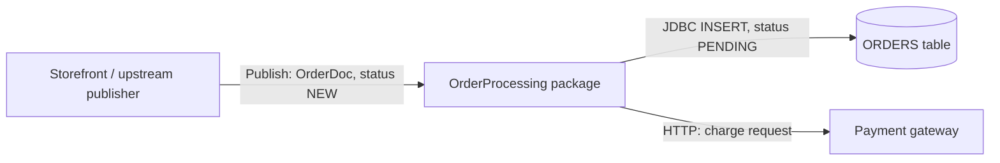
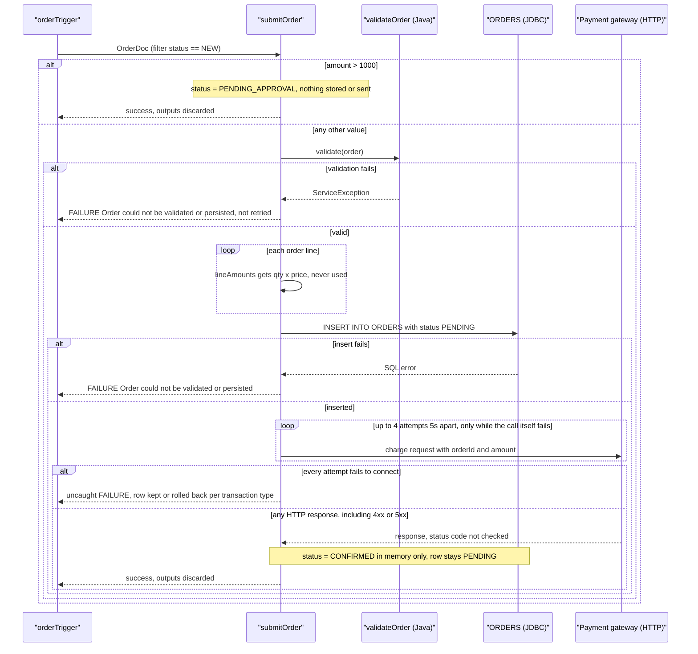
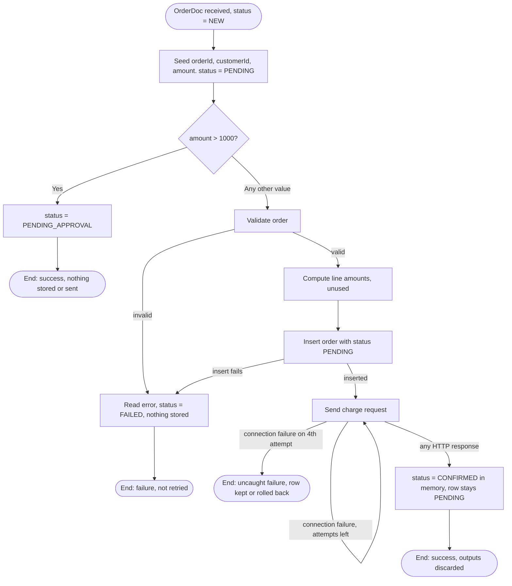
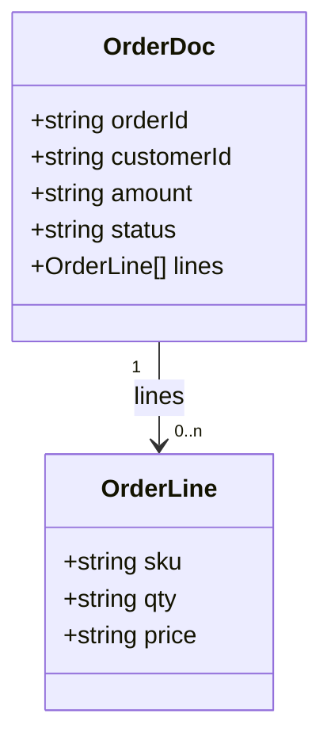
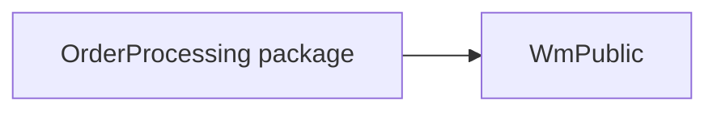

# Functional Specification — OrderProcessing

| Item | Value |
|---|---|
| Source packages | OrderProcessing 1.0 |
| Generated from | Sample package at `sample/OrderProcessing` (synthetic test fixture for the `wm-fsd` agent/skill) |
| Status | Draft — reverse-engineered, pending SME review |

## 1. Introduction

**1.1 Purpose** — Describes what the `OrderProcessing` webMethods Integration Server package
actually does at runtime, so it can be signed off by the business and re-implemented in Java
without opening Designer.

**1.2 Scope** — In scope: everything inside the `OrderProcessing` package folder (1 flow service,
1 Java service, 1 JDBC adapter service, 1 document type, 1 trigger). Not supplied: scheduler
exports, global variables, JDBC connection settings (including transaction type), trigger "on
retry failure" settings, and UM/Broker configuration. See Section 12 (Open Questions). Section 11
covers the Java migration.

**1.3 Glossary**
| Term | Meaning |
|---|---|
| IS | webMethods Integration Server |
| Flow service | Declarative webMethods service built from MAP, BRANCH, LOOP, INVOKE and similar steps |
| Trigger | IS subscription that invokes a service when a matching document is published. The service's outputs are discarded |
| `$default` | BRANCH case taken when no other case matches, including missing or non-numeric values |
| ISRuntimeException | The only kind of error that makes IS retry a trigger |
| CAP-01 | Capability 1, Order Submission (the only capability in this package) |

## 2. System Context

`OrderProcessing` receives new orders published as `OrderDoc` documents. It marks orders over
1000 for approval (and then stops), and validates and stores the rest in the `ORDERS` table
before sending a charge request to a payment gateway. Nothing is published back.

## 3. Capability Summary
| ID | Capability | Entry point | Initiated by | Frequency / volume |
|---|---|---|---|---|
| CAP-01 | Order Submission | `order.process:submitOrder` | Trigger `order.triggers:orderTrigger` on `order.docs:OrderDoc` (filter `status == 'NEW'`) | `[TO CONFIRM: volume not visible in code]` |

## 4. Capabilities

### 4.1 CAP-01 Order Submission

**4.1.1 Overview** — Receives a new customer order published as an `OrderDoc`. Orders over 1000
are marked for manual approval and processing stops. Other orders are validated, inserted into the
`ORDERS` table and charged through a payment gateway. What actually results: at most one `ORDERS`
row, always with status `PENDING`, plus charge requests to the gateway. The final status and
confirmation number are calculated but never stored or sent anywhere (see 4.1.12).

**4.1.2 Trigger** — Document trigger `order.triggers:orderTrigger`, subscribed to
`order.docs:OrderDoc`, filter `status == 'NEW'`, processing documents **serially** (one at a
time) (`order.triggers:orderTrigger`). The trigger is configured for 3 retries 5 s apart, but
Integration Server retries only when the service throws an ISRuntimeException. `submitOrder`
never does this explicitly, so validation, database and payment failures are **not** retried by
the trigger (`order.triggers:orderTrigger`, `order.process:submitOrder`).
`[TO CONFIRM: the trigger's "on retry failure" setting, and whether the JDBC adapter reports
transient database errors as retryable.]`

**4.1.3 Inputs / Outputs**
| Direction | Field | Type | Mandatory | Description / allowed values | Source |
|---|---|---|---|---|---|
| In | `order` | `order.docs:OrderDoc` | Yes | The order to submit | `order.process:submitOrder` |
| In | `order/orderId` | string | Yes (validated) | Unique order identifier from the storefront | `order.docs:OrderDoc` |
| In | `order/customerId` | string | Not validated | Customer identifier | `order.docs:OrderDoc` |
| In | `order/amount` | string (decimal) | Yes (validated) | Order total in USD | `order.docs:OrderDoc` |
| In | `order/status` | string | No | Incoming status. The trigger filter only passes `NEW` | `order.docs:OrderDoc` |
| In | `order/lines[]` | record list | Not validated | Line items: `sku`, `qty`, `price` | `order.docs:OrderDoc` |
| Out | `orderId` | string | — | Echo of the order identifier. **Discarded** | `order.process:submitOrder` |
| Out | `status` | string | — | `PENDING_APPROVAL`, `FAILED` or `CONFIRMED`. **Discarded** | `order.process:submitOrder` |
| Out | `confirmationNumber` | string | — | `<orderId>-CONF`, only on the success path. **Discarded** | `order.process:submitOrder` |

Because a trigger invokes the service, Integration Server discards all three outputs: no system
receives them. `[TO CONFIRM: should the status or confirmation number reach the storefront or
customer?]`

**4.1.4 Sequence diagram**

**4.1.5 Processing logic**
1. Copy `orderId`, `customerId` and `amount` from the input order into working variables and
   set `status = "PENDING"` (`order.process:submitOrder`).
2. Check the order amount against the approval threshold (see 4.1.6). This happens **before**
   validation. If the order needs approval, set `status = "PENDING_APPROVAL"` and end the service
   successfully. Nothing is stored, published or returned, so the order is effectively dropped
   (`order.process:submitOrder`). `[TO CONFIRM: where are high-value orders approved?]`
3. Otherwise, validate and save the order:
   1. Validate the order (`order.process:validateOrder`), see 4.1.7.
   2. For each order line, calculate `qty × price` with floating-point arithmetic and collect the
      results into `lineAmounts` (`order.process:submitOrder`, via `pub.math:multiplyFloats`).
      `lineAmounts` is **never used afterwards**: it isn't stored, and it isn't compared with
      `amount`.
   3. Insert the order into `ORDERS` (`order.jdbc:insertOrder`), with the status at this point
      being `PENDING`.
   4. If 3.1–3.3 fail, read the error with `pub.flow:getLastError` (the details are never logged
      or returned), set `status = "FAILED"` (never stored), and end the service with a failure,
      message "Order could not be validated or persisted" (`order.process:submitOrder`).
4. Send a charge request with `orderId` and `amount` to `https://payments.internal/charge`
   (`order.process:submitOrder`). The response isn't inspected. The call is repeated, up to 4
   attempts 5 s apart, only if the call itself fails (connection error or timeout). An HTTP error
   response, such as a declined payment, counts as success.
5. Set `status = "CONFIRMED"` and `confirmationNumber = "<orderId>-CONF"`, then end the service
   successfully (`order.process:submitOrder`). Neither value is stored, and both outputs are
   discarded, so the `ORDERS` row keeps status `PENDING`.

**4.1.6 Business rules & decision tables**
| Rule ID | Condition | Outcome | Source |
|---|---|---|---|
| CAP-01-R1 | `amount > 1000` (raw: `%amount% > 1000`) | `status = PENDING_APPROVAL`, the service ends successfully. Nothing is stored, charged, published or returned | `order.process:submitOrder` |
| CAP-01-R2 | Any other value (`$default`): 1000 or less, **and also** missing, empty or non-numeric amounts | Continue to validation, saving and payment. Non-numeric, zero and negative amounts then fail validation (4.1.7) | `order.process:submitOrder` |

[TO CONFIRM: how Integration Server evaluates `%amount% > 1000` when `amount` is a string,
e.g. "1000.50", "1,200" or "abc".] The boundary value 1000 itself follows R2.

**4.1.7 Validations**
| Field | Check | On failure | Source |
|---|---|---|---|
| `order/orderId` | Must be present and not blank | `ServiceException("orderId is required")` → CATCH → service fails (4.1.10) | `order.process:validateOrder` |
| `order/amount` | Must parse as a number (`Double.parseDouble`) | `ServiceException("amount must be numeric")` → CATCH → service fails | `order.process:validateOrder` |
| `order/amount` | Must be greater than 0 | `ServiceException("amount must be greater than zero")` → CATCH → service fails | `order.process:validateOrder` |
| `order/customerId`, `order/lines` | **Not validated** | A missing customer or empty line list is saved as-is | `order.process:validateOrder` |

The three validation messages never reach anyone: CATCH replaces them with the generic failure
message without logging them.

**4.1.8 Data mappings**
| Target | Source | Transformation / default | Source service |
|---|---|---|---|
| `orderId` | `order/orderId` | copy | `order.process:submitOrder` |
| `customerId` | `order/customerId` | copy | `order.process:submitOrder` |
| `amount` | `order/amount` | copy (stays a string) | `order.process:submitOrder` |
| `status` | literal | `"PENDING"` at the start, then `PENDING_APPROVAL`, `FAILED` or `CONFIRMED` by path | `order.process:submitOrder` |
| `lineAmounts[]` | `order/lines/qty`, `order/lines/price` | `pub.math:multiplyFloats` (`num1 × num2`), one entry per line. **Unused** | `order.process:submitOrder` |
| `ORDERS.ORDER_ID / CUSTOMER_ID / AMOUNT / STATUS` | `orderId`, `customerId`, `amount`, `status` | copied into `orderRecord`. STATUS is always `PENDING` | `order.process:submitOrder` → `order.jdbc:insertOrder` |
| HTTP body `data/orderId`, `data/amount` | `orderId`, `amount` | copy | `order.process:submitOrder` |
| `confirmationNumber` | `orderId` | `"%orderId%-CONF"` (pipeline variable substitution). **Discarded** | `order.process:submitOrder` |

**4.1.9 Integrations used**
| System | Protocol / adapter | Operation / SQL / endpoint | Direction | Sync/async | Source |
|---|---|---|---|---|---|
| `ORDERS` table (connection alias `OrderDB_Conn`) | JDBC adapter | `INSERT INTO ORDERS (ORDER_ID, CUSTOMER_ID, AMOUNT, STATUS) VALUES (?, ?, ?, ?)` | Outbound | Sync | `order.jdbc:insertOrder` |
| Payment gateway | HTTP (`pub.client:http`) | URL `https://payments.internal/charge`, body fields `orderId`, `amount`. Method, headers, auth and timeout aren't set in the flow `[TO CONFIRM]` | Outbound | Sync, repeated on transport failure | `order.process:submitOrder` |

**4.1.10 Error handling & retries**
| Scenario | Detection | Action | Retry policy | Message / code | Final outcome |
|---|---|---|---|---|---|
| Validation fails | `ServiceException` from `order.process:validateOrder`, caught by TRY/CATCH | `pub.flow:getLastError` (result unused), `status = FAILED` (not stored), `EXIT FAILURE` | None. Not retried by the trigger | "Order could not be validated or persisted" (the specific reason is lost) | Nothing stored, nothing charged |
| Insert fails | Error from `order.jdbc:insertOrder`, caught by the same CATCH | Same as above | None `[TO CONFIRM: transient DB errors and trigger retry]` | Same as above | No row, nothing charged |
| Gateway unreachable (connection error, timeout) | `pub.client:http` throws | Re-run the call | Up to 4 attempts in total, 5 s apart | No CATCH covers this step, so the error propagates uncaught | Service fails. Whether the `PENDING` row stays depends on the transaction type of `OrderDB_Conn`: NO_TRANSACTION keeps it, LOCAL/XA rolls it back `[TO CONFIRM]`. The customer is not charged |
| Gateway returns an HTTP error (4xx/5xx, e.g. declined) | **Not detected**: the status code is never checked | Continues as success | No retry | None | Service succeeds, the row stays `PENDING`, and the customer may not have been charged |

**4.1.11 Process flowchart**

**4.1.12 Notes**
- **Database status never changes from `PENDING`.** The status is saved at insert time, and the
  later `CONFIRMED` / `FAILED` values are never written (`order.process:submitOrder`).
- **Outputs are discarded.** Because a trigger invokes the service, `status` and
  `confirmationNumber` never reach anyone (`order.triggers:orderTrigger`).
- **HTTP error responses are treated as success.** `header/status` is never checked
  (`order.process:submitOrder`).
- **High-value orders are dropped.** Rule R1 ends the service without storing or publishing
  anything.
- **`lineAmounts` is dead logic.** It is calculated per line and never used, and nothing checks
  that the line totals add up to `amount`.
- **Error details are lost.** `pub.flow:getLastError` is called, but its result isn't logged,
  returned or rethrown.
- **Floating-point money.** `pub.math:multiplyFloats` and `Double.parseDouble` are used on
  monetary values.
- **Hard-coded endpoint.** The gateway URL `https://payments.internal/charge` is a literal in the
  flow, not an endpoint alias.
- No step is `DISABLED`.

## 5. Common Services
None. The package has no shared logging, formatting or auditing services. There is also no
logging at all, so failures leave no trace in the package itself.

## 6. Data Dictionary

### `order.docs:OrderDoc`
| Field | Type | Cardinality | Description |
|---|---|---|---|
| `orderId` | string | 1 | Unique order identifier generated upstream by the storefront |
| `customerId` | string | 1 | Customer identifier |
| `amount` | string (decimal) | 1 | Order total in USD, represented as a decimal string |
| `status` | string | 0..1 | Incoming status (the trigger filter requires `NEW`) |
| `lines` | record | 0..n | Order line items |
| `lines/sku` | string | 1 | Product SKU |
| `lines/qty` | string | 1 | Quantity ordered |
| `lines/price` | string | 1 | Unit price |

## 7. Integration Catalog
| System | Protocol / adapter | Connection / endpoint alias | Operations | Used by |
|---|---|---|---|---|
| `ORDERS` table | JDBC adapter | `OrderDB_Conn` | INSERT (no UPDATE anywhere) | CAP-01 (`order.jdbc:insertOrder`) |
| Payment gateway | HTTP | Hard-coded URL `https://payments.internal/charge`, no alias | Charge request (method not set in flow) | CAP-01 (`order.process:submitOrder`) |

## 8. Error Catalog
| Message / code | Raised by | Where | Resulting behaviour |
|---|---|---|---|
| "orderId is required" | `ServiceException` | `order.process:validateOrder` | Caught by CAP-01 CATCH and replaced with the generic message below. Never logged |
| "amount must be numeric" | `ServiceException` | `order.process:validateOrder` | Same as above |
| "amount must be greater than zero" | `ServiceException` | `order.process:validateOrder` | Same as above |
| "Order could not be validated or persisted" | Flow `EXIT … SIGNAL FAILURE` | `order.process:submitOrder` CATCH | Service fails. Not retried by the trigger (not an ISRuntimeException) |
| Transport error from `pub.client:http` after 4 attempts | `pub.client:http` | `order.process:submitOrder` | Uncaught, so the service fails. Row kept or rolled back depending on transaction type `[TO CONFIRM]` |
| HTTP 4xx/5xx from the gateway | Not raised | `order.process:submitOrder` | Silently treated as success |

## 9. Configuration & Environment Dependencies
- **Package dependency:** `WmPublic` (`manifest.v3`).
- **JDBC connection:** alias `OrderDB_Conn`, used by `order.jdbc:insertOrder`. Its transaction
  type decides whether the insert survives a later payment failure `[TO CONFIRM]`.
- **Hard-coded HTTP endpoint:** `https://payments.internal/charge` in `order.process:submitOrder`.
- **Trigger:** `order.triggers:orderTrigger`, serial, 3 retries 5 s apart (effective only for
  ISRuntimeExceptions). "On retry failure" setting not supplied.
- No startup/shutdown services, scheduler tasks or global variables were found in the package.
  `[TO CONFIRM: outside-package configuration.]`

## 10. Non-Functional Characteristics Observed in Code
- **Transactions:** no explicit `pub.art.transaction:*` boundaries. The connection's transaction
  type controls what happens (see 9).
- **Retries:** payment call up to 4 attempts in total, 5 s apart, on transport errors only.
  Trigger retries only happen for ISRuntimeExceptions, which this code never raises explicitly.
- **Concurrency:** serial trigger, one document at a time.
- **Timeouts:** none set for the HTTP call `[TO CONFIRM: IS default HTTP timeout in this
  environment]`.
- **Idempotency:** none. A redelivered document would be inserted and charged again unless
  `ORDERS.ORDER_ID` is unique `[TO CONFIRM]`.
- **Logging/audit:** none. Error details are dropped in CATCH.
- **Numeric handling:** amounts and line values are strings, multiplied as floating-point numbers.

## 11. Re-implementation Notes (target: Java)

**11.1 Construct mapping**
| webMethods element | Behaviour to reproduce | Java equivalent |
|---|---|---|
| `order.triggers:orderTrigger` | Consume `OrderDoc` messages where `status == 'NEW'`, one at a time. Retry only errors classed as transient | JMS/Kafka listener with concurrency 1 and a selector/filter on `status`. Retry only exceptions marked as transient |
| `order.process:submitOrder` | Steps in 4.1.5. Result discarded | `OrderSubmissionService.submit(OrderDoc)` returning `void` (or a result object if decision D2 says so) |
| `order.process:validateOrder` | Three checks in 4.1.7, in order, first failure wins | `OrderValidator.validate(OrderDoc)` throwing `OrderValidationException` |
| BRANCH `%amount% > 1000` / `$default` | Runs before validation. Anything that isn't over 1000 continues | `if (isOver(amount, 1000)) { … return; }`, with the string comparison behaviour from open question 7 |
| LOOP + `pub.math:multiplyFloats` → `lineAmounts` | Per-line `qty × price` as `double`, unused | Drop it, or keep it as `double` math, per decision D5 |
| `order.jdbc:insertOrder` | One INSERT with status `PENDING` | `JdbcTemplate.update("INSERT INTO ORDERS (ORDER_ID, CUSTOMER_ID, AMOUNT, STATUS) VALUES (?, ?, ?, ?)", …)` |
| TRY / CATCH + `getLastError` + `EXIT FAILURE` | Validation or insert error → generic failure, original error dropped | `try { … } catch (Exception e) { throw new OrderProcessingException("Order could not be validated or persisted"); }`. Decision D6 covers whether to keep the cause |
| `pub.client:http` | Send `orderId`, `amount`, ignore the response status | `HttpClient` / `RestClient`. Don't fail on non-2xx unless decision D3 says so |
| REPEAT `COUNT=3 BACK-OFF=5 LOOP-ON=FAILURE` | Up to 4 attempts in total, 5 s apart, on transport exceptions only | Resilience4j `Retry` (`maxAttempts=4`, `waitDuration=5s`, `retryExceptions=IOException`) or Spring `@Retryable` |
| Implicit adapter transaction | Depends on the `OrderDB_Conn` transaction type | NO_TRANSACTION → auto-commit insert. LOCAL/XA → `@Transactional` around the whole `submit` |
| `%orderId%-CONF` | Text concatenation | `orderId + "-CONF"` |

**11.2 Behaviour decisions (reproduce exactly or fix)**
| # | Current behaviour | Evidence | Options | Decision owner |
|---|---|---|---|---|
| D1 | `ORDERS.STATUS` stays `PENDING` forever | No UPDATE after insert (4.1.12) | Reproduce, or add an UPDATE to `CONFIRMED` / `FAILED` | Business owner |
| D2 | Status and confirmation number go nowhere | Outputs discarded by trigger (4.1.3) | Reproduce, or publish a result event / store the confirmation number | Business owner |
| D3 | Declined or failed charges (HTTP 4xx/5xx) count as success | `header/status` never read (4.1.10) | Reproduce, or treat non-2xx as failure (and decide whether to retry) | Business + payments |
| D4 | Orders over 1000 are dropped, not queued for approval | R1 ends with nothing stored (4.1.6) | Reproduce, or store/publish them for approval | Business owner |
| D5 | Line totals calculated and ignored | `lineAmounts` unused (4.1.5) | Drop it, or add a check that lines add up to `amount` | Business analyst |
| D6 | Validation and database error details are lost | `lastError` unused (4.1.10) | Reproduce the generic message, or log and keep the cause | Tech lead |
| D7 | Money handled as floating point | `multiplyFloats`, `Double.parseDouble` | Use `double` to match exactly, or switch to `BigDecimal` | Tech lead + finance |
| D8 | Duplicate delivery may insert and charge twice | No idempotency (10) | Reproduce, or de-duplicate on `orderId` | Tech lead |

**11.3 Data types**
| Field | IS type | Meaning | Recommended Java type | Note |
|---|---|---|---|---|
| `orderId` | String | Identifier | `String` | Must be non-blank |
| `customerId` | String | Identifier | `String` | Not validated today |
| `amount` | String | USD total | `BigDecimal` (or `double` to match, D7) | Parsed with `Double.parseDouble` today, so "1e3" and "NaN" parse |
| `lines/qty` | String | Quantity | `int` / `BigDecimal` | Multiplied as float today |
| `lines/price` | String | Unit price | `BigDecimal` | Multiplied as float today |
| `status` | String | Order state | `enum OrderStatus { PENDING, PENDING_APPROVAL, FAILED, CONFIRMED }` | Only `PENDING` is ever stored |

**11.4 Idempotency & transactions** — The flow inserts first and charges second, with no
de-duplication. On redelivery of the same `OrderDoc` (e.g. after a crash), the order is inserted
again (or fails if `ORDER_ID` is unique) and may be charged again. If all payment attempts fail
to connect, the outcome depends on the `OrderDB_Conn` transaction type: with NO_TRANSACTION a
`PENDING` row remains with no charge, with LOCAL/XA the insert is rolled back. Confirm both
before choosing transaction boundaries in Java.

**11.5 Acceptance test cases** (describe current behaviour; update them if a decision in 11.2 changes it)
| ID | Input / precondition | Expected observable outcome | Covers |
|---|---|---|---|
| T01 | `amount = "1500"`, valid order | No INSERT, no HTTP call, service succeeds | R1 |
| T02 | `amount = "1000"`, valid order, gateway returns 200 | 1 INSERT with STATUS `PENDING`, 1 HTTP call, success | R2 boundary |
| T03 | `amount = "250"`, 2 lines, gateway returns 200 | 1 INSERT `PENDING`, 1 HTTP call with `orderId` and `amount = "250"`, success, no UPDATE | R2, 4.1.5 |
| T04 | `orderId = ""` | No INSERT, no HTTP call, failure "Order could not be validated or persisted" | Validation 1 |
| T05 | `amount = "abc"` | Branch result `[TO CONFIRM]`, then validation failure as T04, no INSERT | R2, validation 2 |
| T06 | `amount = "0"` and `amount = "-5"` | Validation failure as T04 | Validation 3 |
| T07 | INSERT throws an SQL error | No HTTP call, failure as T04 | Insert-fails row |
| T08 | Gateway refuses connections every time | 4 HTTP attempts about 5 s apart, then the service fails. Row present or absent per transaction type | Retry, gateway-unreachable row |
| T09 | Gateway refuses twice, then returns 200 | 3 HTTP attempts, success, 1 row `PENDING` | Retry |
| T10 | Gateway returns 402 or 500 | 1 HTTP attempt, success, row `PENDING` | HTTP-error row, D3 |
| T11 | Same `OrderDoc` delivered twice | 2 INSERT attempts and up to 2 charges `[TO CONFIRM: unique key]` | D8 |
| T12 | Document with `status = "PAID"` | Trigger filter skips it, no service run | 4.1.2 |
| T13 | Valid order with empty `lines` | Saved and charged as normal | Missing validation |

## 12. Open Questions
| # | Question | Context / service | Owner |
|---|---|---|---|
| 1 | What HTTP method, headers, auth and timeout should the payment call use? None are set in the flow | `order.process:submitOrder` | Integration team |
| 2 | What is the transaction type of `OrderDB_Conn`? It decides whether the insert is rolled back when payment can't be reached | `order.jdbc:insertOrder` | DBA / IS admin |
| 3 | Should `ORDERS.STATUS` be updated to `CONFIRMED` / `FAILED`? It stays `PENDING` today (D1) | `order.process:submitOrder` | Business owner |
| 4 | Where are orders over 1000 approved? They are neither stored nor published (D4) | `order.process:submitOrder` | Business owner |
| 5 | Should the status or confirmation number reach the storefront or customer? Outputs are discarded (D2) | `order.process:submitOrder` | Business owner |
| 6 | Is treating HTTP 4xx/5xx (e.g. declined payment) as success intended? (D3) | `order.process:submitOrder` | Payments |
| 7 | How does IS evaluate `%amount% > 1000` for strings such as "1000.50", "1,200" or "abc"? | `order.process:submitOrder` | IS developer |
| 8 | What is the trigger's "on retry failure" setting, and does the JDBC adapter report transient errors as retryable? | `order.triggers:orderTrigger` | IS admin |
| 9 | Is `ORDERS.ORDER_ID` unique? Is duplicate delivery possible? (D8) | `order.jdbc:insertOrder` | DBA |
| 10 | Should the gateway URL become an endpoint alias? | `order.process:submitOrder` | Integration team |
| 11 | Are there scheduler tasks, global variables or UM/Broker settings outside the package that affect this flow? | Package-wide | IS admin |

## Appendix A — Service Inventory
| Name | Kind | Capability | Purpose |
|---|---|---|---|
| `order.process:submitOrder` | Flow service | CAP-01 | Validates, saves and charges an order |
| `order.process:validateOrder` | Java service | CAP-01 | Checks `orderId` is present and `amount` is a positive number |
| `order.jdbc:insertOrder` | JDBC adapter service | CAP-01 | Inserts the order into `ORDERS` |
| `order.triggers:orderTrigger` | Trigger | CAP-01 | Subscribes to `OrderDoc` (`status == 'NEW'`) and invokes `submitOrder` |
| `order.docs:OrderDoc` | Document type | Data dictionary | Canonical order document |

## Appendix B — Coverage Report

**Services** — all 5 nodes in `inventory.json` appear in Section 4 and Appendix A. No gaps.

**Branches, exits, catches and retries in `order.process:submitOrder`**
| Construct | Addressed in |
|---|---|
| BRANCH case `%amount% > 1000` | R1 (4.1.6), 4.1.5 step 2 |
| BRANCH `$default` | R2 (4.1.6) |
| `EXIT $flow SUCCESS` after approval | 4.1.5 step 2, flowchart node E |
| TRY around validate + LOOP + insert | 4.1.10 rows 1–2 |
| CATCH + `EXIT $flow FAILURE` | 4.1.10 rows 1–2, flowchart node H |
| LOOP over `order/lines` → `lineAmounts` | 4.1.5 step 3.2, 4.1.8 |
| REPEAT (COUNT 3, back-off 5 s) around `pub.client:http` | 4.1.10 rows 3–4, 11.1, T08–T10 |
| Final `EXIT $flow SUCCESS` | 4.1.5 step 5, flowchart node M |

**Semantic flags from the extract**
| Flag | Addressed in |
|---|---|
| `submitOrder`: `$default` also catches missing / non-numeric values | R2, open question 7, T05 |
| `submitOrder`: `lineAmounts` never used | 4.1.5 step 3.2, 4.1.12, D5 |
| `submitOrder`: `lastError` never logged or rethrown | 4.1.10, 4.1.12, D6 |
| `submitOrder`: `pub.client:http` status never checked | 4.1.10 row 4, 4.1.12, D3, T10 |
| `submitOrder`: `status` changed after insert, never re-saved | 4.1.5 step 5, 4.1.12, D1 |
| `submitOrder`: floating-point money | 4.1.12, 11.3, D7 |
| `submitOrder`: outputs discarded (trigger-invoked) | 4.1.3, 4.1.12, D2 |
| `validateOrder`: floating-point money | 4.1.7, 11.3, D7 |
| `orderTrigger`: trigger retries never happen | 4.1.2, Section 8, open question 8 |

**Needs SME review** — the 11 open questions in Section 12 and the 8 decisions in 11.2.
