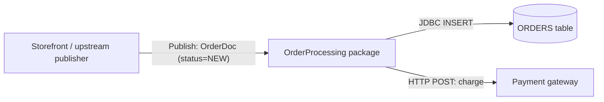
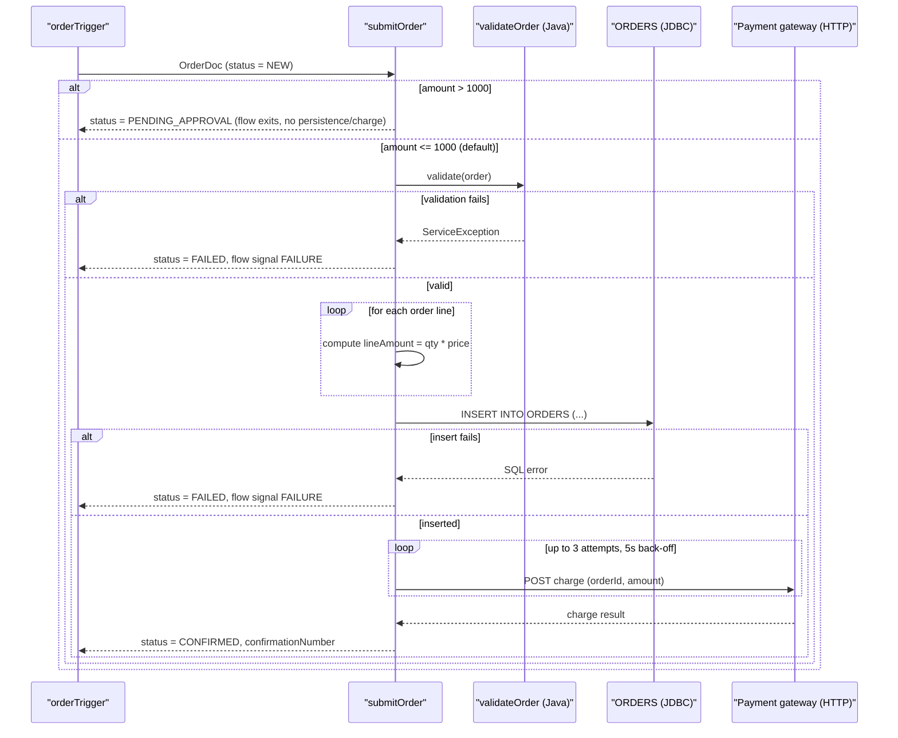
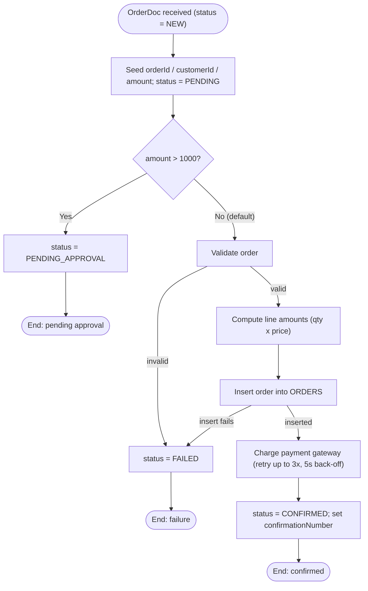
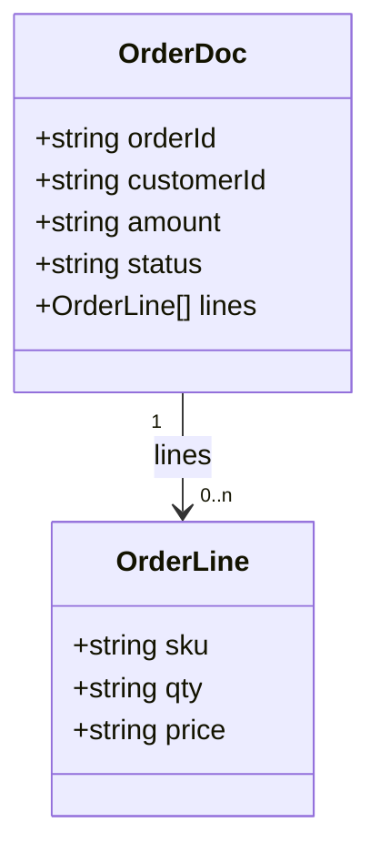
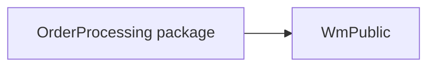

# Functional Specification — OrderProcessing

| Item | Value |
|---|---|
| Source packages | OrderProcessing 1.0 |
| Generated from | Sample package at `sample/OrderProcessing` (test fixture for the `wm-fsd` agent/skill) |
| Status | Draft — reverse-engineered, pending SME review |

## 1. Introduction

**1.1 Purpose** — This document describes the business and technical behaviour of the
`OrderProcessing` webMethods Integration Server package, reverse-engineered from its flow
services, Java service, JDBC adapter service, document type and trigger, so it can be understood
or re-implemented without opening Designer.

**1.2 Scope** — In scope: everything inside the `OrderProcessing` package folder (1 flow service,
1 Java service, 1 JDBC adapter service, 1 document type, 1 trigger). Out of scope / not supplied:
scheduler task exports, global variables, JDBC connection pool/credential settings, and any
Trading Networks/UM/Broker configuration — see Section 11 (Open Questions).

**1.3 Glossary**
| Term | Meaning |
|---|---|
| IS | webMethods Integration Server |
| Flow service | Graphical/declarative webMethods service (MAP, BRANCH, LOOP, INVOKE, etc.) |
| Trigger | IS subscription that invokes a service when a matching document is published |
| `$default` | BRANCH case matched when no other case label matches |
| CAP-01 | Capability 1 — Order Submission (this package's only capability) |

## 2. System Context

`OrderProcessing` receives new orders published as `OrderDoc` documents, decides whether an order
needs manual approval, validates and stores approved orders in a relational `ORDERS` table, and
charges the customer through an external payment gateway.

## 3. Capability Summary
| ID | Capability | Entry point | Initiated by | Frequency / volume |
|---|---|---|---|---|
| CAP-01 | Order Submission | `order.process:submitOrder` | Trigger `order.triggers:orderTrigger` on `order.docs:OrderDoc` publication | `[TO CONFIRM: expected order volume/frequency not available from code]` |

## 4. Capabilities

### 4.1 CAP-01 Order Submission

**4.1.1 Overview** — Accepts a new customer order, routes high-value orders to manual approval,
validates and persists the remaining orders, charges the customer, and returns a confirmation.
It is the single entry point for turning a published `OrderDoc` into a stored, charged order.

**4.1.2 Trigger** — Document trigger `order.triggers:orderTrigger`, subscribed to
`order.docs:OrderDoc`, filter condition `status == 'NEW'` (`order.triggers:orderTrigger`).
Processing is **serial** (one document at a time), with up to 3 redelivery retries at a 5s
interval if the trigger itself fails (`order.triggers:orderTrigger`).

**4.1.3 Inputs / Outputs**
| Direction | Field | Type | Mandatory | Description / allowed values | Source |
|---|---|---|---|---|---|
| In | `order` | `order.docs:OrderDoc` | Yes | The order to submit | `order.process:submitOrder` |
| In | `order/orderId` | string | Yes | Unique order identifier from the storefront | `order.docs:OrderDoc` |
| In | `order/customerId` | string | Yes | Customer identifier | `order.docs:OrderDoc` |
| In | `order/amount` | string (decimal) | Yes | Order total in USD | `order.docs:OrderDoc` |
| In | `order/status` | string | No | Optional incoming status | `order.docs:OrderDoc` |
| In | `order/lines[]` | record list | Yes | Line items: `sku`, `qty`, `price` | `order.docs:OrderDoc` |
| Out | `orderId` | string | Yes | Echoed order identifier | `order.process:submitOrder` |
| Out | `status` | string | Yes | `PENDING_APPROVAL`, `FAILED`, or `CONFIRMED` | `order.process:submitOrder` |
| Out | `confirmationNumber` | string | No | Set only when the order reaches `CONFIRMED` | `order.process:submitOrder` |

**4.1.4 Sequence diagram**

**4.1.5 Processing logic**
1. Seed working variables `orderId`, `customerId`, `amount` from the input order and set
   `status = "PENDING"` (`order.process:submitOrder`).
2. Evaluate the order amount against the approval threshold (see 4.1.6). If approval is required,
   set `status = "PENDING_APPROVAL"` and end the flow successfully without persisting or charging
   the order (`order.process:submitOrder`).
3. Otherwise, validate and persist the order:
   1. Validate the order (`order.process:validateOrder`) — see 4.1.7.
   2. For each order line, compute the extended line amount as `qty * price`
      (`order.process:submitOrder`, via `pub.math:multiplyFloats`).
   3. Insert the order into the `ORDERS` table (`order.jdbc:insertOrder`) — see 4.1.9.
   4. If validation or persistence fails at any point, set `status = "FAILED"` and end the flow
      with a failure signal (see 4.1.10).
4. Charge the payment gateway for the order amount, retrying on failure (see 4.1.10)
   (`order.process:submitOrder`).
5. Set `status = "CONFIRMED"` and `confirmationNumber = "<orderId>-CONF"`, then end the flow
   successfully (`order.process:submitOrder`).

**4.1.6 Business rules & decision tables**
| Rule ID | Condition | Outcome | Source |
|---|---|---|---|
| CAP-01-R1 | `amount > 1000` | Order held for manual approval: `status = PENDING_APPROVAL`; flow ends immediately (order is **not** persisted or charged at this point) | `order.process:submitOrder` |
| CAP-01-R2 | `amount <= 1000` (`$default`) | Order proceeds to validation, persistence and payment | `order.process:submitOrder` |

**4.1.7 Validations**
| Field | Check | On failure | Source |
|---|---|---|---|
| `order/orderId` | Must be non-null and non-blank | Throws `ServiceException("orderId is required")`, caught by the flow's TRY/CATCH → `status = FAILED` | `order.process:validateOrder` |
| `order/amount` | Must parse as a number | Throws `ServiceException("amount must be numeric")` → `status = FAILED` | `order.process:validateOrder` |
| `order/amount` | Must be `> 0` | Throws `ServiceException("amount must be greater than zero")` → `status = FAILED` | `order.process:validateOrder` |

**4.1.8 Data mappings**
| Target | Source | Transformation / default | Source service |
|---|---|---|---|
| `orderId` | `order/orderId` | copy | `order.process:submitOrder` |
| `customerId` | `order/customerId` | copy | `order.process:submitOrder` |
| `amount` | `order/amount` | copy | `order.process:submitOrder` |
| `status` | literal | set to `"PENDING"` at start, then reassigned by business rules/outcomes | `order.process:submitOrder` |
| `lineAmount` (per line, loop-local) | `lines/qty`, `lines/price` | `pub.math:multiplyFloats` transformer: `qty * price`, collected into `lineAmounts` | `order.process:submitOrder` |
| `orderRecord/orderId`, `/customerId`, `/amount`, `/status` | `orderId`, `customerId`, `amount`, `status` | copy, passed as JDBC insert input | `order.process:submitOrder` → `order.jdbc:insertOrder` |
| `confirmationNumber` | `orderId` | literal template `"%orderId%-CONF"` (pipeline variable substitution) | `order.process:submitOrder` |

**4.1.9 Integrations used**
| System | Protocol / adapter | Operation / SQL / endpoint | Direction | Sync/async | Source |
|---|---|---|---|---|---|
| `ORDERS` table (connection alias `OrderDB_Conn`) | JDBC adapter | `INSERT INTO ORDERS (ORDER_ID, CUSTOMER_ID, AMOUNT, STATUS) VALUES (?, ?, ?, ?)` | Outbound | Sync | `order.jdbc:insertOrder` |
| Payment gateway | HTTP (`pub.client:http`) | `POST https://payments.internal/charge` `[TO CONFIRM: HTTP method/headers/auth — only the URL and body fields are visible in the flow]` | Outbound | Sync, retried | `order.process:submitOrder` |

**4.1.10 Error handling & retries**
| Scenario | Detection | Action | Retry policy | Message / code | Final outcome |
|---|---|---|---|---|---|
| Validation fails (`orderId`/`amount`) | `ServiceException` from `order.process:validateOrder`, caught by TRY/CATCH | Call `pub.flow:getLastError`, set `status = "FAILED"` | None | Flow `FAILURE` signal, message "Order could not be validated or persisted" | Order not persisted or charged; caller sees failure |
| JDBC insert fails | `ServiceException`/SQL error from `order.jdbc:insertOrder`, caught by same TRY/CATCH | Same as above | None | Same as above | Order not persisted or charged |
| Payment gateway call fails | Failure signal from `pub.client:http` | Retry the HTTP call | Up to 3 attempts, 5s back-off (`REPEAT ... LOOP-ON FAILURE`) | `[TO CONFIRM: what happens if all 3 retries fail — the flow has no CATCH around the REPEAT, so a FAILURE here propagates uncaught]` | Order is persisted (`status` was never reset to `FAILED` for this path) but payment may not have succeeded |

**4.1.11 Process flowchart**

**4.1.12 Notes**
- The payment gateway URL `https://payments.internal/charge` is hard-coded in the flow rather than
  read from a package configuration value or endpoint alias (`order.process:submitOrder`).
  `[TO CONFIRM: should this be externalised to an endpoint alias?]`
- No step is `DISABLED`; all steps in the flow execute.
- `[TO CONFIRM: is there a CATCH around the payment REPEAT step, or an outer handler, so an order
  can end up persisted with status CONFIRMED-but-unpaid if all 3 payment retries fail?]`

## 5. Common Services
None detected — the package contains no shared logging/formatting/auditing utility services
beyond the business services covered in Section 4.

## 6. Data Dictionary

### `order.docs:OrderDoc`
| Field | Type | Cardinality | Description |
|---|---|---|---|
| `orderId` | string | 1 | Unique order identifier generated upstream by the storefront |
| `customerId` | string | 1 | Customer identifier |
| `amount` | string (decimal) | 1 | Order total in USD, represented as a decimal string |
| `status` | string | 0..1 | Optional incoming status |
| `lines` | record | 0..n | Order line items |
| `lines/sku` | string | 1 | Product SKU |
| `lines/qty` | string | 1 | Quantity ordered |
| `lines/price` | string | 1 | Unit price |

## 7. Integration Catalog
| System | Protocol / adapter | Connection / endpoint alias | Operations | Used by |
|---|---|---|---|---|
| `ORDERS` table | JDBC adapter | `OrderDB_Conn` | INSERT | CAP-01 (`order.jdbc:insertOrder`) |
| Payment gateway | HTTP | `https://payments.internal/charge` (hard-coded, not an alias) | POST charge | CAP-01 (`order.process:submitOrder`) |

## 8. Error Catalog
| Message / code | Raised by | Where | Resulting behaviour |
|---|---|---|---|
| "orderId is required" | `ServiceException` | `order.process:validateOrder` | Caught in CAP-01 TRY/CATCH → `status = FAILED`, flow fails |
| "amount must be numeric" | `ServiceException` | `order.process:validateOrder` | Same as above |
| "amount must be greater than zero" | `ServiceException` | `order.process:validateOrder` | Same as above |
| "Order could not be validated or persisted" | Flow `EXIT ... SIGNAL FAILURE` | `order.process:submitOrder` CATCH block | Flow ends with failure signal to the trigger |
| (uncaught) payment gateway failure after 3 retries | `pub.client:http` failure, not caught by any TRY/CATCH | `order.process:submitOrder` | `[TO CONFIRM: confirm actual trigger-level behaviour on an uncaught failure after persistence]` |

## 9. Configuration & Environment Dependencies
- **Package dependency:** `WmPublic` (`manifest.v3`).
- **JDBC connection:** alias `OrderDB_Conn`, used by `order.jdbc:insertOrder`; connection
  pool/credential details are not in scope of this package and were not read from raw config.
- **Hard-coded HTTP endpoint:** `https://payments.internal/charge` in `order.process:submitOrder`
  (not an endpoint alias — see CAP-01 Notes).
- **Trigger concurrency:** `order.triggers:orderTrigger` runs serial, max 3 redelivery retries,
  5s interval.
- No startup/shutdown services, scheduler tasks, global variables, or Trading
  Networks/UM/Broker configuration were found in the scanned package.
  `[TO CONFIRM: scheduler tasks, global variables, and JDBC connection pool settings live outside
  the package and were not supplied for this review.]`

## 10. Non-Functional Characteristics Observed in Code
- **Transactions:** no explicit `pub.art.transaction:*` boundary around the JDBC insert; the
  insert and the trigger's own transaction model govern atomicity.
  `[TO CONFIRM: adapter connection transaction type]`
- **Retries:** payment gateway call retried up to 3 times with a 5-second back-off
  (`order.process:submitOrder`); trigger redelivery retried up to 3 times at 5s intervals
  (`order.triggers:orderTrigger`).
- **Concurrency:** trigger processes documents serially (one at a time).
- **Timeouts:** none configured in the scanned flow for the HTTP call.
  `[TO CONFIRM: HTTP client timeout]`
- **Validation:** performed in Java (`order.process:validateOrder`) before persistence.
- **Batching:** none — orders are processed and inserted one at a time.

## 11. Open Questions
| # | Question | Context / service | Owner |
|---|---|---|---|
| 1 | What are the HTTP method, headers, and auth used for the payment gateway call beyond the URL and body fields visible in the flow? | `order.process:submitOrder` | `[TO CONFIRM]` |
| 2 | If all 3 payment retries fail, is there an outer handler, or does the order remain persisted with no final status update? | `order.process:submitOrder` | `[TO CONFIRM]` |
| 3 | Should the payment gateway URL be externalised to a package/endpoint alias instead of being hard-coded? | `order.process:submitOrder` | `[TO CONFIRM]` |
| 4 | What are the JDBC connection pool settings and credentials for `OrderDB_Conn`? (outside scanned package) | `order.jdbc:insertOrder` | `[TO CONFIRM]` |
| 5 | Are there scheduler tasks, global variables, or Trading Networks/UM/Broker configuration relevant to this application? (outside scanned package) | Package-wide | `[TO CONFIRM]` |

## Appendix A — Service Inventory
| Name | Kind | Capability | Purpose |
|---|---|---|---|
| `order.process:submitOrder` | Flow service | CAP-01 | Validates, persists, charges and confirms a customer order |
| `order.process:validateOrder` | Java service | CAP-01 | Validates required order fields and that the amount is positive |
| `order.jdbc:insertOrder` | JDBC adapter service | CAP-01 | Inserts the order into the `ORDERS` table |
| `order.triggers:orderTrigger` | Trigger | CAP-01 | Subscribes to new `OrderDoc` publications and invokes `submitOrder` |
| `order.docs:OrderDoc` | Document type | Data dictionary | Canonical order document |

## Appendix B — Coverage Report

**Service coverage** — all 5 nodes in `inventory.json` are referenced either in the Section 4 body
or in Appendix A: `order.process:submitOrder`, `order.process:validateOrder`,
`order.jdbc:insertOrder`, `order.triggers:orderTrigger`, `order.docs:OrderDoc`. No gaps.

**Branch/exit/catch coverage for `order.process:submitOrder`** (checked against
`_fsd_work/extract/services/order.process__submitOrder.md`):
- BRANCH case `%amount% > 1000` → CAP-01-R1 (4.1.6). Covered.
- BRANCH case `$default` → CAP-01-R2 (4.1.6). Covered.
- `EXIT FROM $flow SIGNAL SUCCESS` (after approval case) → 4.1.5 step 2, flowchart node E. Covered.
- `TRY` / `CATCH` around validate + insert → 4.1.10 row 1 and row 2. Covered.
- `EXIT FROM $flow SIGNAL FAILURE` (in CATCH) → 4.1.10, flowchart node H. Covered.
- `REPEAT ... LOOP-ON FAILURE` around the HTTP call → 4.1.10 row 3, flowchart node K. Covered.
- Final `EXIT FROM $flow SIGNAL SUCCESS` → 4.1.5 step 5, flowchart node M. Covered.
- `LOOP over order/lines` with `MAPINVOKE pub.math:multiplyFloats` → 4.1.5 step 3.2, 4.1.8. Covered.

**Items needing SME review:** all 5 rows in Section 11 (Open Questions), plus the `[TO CONFIRM]`
markers in 4.1.9, 4.1.10 and 4.1.12 regarding the payment gateway's HTTP details, auth, and the
uncaught-failure-after-persistence path.

**Known tooling limitation observed during this test run:** the auto-generated Mermaid flowchart
in the raw extract (`_fsd_work/extract/services/order.process__submitOrder.md`) draws the steps
after a `REPEAT` block as continuing linearly from inside the retry body, rather than from the
`REPEAT` node itself — it does not visually show the retry loop-back edge. This did not affect the
business-level flowchart or tables above (those were authored from the pseudocode/logic text,
which does state the retry policy correctly), but should be kept in mind if relying on the raw
extract's diagrams directly for other packages.
