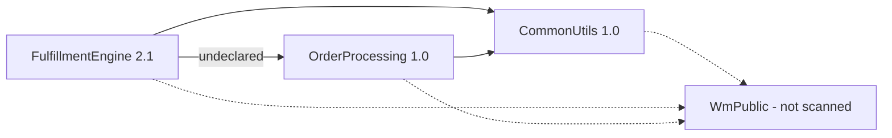
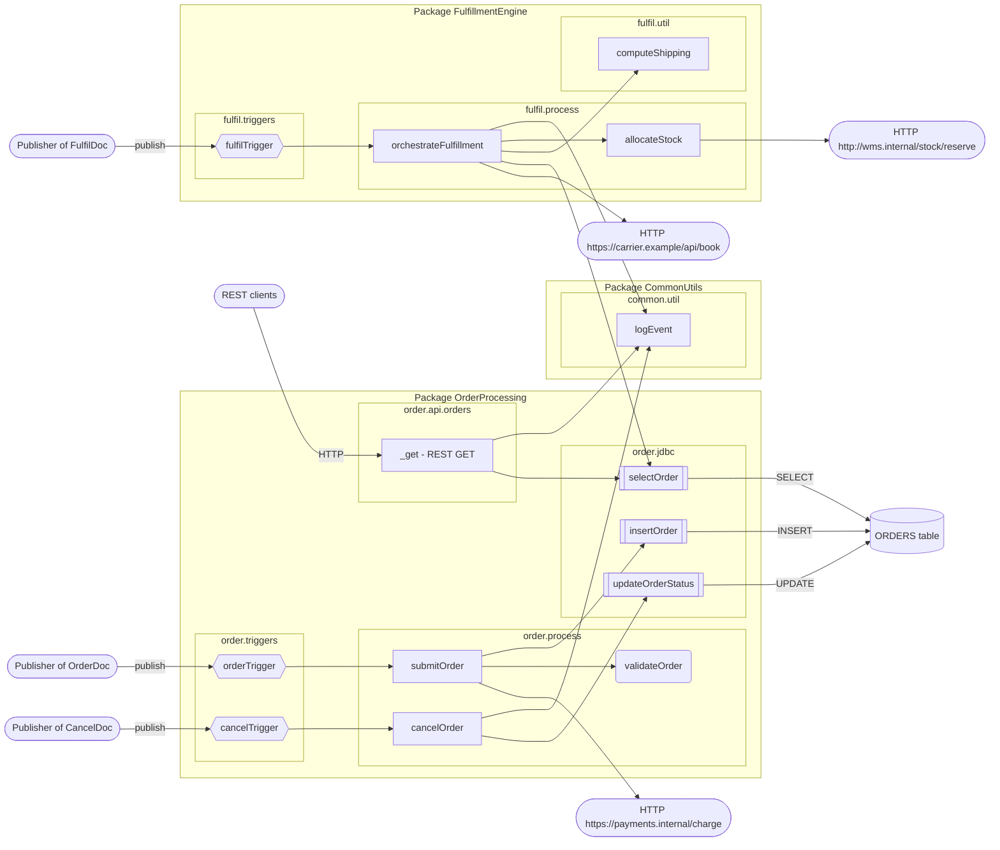

[← index](index.md)

# Existing architecture (generated from code)

Facts for the FSD's Existing Architecture section. Capabilities are named by their entry service.

## Packages
| Package | Version | Requires | Startup | Shutdown | Components |
|---|---|---|---|---|---|
| `OrderProcessing` | 1.0 | WmPublic, CommonUtils | - | - | 11 |
| `CommonUtils` | 1.0 | WmPublic | - | - | 1 |
| `FulfillmentEngine` | 2.1 | WmPublic, CommonUtils | - | - | 5 |

## Package dependencies
Solid arrow: declared dependency on a scanned package. Dotted: package not scanned. Labelled `undeclared`: called but not declared.

| Calls across packages | Services |
|---|---|
| FulfillmentEngine -> CommonUtils | fulfil.process:orchestrateFulfillment → common.util:logEvent |
| FulfillmentEngine -> OrderProcessing | fulfil.process:orchestrateFulfillment → order.jdbc:selectOrder |
| OrderProcessing -> CommonUtils | order.api.orders:_get → common.util:logEvent; order.process:cancelOrder → common.util:logEvent |

## Components
| Component | Package | Kind | Role | Used by capabilities |
|---|---|---|---|---|
| `common.util:logEvent` | CommonUtils | Flow service | Shared utility | `orchestrateFulfillment`, `_get`, `cancelOrder` |
| `fulfil.docs:FulfilDoc` | FulfillmentEngine | Document type | Data contract (document type) | `orchestrateFulfillment` |
| `fulfil.process:allocateStock` | FulfillmentEngine | Flow service | Orchestration (flow) | `orchestrateFulfillment` |
| `fulfil.process:orchestrateFulfillment` | FulfillmentEngine | Flow service | Entry: trigger fulfil.triggers:fulfilTrigger | `orchestrateFulfillment` |
| `fulfil.triggers:fulfilTrigger` | FulfillmentEngine | Trigger | Trigger (subscription) | `orchestrateFulfillment` |
| `fulfil.util:computeShipping` | FulfillmentEngine | Flow service | Shared utility | `orchestrateFulfillment` |
| `order.api.orders:_get` | OrderProcessing | Flow service | Entry: REST GET /rest/order/api/orders | `_get` |
| `order.docs:CancelDoc` | OrderProcessing | Document type | Data contract (document type) | `cancelOrder` |
| `order.docs:OrderDoc` | OrderProcessing | Document type | Data contract (document type) | `submitOrder` |
| `order.jdbc:insertOrder` | OrderProcessing | jdbc service | Data access (adapter) | `submitOrder` |
| `order.jdbc:selectOrder` | OrderProcessing | jdbc service | Data access (adapter) | `orchestrateFulfillment`, `_get` |
| `order.jdbc:updateOrderStatus` | OrderProcessing | jdbc service | Data access (adapter) | `cancelOrder` |
| `order.process:cancelOrder` | OrderProcessing | Flow service | Entry: trigger order.triggers:cancelTrigger | `cancelOrder` |
| `order.process:submitOrder` | OrderProcessing | Flow service | Entry: trigger order.triggers:orderTrigger | `submitOrder` |
| `order.process:validateOrder` | OrderProcessing | Java service | Business logic (Java) | `submitOrder` |
| `order.triggers:cancelTrigger` | OrderProcessing | Trigger | Trigger (subscription) | `cancelOrder` |
| `order.triggers:orderTrigger` | OrderProcessing | Trigger | Trigger (subscription) | `submitOrder` |

## Component diagram (component level)
Shapes: rectangle = flow service, rounded = Java service, double-bordered = adapter service, hexagon = trigger, cylinder = database table, stadium = external system or caller.

## Capabilities and their components
| Capability (entry) | Components |
|---|---|
| `fulfil.process:orchestrateFulfillment` | `common.util:logEvent`, `fulfil.process:allocateStock`, `fulfil.process:orchestrateFulfillment`, `fulfil.triggers:fulfilTrigger`, `fulfil.util:computeShipping`, `order.jdbc:selectOrder` |
| `order.api.orders:_get` | `common.util:logEvent`, `order.api.orders:_get`, `order.jdbc:selectOrder` |
| `order.process:cancelOrder` | `common.util:logEvent`, `order.jdbc:updateOrderStatus`, `order.process:cancelOrder`, `order.triggers:cancelTrigger` |
| `order.process:submitOrder` | `order.jdbc:insertOrder`, `order.process:submitOrder`, `order.process:validateOrder`, `order.triggers:orderTrigger` |

## Shared components (used by 2+ capabilities)
- `common.util:logEvent` ← `orchestrateFulfillment`, `_get`, `cancelOrder`
- `order.jdbc:selectOrder` ← `orchestrateFulfillment`, `_get`

## External systems and channels
| Type | Detail | Used by |
|---|---|---|
| Database (outbound) | connection `OrderDB_Conn`, tables ORDERS | `order.jdbc:insertOrder`, `order.jdbc:selectOrder`, `order.jdbc:updateOrderStatus` |
| HTTP endpoint (outbound) | `http://wms.internal/stock/reserve` | `fulfil.process:allocateStock` |
| HTTP endpoint (outbound) | `https://carrier.example/api/book` | `fulfil.process:orchestrateFulfillment` |
| HTTP endpoint (outbound) | `https://payments.internal/charge` | `order.process:submitOrder` |
| Publisher (inbound, publish/subscribe) | publishes `fulfil.docs:FulfilDoc` | `fulfil.triggers:fulfilTrigger` |
| Publisher (inbound, publish/subscribe) | publishes `order.docs:CancelDoc` | `order.triggers:cancelTrigger` |
| Publisher (inbound, publish/subscribe) | publishes `order.docs:OrderDoc` | `order.triggers:orderTrigger` |
| REST client (inbound) | GET /rest/order/api/orders | `order.api.orders:_get` |

## Data access by capability
| Table | `orchestrateFulfillment` | `_get` | `cancelOrder` | `submitOrder` |
|---|---|---|---|---|
| `ORDERS` | SELECT | SELECT | UPDATE | INSERT |

## Document type usage
| Document type | Used by |
|---|---|
| `fulfil.docs:FulfilDoc` | `fulfil.process:orchestrateFulfillment`, `fulfil.triggers:fulfilTrigger` |
| `order.docs:CancelDoc` | `order.process:cancelOrder`, `order.triggers:cancelTrigger` |
| `order.docs:OrderDoc` | `order.process:submitOrder`, `order.process:validateOrder`, `order.triggers:orderTrigger` |

## Architecture observations (verify, then carry into the FSD)
- Package `FulfillmentEngine` calls `OrderProcessing` (1 call(s)) but doesn't declare it in manifest.v3 `requires`, so load order isn't guaranteed
- Table `ORDERS` is shared by 4 capabilities (`fulfil.process:orchestrateFulfillment` SELECT; `order.api.orders:_get` SELECT; `order.process:cancelOrder` UPDATE; `order.process:submitOrder` INSERT). Document its lifecycle across capabilities and check how they interact (ordering, status assumptions, concurrency)
- Logging is inconsistent: `fulfil.process:orchestrateFulfillment` logs, `order.api.orders:_get` logs, `order.process:cancelOrder` logs, `order.process:submitOrder` has no logging
- Error handling is inconsistent: `fulfil.process:orchestrateFulfillment` uses TRY/CATCH, `order.api.orders:_get` has no TRY/CATCH, `order.process:cancelOrder` has no TRY/CATCH, `order.process:submitOrder` uses TRY/CATCH
- Hard-coded URL `http://wms.internal/stock/reserve` in `fulfil.process:allocateStock` instead of an endpoint alias or configuration value
- Hard-coded URL `https://carrier.example/api/book` in `fulfil.process:orchestrateFulfillment` instead of an endpoint alias or configuration value
- Hard-coded URL `https://payments.internal/charge` in `order.process:submitOrder` instead of an endpoint alias or configuration value
- All 3 adapter services share connection `OrderDB_Conn`; its transaction type and pool size affect every capability that uses it
