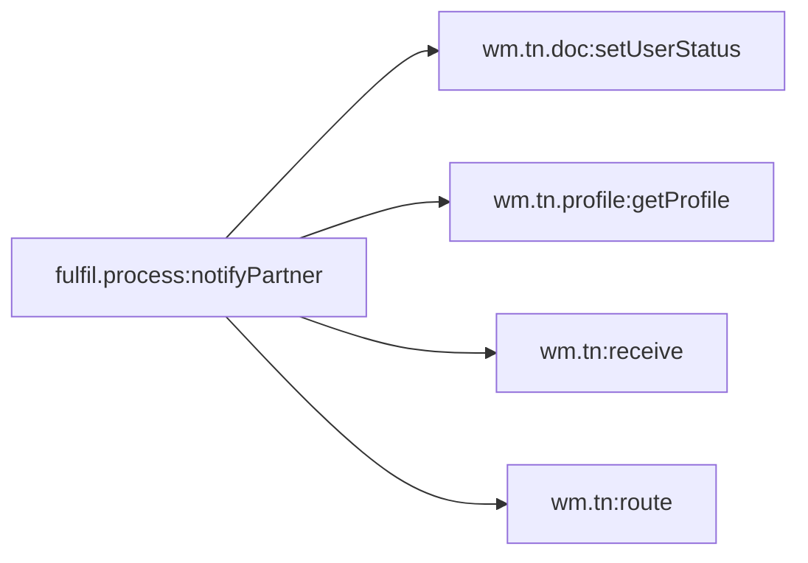

# Capability: fulfil.process:notifyPartner

[← index](../index.md) · Entry: not invoked by any scanned service (scheduler, manual or external caller?)

## Components used

- [`fulfil.process:notifyPartner`](../services/fulfil.process__notifyPartner.md) - Entry: not invoked by any scanned service (scheduler, manual or external caller?)

## Findings in this capability

- `fulfil.process:notifyPartner`: `partnerName` is set but never used afterwards (not read later, not a declared output). Either it is dead logic or a step is missing

## Call graph

