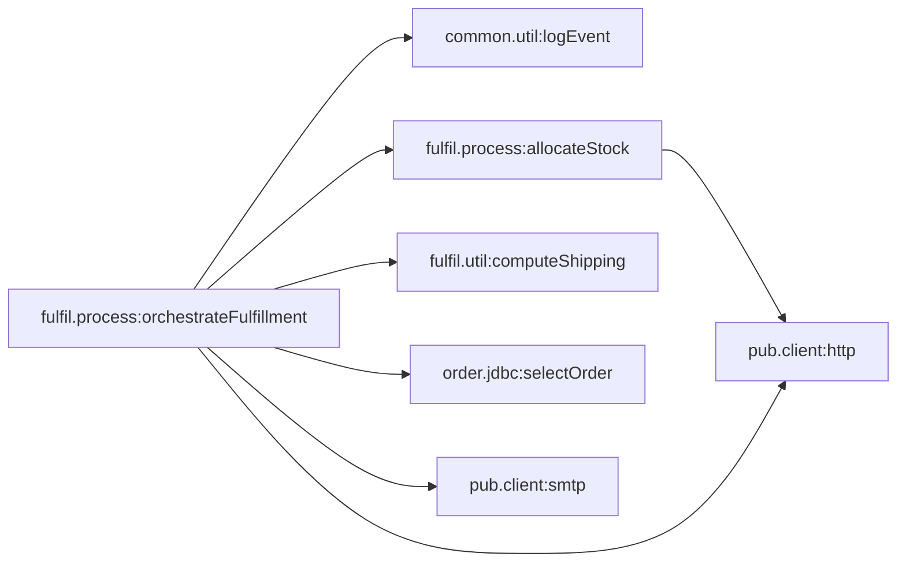

# Capability: fulfil.process:orchestrateFulfillment

[← index](../index.md) · Entry: trigger fulfil.triggers:fulfilTrigger

## Components used

- [`common.util:logEvent`](../services/common.util__logEvent.md) - Shared utility
- [`fulfil.process:allocateStock`](../services/fulfil.process__allocateStock.md) - Orchestration (flow)
- [`fulfil.process:orchestrateFulfillment`](../services/fulfil.process__orchestrateFulfillment.md) - Entry: trigger fulfil.triggers:fulfilTrigger
- [`fulfil.triggers:fulfilTrigger`](../services/fulfil.triggers__fulfilTrigger.md) - Trigger (subscription)
- [`fulfil.util:computeShipping`](../services/fulfil.util__computeShipping.md) - Shared utility
- [`order.jdbc:selectOrder`](../services/order.jdbc__selectOrder.md) - Data access (adapter)

## Findings in this capability

- `fulfil.process:allocateStock`: REPEAT with `COUNT=-1` on FAILURE has no upper bound: if the body keeps failing the flow never gives up and never reaches its error handling. A re-implementation needs an explicit maximum or timeout, so ask what it should be
- `fulfil.process:allocateStock`: BRANCH on `httpStatus` has no `$default`: values matching no case skip the branch silently
- `fulfil.process:orchestrateFulfillment`: BRANCH on `orderStatus` has no `$default`: values matching no case skip the branch silently
- `fulfil.process:orchestrateFulfillment`: `EXIT $flow FAILURE` ("Stock allocation failed") sits inside TRY [allocation], so it is caught by that TRY's CATCH and does not reach the caller as written. What the caller sees depends on what the CATCH does (swallow, rethrow, or its own EXIT)
- `fulfil.process:orchestrateFulfillment`: BRANCH on `lastAllocated` has no `$default`: values matching no case skip the branch silently
- `fulfil.process:orchestrateFulfillment`: BRANCH on `needsSpecialCarrier` has no `$default`: values matching no case skip the branch silently
- `fulfil.process:orchestrateFulfillment`: `allocations` is set but never used afterwards (not read later, not a declared output). Either it is dead logic or a step is missing
- `fulfil.process:orchestrateFulfillment`: `allocError` from `pub.flow:getLastError` is never logged, returned or rethrown, so the original error is lost
- `fulfil.process:orchestrateFulfillment`: Invoked by trigger fulfil.triggers:fulfilTrigger: Integration Server discards the outputs (fulfilStatus, trackingNumber). Only side effects (DB writes, calls, publishes) are visible to anyone
- `fulfil.util:computeShipping`: BRANCH on `priority` has no `$default`: values matching no case skip the branch silently
- `fulfil.util:computeShipping`: BRANCH on `weightKg`: `$default` also catches missing, empty and non-numeric values. Describe it as "any other value", never as the numeric opposite of the other cases
- `fulfil.util:computeShipping`: `priority` is set but never used afterwards (not read later, not a declared output). Either it is dead logic or a step is missing

## Call graph

