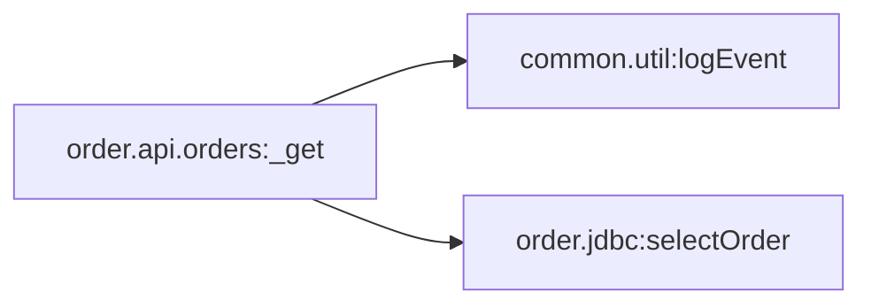

# Capability: order.api.orders:_get

[← index](../index.md) · Entry: REST GET /rest/order/api/orders

## Components used

- [`common.util:logEvent`](../services/common.util__logEvent.md) - Shared utility
- [`order.api.orders:_get`](../services/order.api.orders___get.md) - Entry: REST GET /rest/order/api/orders
- [`order.jdbc:selectOrder`](../services/order.jdbc__selectOrder.md) - Data access (adapter)

## Findings in this capability

- none

## Call graph

