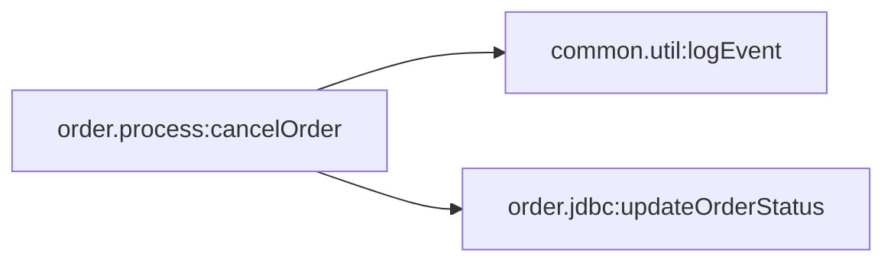

# Capability: order.process:cancelOrder

[← index](../index.md) · Entry: trigger order.triggers:cancelTrigger

## Components used

- [`common.util:logEvent`](../services/common.util__logEvent.md) - Shared utility
- [`order.jdbc:updateOrderStatus`](../services/order.jdbc__updateOrderStatus.md) - Data access (adapter)
- [`order.process:cancelOrder`](../services/order.process__cancelOrder.md) - Entry: trigger order.triggers:cancelTrigger
- [`order.triggers:cancelTrigger`](../services/order.triggers__cancelTrigger.md) - Trigger (subscription)

## Findings in this capability

- `order.triggers:cancelTrigger`: Trigger retries only happen when `order.process:cancelOrder` throws an ISRuntimeException (for example via `pub.flow:throwExceptionForRetry` or a transient adapter error). Its call tree never does this explicitly, so ordinary failures are not retried

## Call graph

