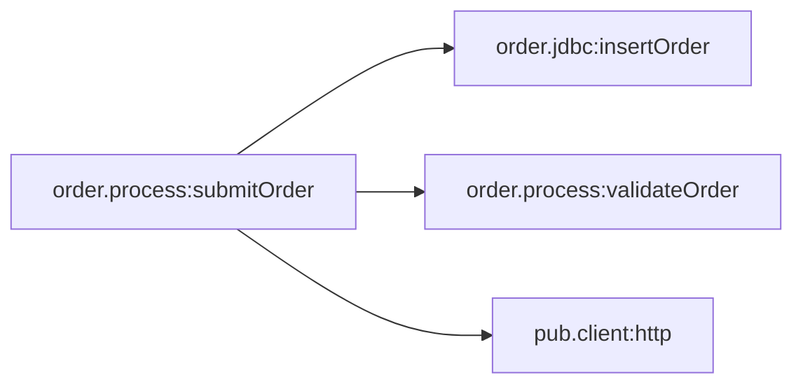

# Capability: order.process:submitOrder

[← index](../index.md) · Entry: trigger order.triggers:orderTrigger

## Components used

- [`order.jdbc:insertOrder`](../services/order.jdbc__insertOrder.md) - Data access (adapter)
- [`order.process:submitOrder`](../services/order.process__submitOrder.md) - Entry: trigger order.triggers:orderTrigger
- [`order.process:validateOrder`](../services/order.process__validateOrder.md) - Business logic (Java)
- [`order.triggers:orderTrigger`](../services/order.triggers__orderTrigger.md) - Trigger (subscription)

## Findings in this capability

- `order.process:submitOrder`: BRANCH on `amount`: `$default` also catches missing, empty and non-numeric values. Describe it as "any other value", never as the numeric opposite of the other cases
- `order.process:submitOrder`: `lineAmounts` is set but never used afterwards (not read later, not a declared output). Either it is dead logic or a step is missing
- `order.process:submitOrder`: `lastError` from `pub.flow:getLastError` is never logged, returned or rethrown, so the original error is lost
- `order.process:submitOrder`: `pub.client:http` does not fail on HTTP 4xx/5xx responses, and the flow never checks `header/status`. Error responses count as success, and REPEAT/TRY never sees them
- `order.process:submitOrder`: `status` is passed to adapter `order.jdbc:insertOrder` and changed afterwards, but no later adapter call saves the new value. The stored value is whatever it was at `order.jdbc:insertOrder`
- `order.process:submitOrder`: Uses floating-point arithmetic (`double`/`float`) on values that may be money. A re-implementation must decide whether to copy that exactly or use a decimal type
- `order.process:submitOrder`: Invoked by trigger order.triggers:orderTrigger: Integration Server discards the outputs (confirmationNumber, orderId, status). Only side effects (DB writes, calls, publishes) are visible to anyone
- `order.process:validateOrder`: Uses floating-point arithmetic (`double`/`float`) on values that may be money. A re-implementation must decide whether to copy that exactly or use a decimal type
- `order.triggers:orderTrigger`: Trigger retries only happen when `order.process:submitOrder` throws an ISRuntimeException (for example via `pub.flow:throwExceptionForRetry` or a transient adapter error). Its call tree never does this explicitly, so ordinary failures are not retried

## Call graph

