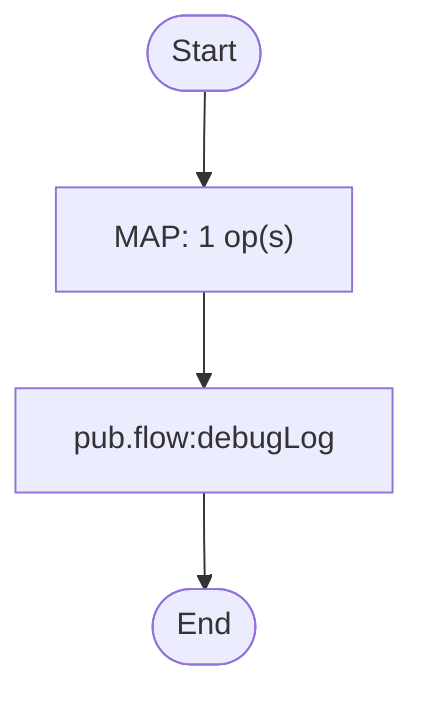

# common.util:logEvent

[← index](../index.md) · kind: **Flow service** · role: Shared utility

## Overview


- **Kind:** Flow service
- **Package:** CommonUtils
- **Role:** Shared utility
- **Source dir:** `sample/CommonUtils/ns/common/util/logEvent`
- **Used by capabilities:** fulfil.process:orchestrateFulfillment, order.api.orders:_get, order.process:cancelOrder
- **Developer comment:** Writes one audit line to the server log for an order event.
- **Invoked by:** fulfil.process:orchestrateFulfillment, order.api.orders:_get, order.process:cancelOrder

## Signature

**Inputs:**

| Field | Type | Flags | Comment |
|---|---|---|---|
| `eventType` | string |  |  |
| `orderId` | string |  |  |
| `message` | string | optional |  |

**Outputs:** _(none)_

## Invokes

- `pub.flow:debugLog`

## Logic (pseudocode, generated from flow.xml)

```text
# Build one audit line: EVENT order=ID message.
MAP: set logLine = "%eventType% order=%orderId% %message%" (with %var% substitution)
INVOKE pub.flow:debugLog
  input: message ← logLine; set function = "ORDER_AUDIT"; set level = "Info"
```

## Flowchart


