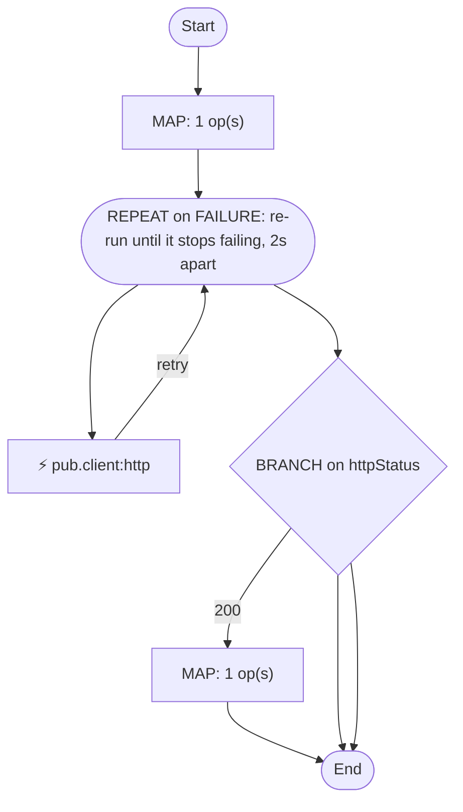

# fulfil.process:allocateStock

[← index](../index.md) · kind: **Flow service** · role: Orchestration (flow)

## Overview


- **Kind:** Flow service
- **Package:** FulfillmentEngine
- **Role:** Orchestration (flow)
- **Source dir:** `sample/FulfillmentEngine/ns/fulfil/process/allocateStock`
- **Used by capabilities:** fulfil.process:orchestrateFulfillment
- **Developer comment:** Allocates stock for one SKU. Returns allocated=true/false.
- **Invoked by:** fulfil.process:orchestrateFulfillment

## Signature

**Inputs:**

| Field | Type | Flags | Comment |
|---|---|---|---|
| `sku` | string |  |  |
| `qty` | string |  |  |

**Outputs:**

| Field | Type | Flags | Comment |
|---|---|---|---|
| `allocated` | string |  |  |
| `warehouse` | string |  |  |

## Invokes

- `pub.client:http` — HTTP/REST call

## Logic (pseudocode, generated from flow.xml)

```text
MAP: set allocated = "false"
# Poll the warehouse service until it answers without an exception (no upper bound).
REPEAT on FAILURE: re-run until it stops failing, 2s apart
  INVOKE pub.client:http   ⟵ HTTP/REST call
    input: set url = "http://wms.internal/stock/reserve"; data/sku ← sku; data/qty ← qty
    output: httpStatus ← header/status; warehouse ← warehouseCode
BRANCH on httpStatus
  CASE 200:
    SEQUENCE [200]
      MAP: set allocated = "true"
  CASE 409:
    # Out of stock: allocated stays false.
    SEQUENCE [409]
  (no $default: unmatched values fall through)
```

## Semantic flags (verify, then carry into the FSD)

- REPEAT with `COUNT=-1` on FAILURE has no upper bound: if the body keeps failing the flow never gives up and never reaches its error handling. A re-implementation needs an explicit maximum or timeout, so ask what it should be
- BRANCH on `httpStatus` has no `$default`: values matching no case skip the branch silently

## Flowchart


