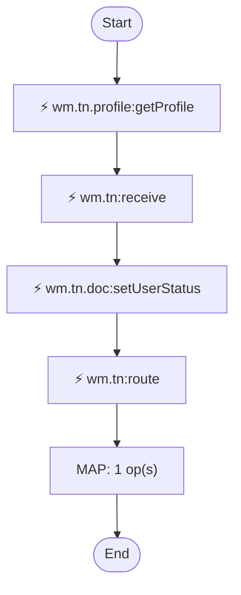

# fulfil.process:notifyPartner

[← index](../index.md) · kind: **Flow service** · role: Entry: not invoked by any scanned service (scheduler, manual or external caller?)

## Overview


- **Kind:** Flow service
- **Package:** FulfillmentEngine
- **Role:** Entry: not invoked by any scanned service (scheduler, manual or external caller?)
- **Source dir:** `sample/FulfillmentEngine/ns/fulfil/process/notifyPartner`
- **Used by capabilities:** fulfil.process:notifyPartner
- **Developer comment:** Sends a ship notice to the trading partner through Trading Networks. Service names are illustrative.

## Signature

**Inputs:**

| Field | Type | Flags | Comment |
|---|---|---|---|
| `orderId` | string |  |  |
| `partnerId` | string |  |  |
| `shipNoticeXml` | object |  |  |

**Outputs:**

| Field | Type | Flags | Comment |
|---|---|---|---|
| `delivered` | string |  |  |

## Invokes

- `wm.tn.doc:setUserStatus` — Trading Networks
- `wm.tn.profile:getProfile` — Trading Networks
- `wm.tn:receive` — Trading Networks
- `wm.tn:route` — Trading Networks

## Logic (pseudocode, generated from flow.xml)

```text
# Look up the partner; its delivery method is configured in TN, not here.
INVOKE wm.tn.profile:getProfile   ⟵ Trading Networks
  input: partnerID ← partnerId
  output: partnerName ← profile/corporationName
# Hand the ship notice to TN; recognition picks the document type.
INVOKE wm.tn:receive   ⟵ Trading Networks
  input: bizdoc/content ← shipNoticeXml; set DocumentType = "ShipNotice"; set SenderID = "FULFIL-HUB"; ReceiverID ← partnerId; set apiPassword = "***redacted***"
  output: bizdocId ← bizdoc/InternalID
INVOKE wm.tn.doc:setUserStatus   ⟵ Trading Networks
  input: InternalID ← bizdocId; set userStatus = "SHIPNOTICE_SENT"
INVOKE wm.tn:route   ⟵ Trading Networks
  input: bizdoc/InternalID ← bizdocId
# Direct delivery, replaced by the processing rule that fires on route.
(INVOKE wm.tn.out:deliver DISABLED — not executed)
MAP: set delivered = "true"
```

## Trading Networks calls

| Operation | Service | Inputs |
|---|---|---|
| Partner profile | `wm.tn.profile:getProfile` | partnerID ← partnerId |
| Receive and recognise a document | `wm.tn:receive` | bizdoc/content ← shipNoticeXml; DocumentType = "ShipNotice"; SenderID = "FULFIL-HUB"; ReceiverID ← partnerId; apiPassword = "***redacted***" |
| Update document status or attributes | `wm.tn.doc:setUserStatus` | InternalID ← bizdocId; userStatus = "SHIPNOTICE_SENT" |
| Route a document (processing rules decide the outcome) | `wm.tn:route` | bizdoc/InternalID ← bizdocId |

## Semantic flags (verify, then carry into the FSD)

- `partnerName` is set but never used afterwards (not read later, not a declared output). Either it is dead logic or a step is missing

## Flowchart


