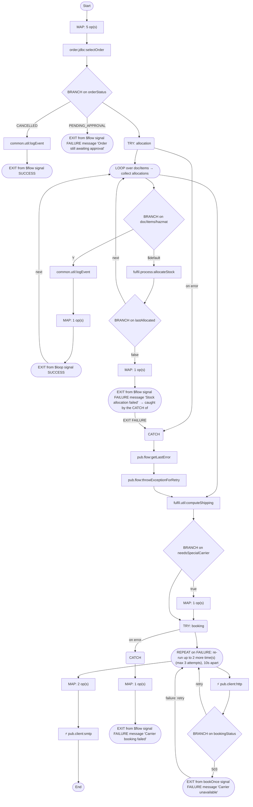

# fulfil.process:orchestrateFulfillment

[← index](../index.md) · kind: **Flow service** · role: Entry: trigger fulfil.triggers:fulfilTrigger

## Overview


- **Kind:** Flow service
- **Package:** FulfillmentEngine
- **Role:** Entry: trigger fulfil.triggers:fulfilTrigger
- **Source dir:** `sample/FulfillmentEngine/ns/fulfil/process/orchestrateFulfillment`
- **Used by capabilities:** fulfil.process:orchestrateFulfillment
- **Developer comment:** Orchestrates fulfilment: stock allocation per item, shipping cost, carrier booking with retry, notification. Triggered by fulfilTrigger.
- **Referenced by (trigger/REST/WSD/other):** fulfil.triggers:fulfilTrigger

## Signature

**Inputs:**

| Field | Type | Flags | Comment |
|---|---|---|---|
| `doc` | record → fulfil.docs:FulfilDoc |  |  |

**Outputs:**

| Field | Type | Flags | Comment |
|---|---|---|---|
| `fulfilStatus` | string |  |  |
| `trackingNumber` | string |  |  |

## Invokes

- [`common.util:logEvent`](common.util__logEvent.md)
- [`fulfil.process:allocateStock`](fulfil.process__allocateStock.md)
- [`fulfil.util:computeShipping`](fulfil.util__computeShipping.md)
- [`order.jdbc:selectOrder`](order.jdbc__selectOrder.md)
- `pub.client:http` — HTTP/REST call
- `pub.client:smtp` — Email (SMTP)
- `pub.flow:getLastError`
- `pub.flow:throwExceptionForRetry`

## Logic (pseudocode, generated from flow.xml)

```text
# Seed pipeline from the FulfilDoc.
MAP: orderId ← doc/orderId; region ← doc/region; weightKg ← doc/weightKg; priority ← doc/priority; set fulfilStatus = "RECEIVED"
# Cross-package call into OrderProcessing (not declared in manifest requires).
INVOKE order.jdbc:selectOrder
  input: orderId ← orderId
  output: orderStatus ← orderRecord/status
# Only confirmed orders are fulfilled; no $default, so any other status silently continues.
BRANCH on orderStatus
  CASE CANCELLED:
    SEQUENCE [CANCELLED]
      INVOKE common.util:logEvent
        input: set eventType = "FULFIL_SKIPPED"; orderId ← orderId
      EXIT from $flow signal SUCCESS
  CASE PENDING_APPROVAL:
    SEQUENCE [PENDING_APPROVAL]
      EXIT from $flow signal FAILURE message "Order still awaiting approval"
  (no $default: unmatched values fall through)
# Allocate stock for every line item; any hazmat item diverts to special handling.
TRY [allocation]
  LOOP over doc/items → collect allocations
    SEQUENCE [perItem]
      BRANCH on doc/items/hazmat
        CASE Y:
          SEQUENCE [Y]
            INVOKE common.util:logEvent
              input: set eventType = "HAZMAT_ITEM"; message ← doc/items/sku
            MAP: set needsSpecialCarrier = "true"
            EXIT from $loop signal SUCCESS
        CASE $default:
          SEQUENCE [$default]
            INVOKE fulfil.process:allocateStock
              input: sku ← doc/items/sku; qty ← doc/items/qty
              output: allocations/allocated ← allocated; lastAllocated ← allocated
            BRANCH on lastAllocated
              CASE false:
                SEQUENCE [false]
                  MAP: set fulfilStatus = "BACKORDER"
                  EXIT from $flow signal FAILURE message "Stock allocation failed"  → caught by the CATCH of TRY [allocation]
              (no $default: unmatched values fall through)
CATCH
  INVOKE pub.flow:getLastError
    output: allocError ← lastError
  # Rethrown as ISRuntimeException so the trigger redelivers the document.
  INVOKE pub.flow:throwExceptionForRetry
    input: set message = "Allocation failed, retrying"
INVOKE fulfil.util:computeShipping
  input: region ← region; weightKg ← weightKg; priority ← priority
  output: shippingCost ← shippingCost; carrier ← carrier
BRANCH on needsSpecialCarrier
  CASE true:
    SEQUENCE [true]
      MAP: set carrier = "HAZMAT-LOGISTICS"
  (no $default: unmatched values fall through)
TRY [booking]
  # Book the carrier; retry twice on exception.
  REPEAT on FAILURE: re-run up to 2 more time(s) (max 3 attempts), 10s apart
    SEQUENCE [bookOnce] (exit on FAILURE)
      INVOKE pub.client:http   ⟵ HTTP/REST call
        input: set url = "https://carrier.example/api/book"; data/orderId ← orderId; data/carrier ← carrier
        output: bookingStatus ← header/status; trackingNumber ← trackingId
      BRANCH on bookingStatus
        CASE 503:
          SEQUENCE [503]
            EXIT from bookOnce signal FAILURE message "Carrier unavailable"
        CASE $default:
          SEQUENCE [$default]
  # Legacy notification, replaced by the email step below.
  (INVOKE pub.publish:publish DISABLED — not executed)
CATCH
  MAP: set fulfilStatus = "BOOKING_FAILED"
  EXIT from $flow signal FAILURE message "Carrier booking failed"
MAP: set fulfilStatus = "SHIPPED"; set body = "Order %orderId% shipped via %carrier%, tracking %trackingNumber%, cost %shippingCost%" (with %var% substitution)
INVOKE pub.client:smtp   ⟵ Email (SMTP)
  input: set to = "ops@example.com"; body ← body
```

## Semantic flags (verify, then carry into the FSD)

- BRANCH on `orderStatus` has no `$default`: values matching no case skip the branch silently
- `EXIT $flow FAILURE` ("Stock allocation failed") sits inside TRY [allocation], so it is caught by that TRY's CATCH and does not reach the caller as written. What the caller sees depends on what the CATCH does (swallow, rethrow, or its own EXIT)
- BRANCH on `lastAllocated` has no `$default`: values matching no case skip the branch silently
- BRANCH on `needsSpecialCarrier` has no `$default`: values matching no case skip the branch silently
- `allocations` is set but never used afterwards (not read later, not a declared output). Either it is dead logic or a step is missing
- `allocError` from `pub.flow:getLastError` is never logged, returned or rethrown, so the original error is lost
- Invoked by trigger fulfil.triggers:fulfilTrigger: Integration Server discards the outputs (fulfilStatus, trackingNumber). Only side effects (DB writes, calls, publishes) are visible to anyone

## Flowchart


