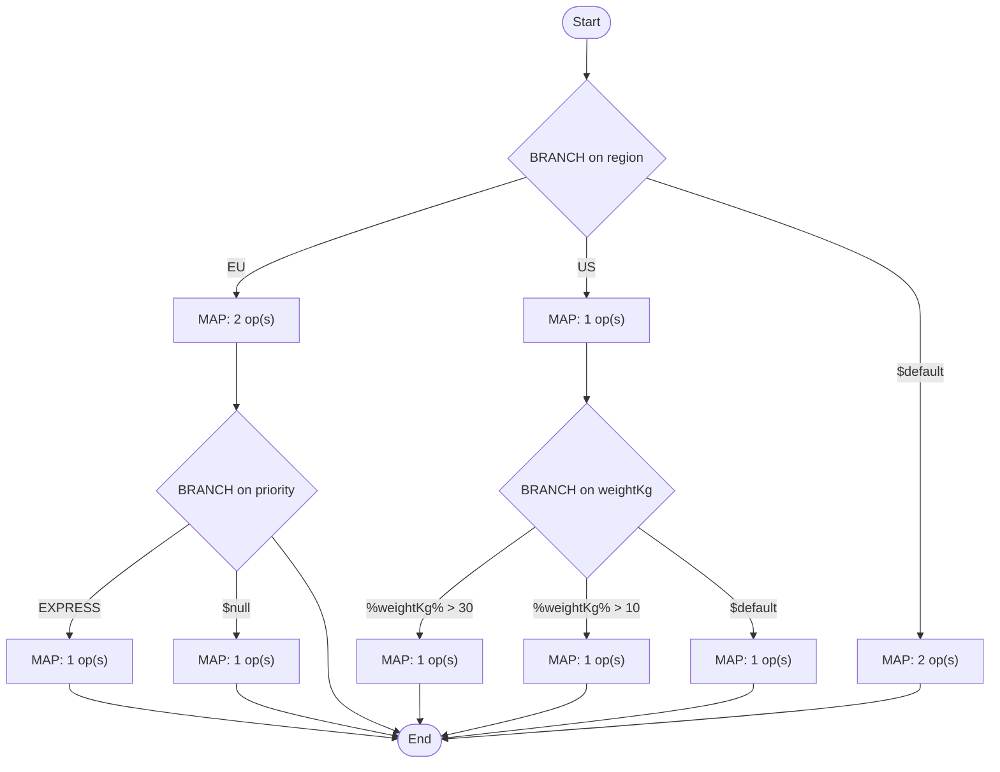

# fulfil.util:computeShipping

[← index](../index.md) · kind: **Flow service** · role: Shared utility

## Overview


- **Kind:** Flow service
- **Package:** FulfillmentEngine
- **Role:** Shared utility
- **Source dir:** `sample/FulfillmentEngine/ns/fulfil/util/computeShipping`
- **Used by capabilities:** fulfil.process:orchestrateFulfillment
- **Developer comment:** Computes shipping cost from region, weight and priority.
- **Invoked by:** fulfil.process:orchestrateFulfillment

## Signature

**Inputs:**

| Field | Type | Flags | Comment |
|---|---|---|---|
| `region` | string |  |  |
| `weightKg` | string |  |  |
| `priority` | string |  |  |

**Outputs:**

| Field | Type | Flags | Comment |
|---|---|---|---|
| `shippingCost` | string |  |  |
| `carrier` | string |  |  |

## Logic (pseudocode, generated from flow.xml)

```text
# Carrier and base rate depend on region; unknown regions are quoted manually.
BRANCH on region
  CASE EU:
    SEQUENCE [EU]
      MAP: set carrier = "DHL"; set shippingCost = "12.50"
      # Express upgrade within EU.
      BRANCH on priority
        CASE EXPRESS:
          SEQUENCE [EXPRESS]
            MAP: set shippingCost = "29.90"
        CASE $null:
          SEQUENCE [$null]
            # Priority missing: treated as standard, rate unchanged.
            MAP: set priority = "STANDARD"
        (no $default: unmatched values fall through)
  CASE US:
    SEQUENCE [US]
      MAP: set carrier = "FEDEX"
      BRANCH on weightKg
        WHEN %weightKg% > 30:
          SEQUENCE [%weightKg% > 30]
            MAP: set shippingCost = "85.00"
        WHEN %weightKg% > 10:
          SEQUENCE [%weightKg% > 10]
            MAP: set shippingCost = "40.00"
        WHEN $default:
          SEQUENCE [$default]
            MAP: set shippingCost = "18.00"
  CASE $default:
    SEQUENCE [$default]
      MAP: set carrier = "MANUAL"; set shippingCost = "0"
```

## Semantic flags (verify, then carry into the FSD)

- BRANCH on `priority` has no `$default`: values matching no case skip the branch silently
- BRANCH on `weightKg`: `$default` also catches missing, empty and non-numeric values. Describe it as "any other value", never as the numeric opposite of the other cases
- `priority` is set but never used afterwards (not read later, not a declared output). Either it is dead logic or a step is missing

## Flowchart


