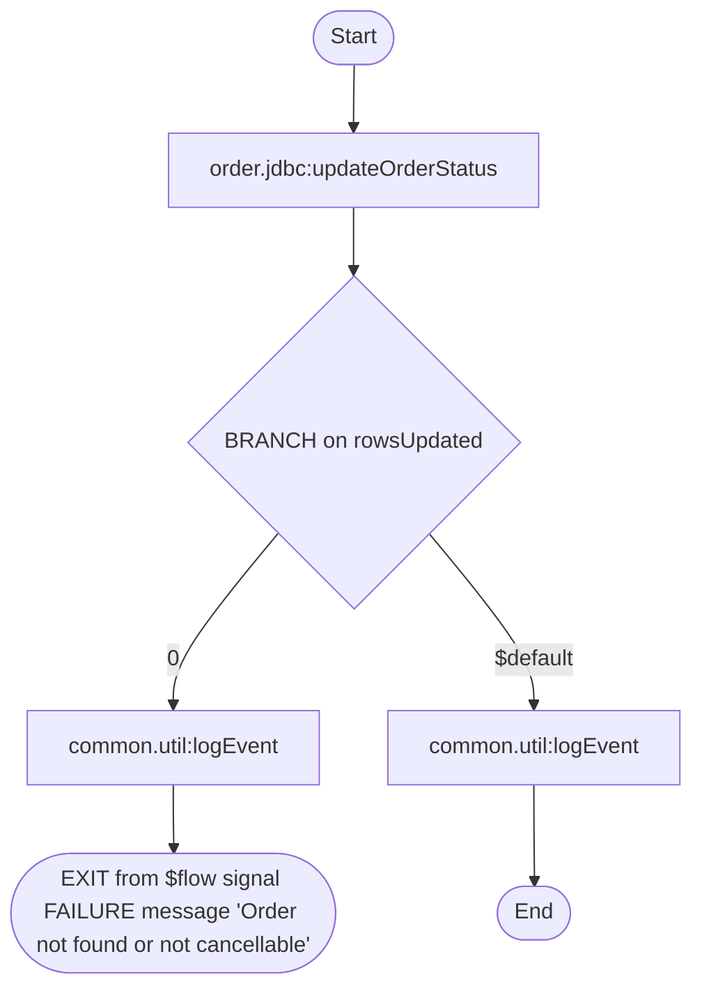

# order.process:cancelOrder

[← index](../index.md) · kind: **Flow service** · role: Entry: trigger order.triggers:cancelTrigger

## Overview


- **Kind:** Flow service
- **Package:** OrderProcessing
- **Role:** Entry: trigger order.triggers:cancelTrigger
- **Source dir:** `sample/OrderProcessing/ns/order/process/cancelOrder`
- **Used by capabilities:** order.process:cancelOrder
- **Developer comment:** Cancels a PENDING order and writes an audit log entry.
- **Referenced by (trigger/REST/WSD/other):** order.triggers:cancelTrigger

## Signature

**Inputs:**

| Field | Type | Flags | Comment |
|---|---|---|---|
| `cancel` | record → order.docs:CancelDoc |  |  |

**Outputs:** _(none)_

## Invokes

- [`common.util:logEvent`](common.util__logEvent.md)
- [`order.jdbc:updateOrderStatus`](order.jdbc__updateOrderStatus.md)

## Logic (pseudocode, generated from flow.xml)

```text
# Only orders still in PENDING can be cancelled.
INVOKE order.jdbc:updateOrderStatus
  input: orderId ← cancel/orderId; set newStatus = "CANCELLED"; set expectedStatus = "PENDING"
  output: rowsUpdated ← updateCount
BRANCH on rowsUpdated
  CASE 0:
    SEQUENCE [0]
      INVOKE common.util:logEvent
        input: set eventType = "CANCEL_REJECTED"; orderId ← cancel/orderId; set message = "not found or not PENDING"
      EXIT from $flow signal FAILURE message "Order not found or not cancellable"
  CASE $default:
    SEQUENCE [$default]
      INVOKE common.util:logEvent
        input: set eventType = "ORDER_CANCELLED"; orderId ← cancel/orderId; message ← cancel/reason
```

## Flowchart


