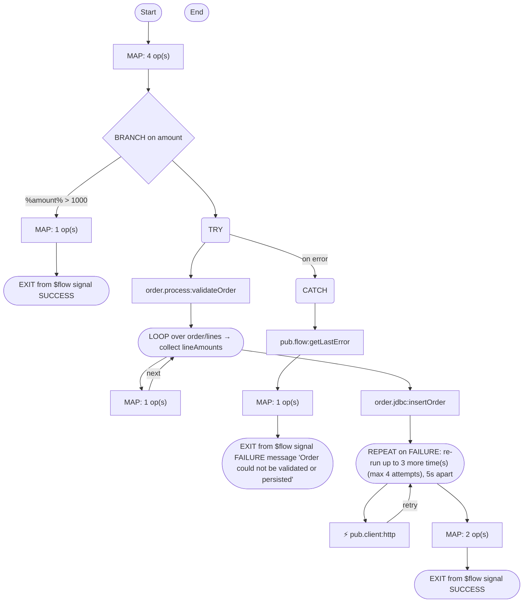

# order.process:submitOrder

[← index](../index.md) · kind: **Flow service** · role: Entry: trigger order.triggers:orderTrigger

## Overview


- **Kind:** Flow service
- **Package:** OrderProcessing
- **Role:** Entry: trigger order.triggers:orderTrigger
- **Source dir:** `sample/OrderProcessing/ns/order/process/submitOrder`
- **Used by capabilities:** order.process:submitOrder
- **Developer comment:** Validates, persists and confirms a customer order. Triggered by orderTrigger when a new OrderDoc is published.
- **Referenced by (trigger/REST/WSD/other):** order.triggers:orderTrigger

## Signature

**Inputs:**

| Field | Type | Flags | Comment |
|---|---|---|---|
| `order` | record → order.docs:OrderDoc |  |  |

**Outputs:**

| Field | Type | Flags | Comment |
|---|---|---|---|
| `orderId` | string |  |  |
| `status` | string |  |  |
| `confirmationNumber` | string | optional |  |

## Invokes

- [`order.jdbc:insertOrder`](order.jdbc__insertOrder.md)
- [`order.process:validateOrder`](order.process__validateOrder.md)
- `pub.client:http` — HTTP/REST call
- `pub.flow:getLastError`
- `pub.math:multiplyFloats`

## Logic (pseudocode, generated from flow.xml)

```text
# Seed working pipeline variables from the incoming order document.
MAP: orderId ← order/orderId; customerId ← order/customerId; amount ← order/amount; set status = "PENDING"
# High value orders require manager approval before fulfillment.
BRANCH on amount
  WHEN %amount% > 1000:
    SEQUENCE [%amount% > 1000]
      MAP: set status = "PENDING_APPROVAL"
      EXIT from $flow signal SUCCESS
  WHEN $default:
    SEQUENCE [$default]
# Validate the order and persist it; any failure is handled in the CATCH block below.
TRY
  INVOKE order.process:validateOrder
    input: order ← order
  LOOP over order/lines → collect lineAmounts
    # Compute the extended amount for each line (qty * price).
    MAP: transformer pub.math:multiplyFloats [num1 ← order/lines/qty; num2 ← order/lines/price; lineAmounts ← value]
  INVOKE order.jdbc:insertOrder
    input: orderRecord/orderId ← orderId; orderRecord/customerId ← customerId; orderRecord/amount ← amount; orderRecord/status ← status
# Persistence or validation failed: log the error, mark the order failed and abort the flow.
CATCH
  INVOKE pub.flow:getLastError
    output: lastError ← lastError
  MAP: set status = "FAILED"
  EXIT from $flow signal FAILURE message "Order could not be validated or persisted"
# Charge the payment gateway; retry up to 3 times with a 5s back-off on failure.
REPEAT on FAILURE: re-run up to 3 more time(s) (max 4 attempts), 5s apart
  INVOKE pub.client:http   ⟵ HTTP/REST call
    input: set url = "https://payments.internal/charge"; data/orderId ← orderId; data/amount ← amount
MAP: set status = "CONFIRMED"; set confirmationNumber = "%orderId%-CONF" (with %var% substitution)
EXIT from $flow signal SUCCESS
```

## Semantic flags (verify, then carry into the FSD)

- BRANCH on `amount`: `$default` also catches missing, empty and non-numeric values. Describe it as "any other value", never as the numeric opposite of the other cases
- `lineAmounts` is set but never used afterwards (not read later, not a declared output). Either it is dead logic or a step is missing
- `lastError` from `pub.flow:getLastError` is never logged, returned or rethrown, so the original error is lost
- `pub.client:http` does not fail on HTTP 4xx/5xx responses, and the flow never checks `header/status`. Error responses count as success, and REPEAT/TRY never sees them
- `status` is passed to adapter [`order.jdbc:insertOrder`](order.jdbc__insertOrder.md) and changed afterwards, but no later adapter call saves the new value. The stored value is whatever it was at [`order.jdbc:insertOrder`](order.jdbc__insertOrder.md)
- Uses floating-point arithmetic (`double`/`float`) on values that may be money. A re-implementation must decide whether to copy that exactly or use a decimal type
- Invoked by trigger order.triggers:orderTrigger: Integration Server discards the outputs (confirmationNumber, orderId, status). Only side effects (DB writes, calls, publishes) are visible to anyone

## Flowchart


